# 利用最大似然分类算法进行赛马情报预测

> 原文：<https://medium.com/mlearning-ai/horse-racing-tipster-bets-prediction-using-ml-classification-algorithms-299b120e072c?source=collection_archive---------1----------------------->

情报人员利用他们的技能来研究马匹并做出预测——他们认为某匹特定的马将赢得某场特定的比赛。

当我们要求系统预测一个赌注是赢还是输，比如说，对于一个告密者 A，我们获取这个告密者的最后一个 ID 号，并给它加 1，使它成为系统体验之外的一个新 ID。在系统更新之前，该 ID 将用于所有下注者的赌注。该系统每周更新一次。

**UID** —唯一的 ID。在实际系统中没有使用。数据集存放在 access 数据库中 UID 使所有的赌注保持有序。你可能会发现它的用处！

**ID** —每个情报贩子的赌注按日期和时间顺序保存，对于每个情报贩子，ID 随着每个新的赌注而递增。

**告密者**——告密者的名字。每个情报贩子的赌注都按顺序排列，接着是下一个情报贩子的赌注

**日期** —比赛的日期。之前的实验表明，无论如何，日期并不重要，是 ID 号向系统显示了每个线人的赌注是一个线性列表。这个日期仍然被使用，因为它从未被证明会对结果产生负面影响。

**曲目** —曲目的名称。一些情报提供者更喜欢一些曲目，这影响了他们的利润率。

**马** —马的名字。

**赌注类型** —赌注是“赢”赌注还是“各赢”赌注。

**赔率** —提出打赌的情报提供者说他们打赌得到的赔率。当你真的下注时，你很少会得到预测的赔率。将可能性降低 10%到 20%会更现实吗？

**结果** —赌注是赢了还是输了。

**密报者活跃** —密报者活跃吗——对还是错

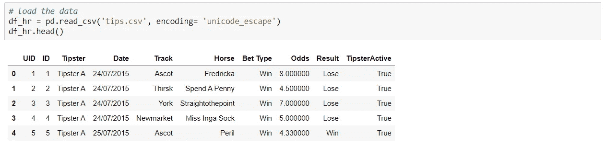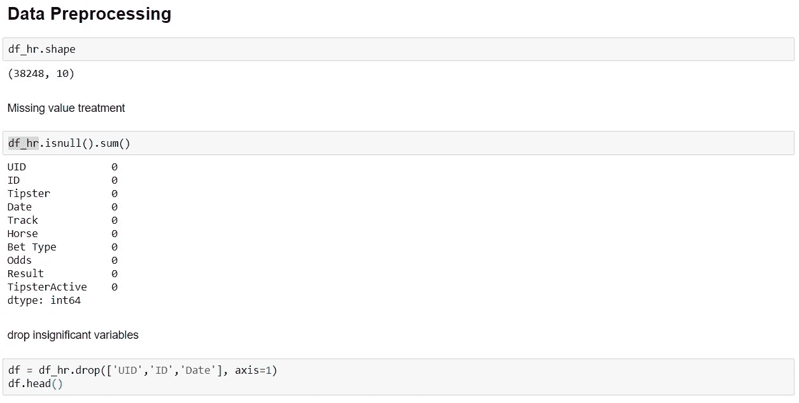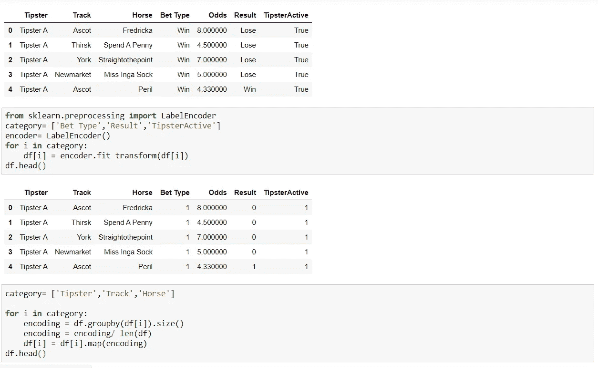

我们可以看到没有空值，并且编码了所有的分类变量。

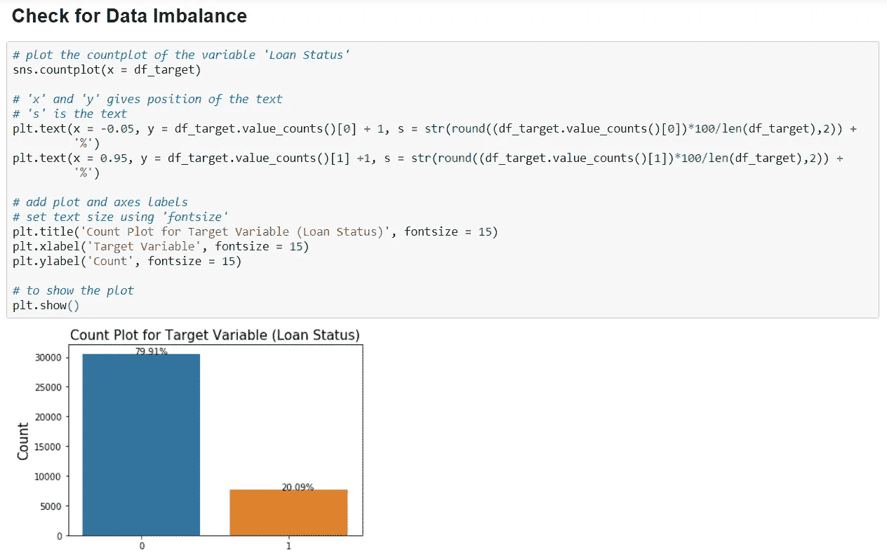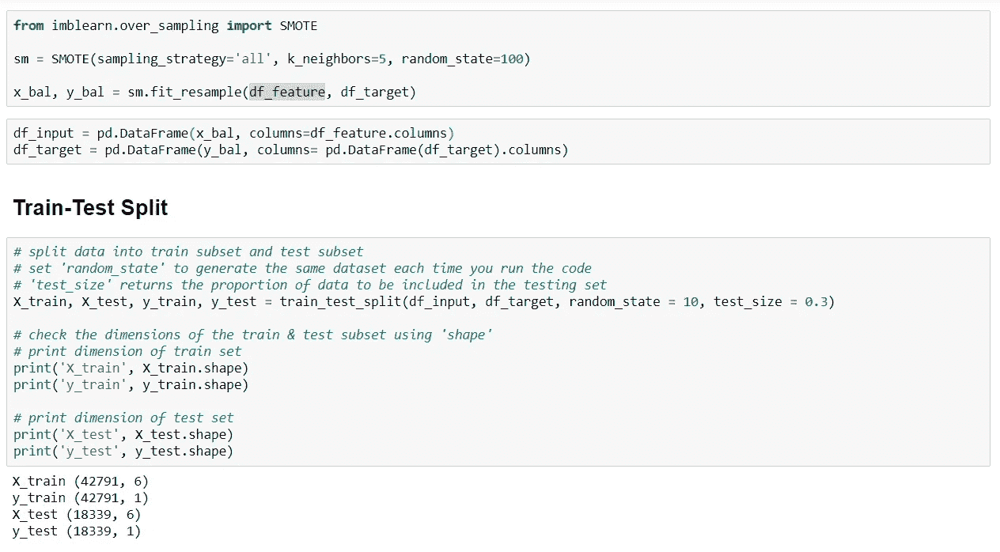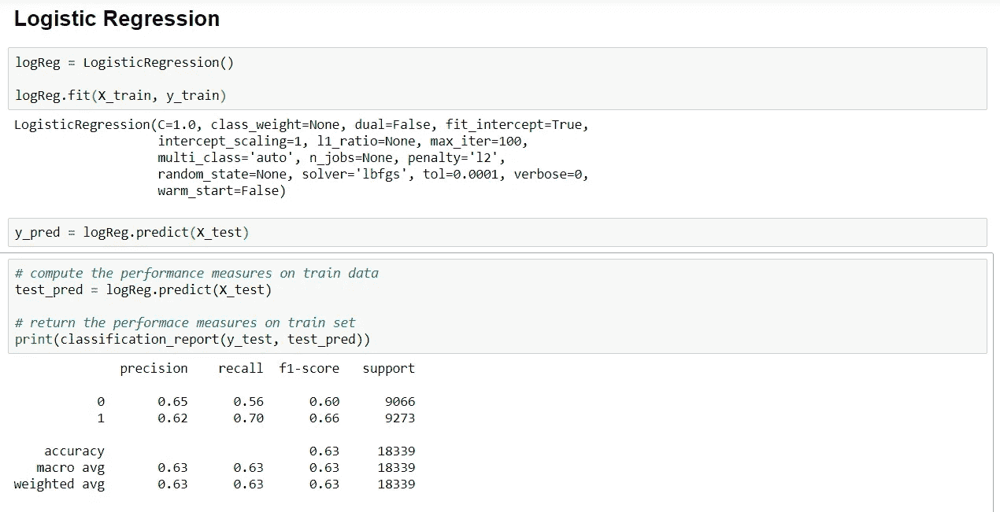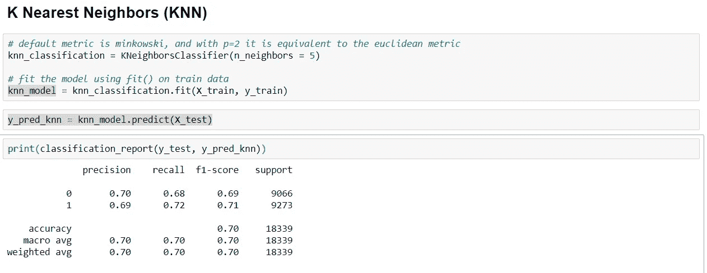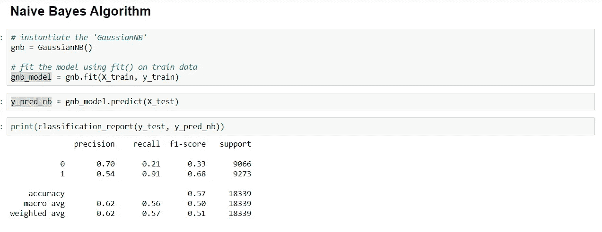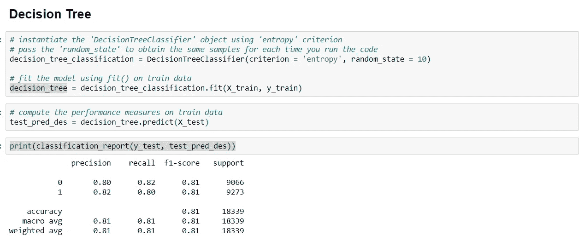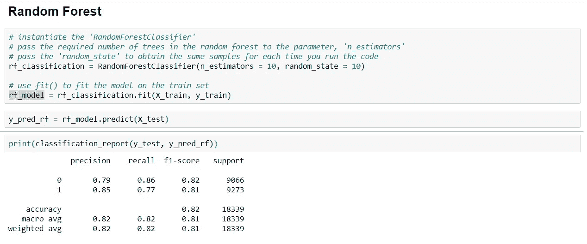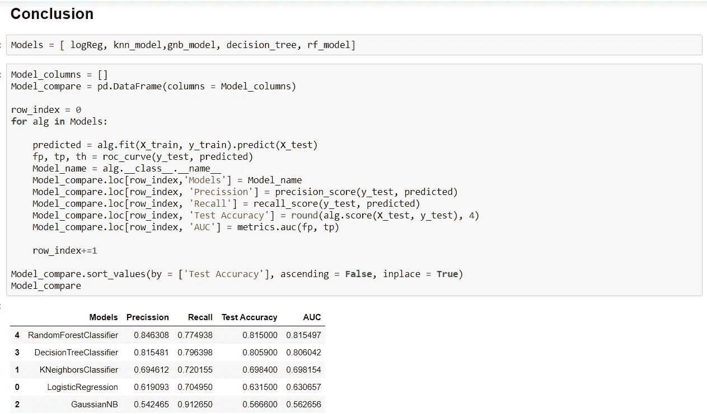

从结果中我们可以看到，与其他模型相比，随机森林给出了更好的准确性