# 基于机器学习的房租预测

> 原文：<https://medium.com/mlearning-ai/house-rent-prediction-with-machine-learning-2960d753e3ca?source=collection_archive---------2----------------------->

最近，根据预算和偏好寻找理想的住房选择是一件非常麻烦的事情。房屋租金的成本取决于许多因素，如:房子的大小、卧室的数量、位置、浴室、大厅和厨房的数量、家具状况等等。通过使用适当的机器学习算法，房地产业主可以轻松地根据客户的预算和偏好找到理想的房子。

该项目的目标是:

I .实现能够预测房屋租金的机器学习模型。

二。确定预测房屋租金所需的重要特征。

实现本研究目标的基本程序是:

1.数据收集

2.数据清理和探索

3.特征编码

4.训练-测试分离验证

5.特征缩放

6.建模

7.模型评估

## 数据收集

本项目使用的数据集是从 [Kaggle](https://www.kaggle.com/datasets/iamsouravbanerjee/house-rent-prediction-dataset) 获得的。它有大约 4700 多套可供出租的房屋的信息，不同的参数从；大小取决于当地的卧室、大厅和厨房的数量，以及家具状况等。

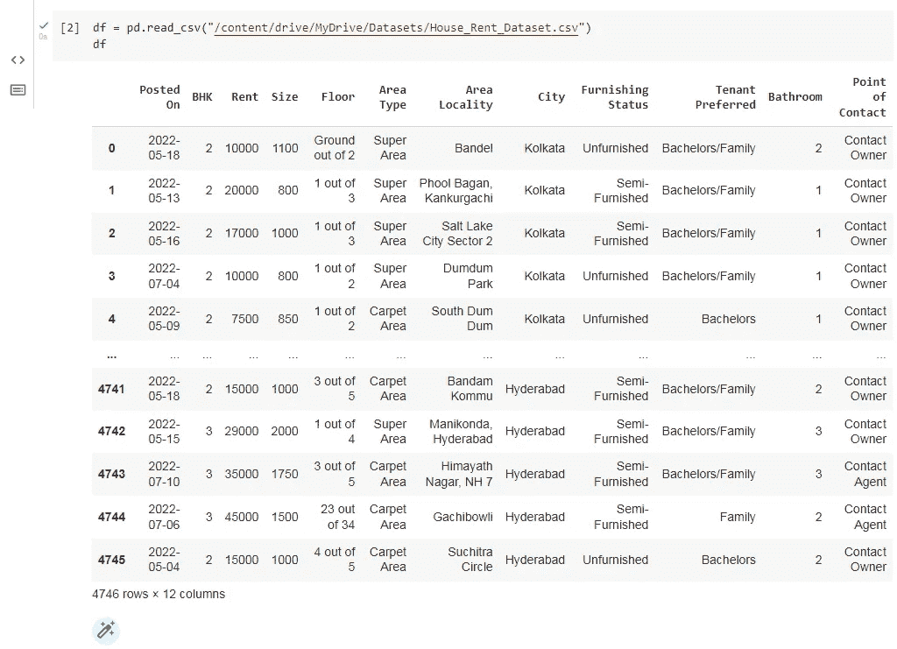

Loading the data

## 数据清理和探索

经过适当的检查，我发现数据集没有空值和重复值。这表明数据集从一开始就是干净的。

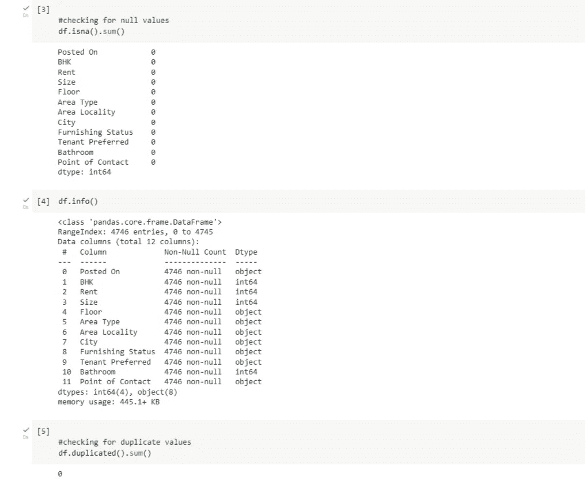

Checking for null and duplicate values

更进一步，我研究了数据，以检查解释变量和目标变量之间是否存在趋势。

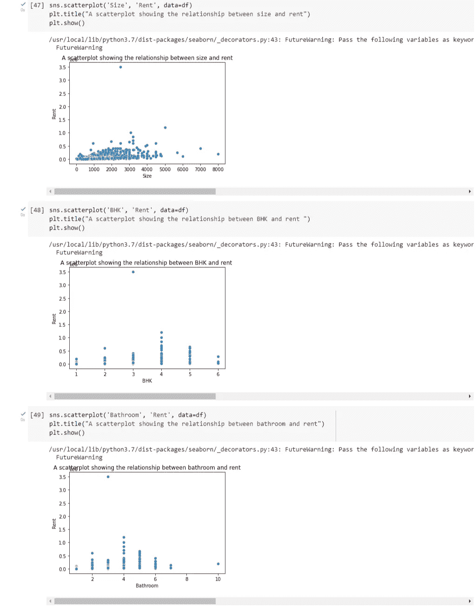

Exploring the relationships between variables

我注意到目标变量有一个极值，但我决定不删除它。这是因为有可能有极高的房租。

检查大多数列的数据类型，我发现大多数特性都是分类的。这就引出了下一步。

## 特征编码

为了有效的建模，必须将分类特征转换成数字特征。进一步的检查表明，分类特征有很多标签，因此使用一个热编码可能会导致高维度。因此，Scikit-learn 的标签编码器用于对特征进行编码。

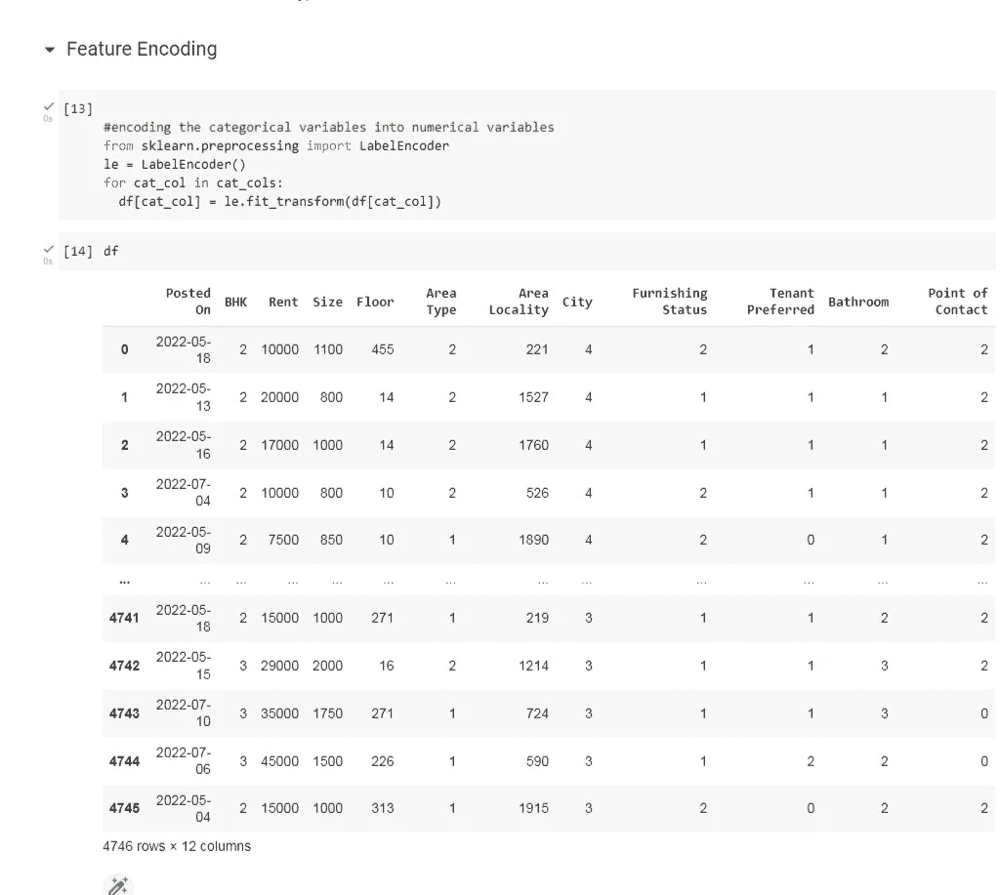

Feature encoding

对特征进行编码后，我决定将特征的相关性可视化，如下图所示。

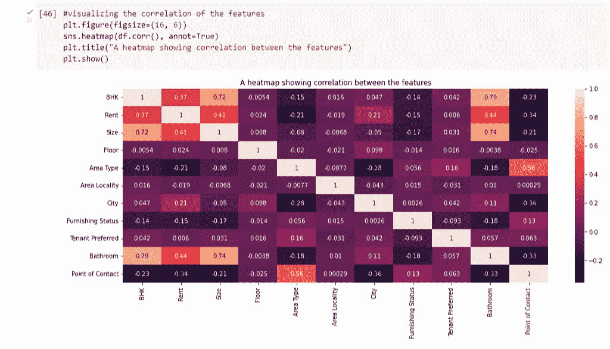

Correlation between features

## 训练-测试分离验证

数据集被分成解释变量 X 和目标变量 y。然后，进一步地，分别以 70:30 的比例分成训练数据和测试数据。拆分数据有助于评估模型在根据训练数据进行训练后在看不见的数据上的性能。Scikit-learn 的训练测试分割用于完成这项任务。

## 特征缩放

在进行适当的建模之前，需要对数据进行缩放，以处理倾斜的特征。Scikit-learn 的标准定标器确保每个特征的平均值为 0，方差为 1，使所有特征达到相同的幅度。这样做会显著影响模型的性能。

## 建模

房租预测是一个回归问题，因此训练了大约五个回归模型并选择了最好的模型。

我定义了两个函数来帮助计算模型指标——R2 分数和均方根误差。

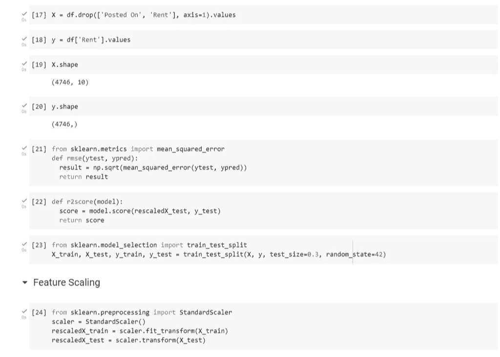

Feature preprocessing

**线性回归**

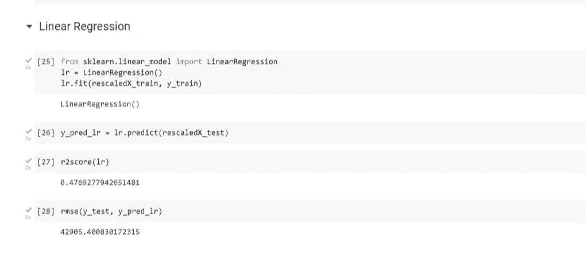

Linear regression model

**决策树**

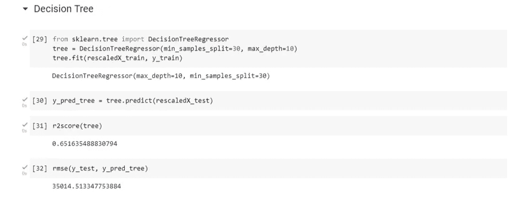

Decision tree model

**XGboost**

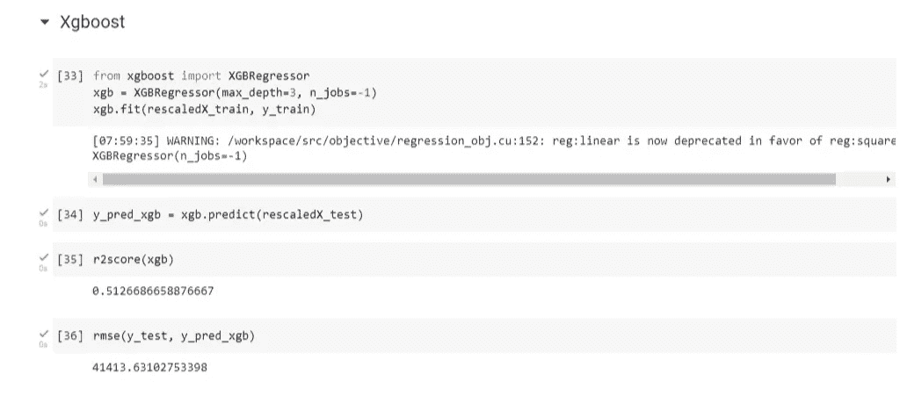

XGboost model

**梯度提升**

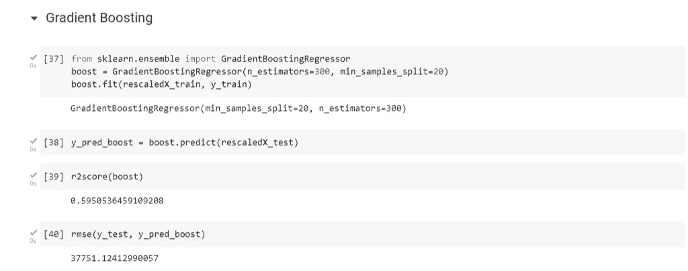

Gradient boost model

**随机森林**

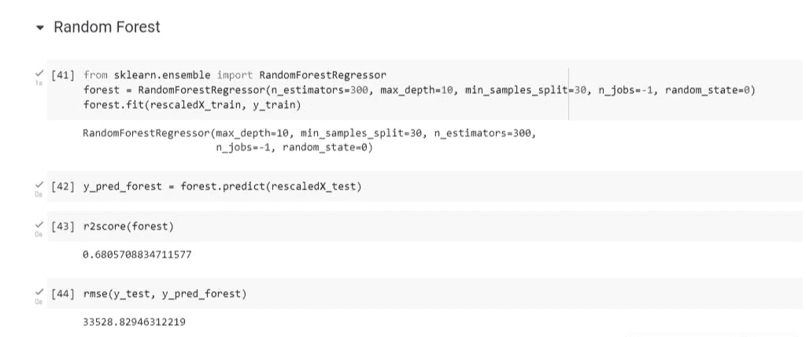

Random forest model

## 模型评估

在根据训练数据训练了五个模型之后，我们可以看到，随机森林模型已经被证明是最好的模型，具有最好的 R2 分数 0.68 和大约 33530 的最小 RMSE。

然后，我继续通过计算特性重要性分数并将其可视化来确定非常重要的特性。从下面的柱状图来看，房子的大小、房子所在的城市以及房子里浴室的数量显著地决定了房子的租金。

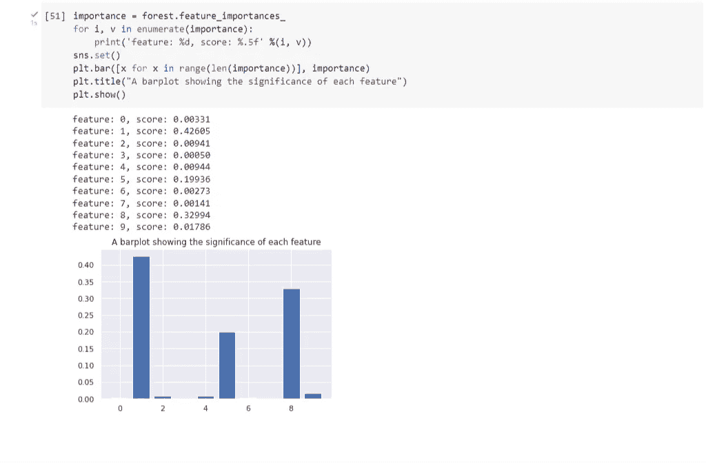

Feature importance

## 最后的想法

通过这个项目，我已经能够开发一个预测房屋租金的最佳模型。有了更多的训练数据，模型的性能将得到显著提高。

这个项目使用的代码可以在 [GitHub](https://github.com/Ukpoweh/house-rent-prediction) 上找到。你可以在 [LinkedIn](https://www.linkedin.com/in/gift-ukpoweh-90510022a) 和 [Twitter](https://twitter.com/iamukpoweh?t=KDnLel-0ilCBd8fm0Aarhg&s=09) 上和我联系。

 [## Mlearning.ai 提交建议

### 如何成为 Mlearning.ai 上的作家

medium.com](/mlearning-ai/mlearning-ai-submission-suggestions-b51e2b130bfb)