# 使用 Oracle Machine Learning for Python 第 1 版进行房价预测

> 原文：<https://medium.com/mlearning-ai/housing-prices-prediction-with-oracle-machine-learning-for-python-release-1-35470f24698e?source=collection_archive---------5----------------------->

几周前，我写了第一篇关于机器学习和深度学习之旅的文章。

我的第二篇文章是关于我使用 Oracle Machine Learning for Python(oml 4 py)创建的一个演示。OML4Py 在 Oracle 自治数据库中提供可扩展的机器学习功能，该数据库是一个融合数据库，支持空间数据、JSON、物联网、用于实时分析的内存技术，当然还有传统的关系数据。融合数据库可以运行各种工作负载，从物联网到区块链到分析和**机器学习**。

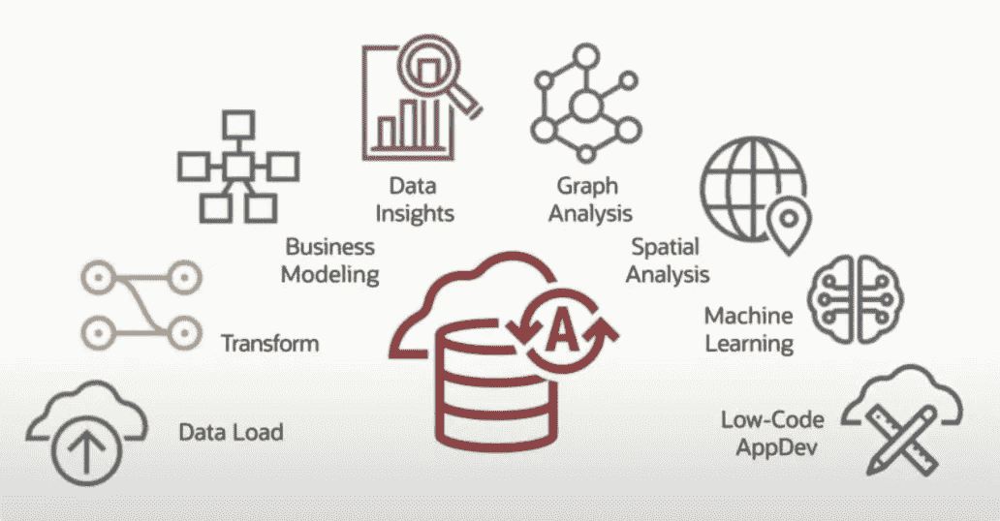

我使用了 Kaggle 的数据集:Kaggle Learn 用户的房价竞争。每个条目包含 81 个与房屋属性相关的特征。这是一个**监督回归**问题。监督学习的目标是学习一个函数，该函数在给定训练数据和期望输出的情况下，最接近数据中可观察到的输入(地块面积、建造年份、一楼表面……)和输出(销售价格)之间的关系。**分类**是关于预测离散的类别标签，而**回归**是关于预测连续的数量(例如销售价格)

> 预测模型取得了排名前 2%的成绩(在 61，000 名竞争对手中排名第 1，015 位)，但在高级模式下使用 AutoML，我们应该取得更好的成绩。

 [## Kaggle Learn 用户的房价竞争

### 将你在 Kaggle Learn 上的机器学习课程中学到的东西与课程中的其他人一起应用。

www.kaggle.com](https://www.kaggle.com/c/home-data-for-ml-course) 

O ML4Py 可通过自主数据库服务中的 Oracle 机器学习笔记本中的 Python 解释器获得。我们还提供 Oracle Machine Learning for SQL(oml 4 SQL ),它提供了两个解释器:SQL 和脚本。

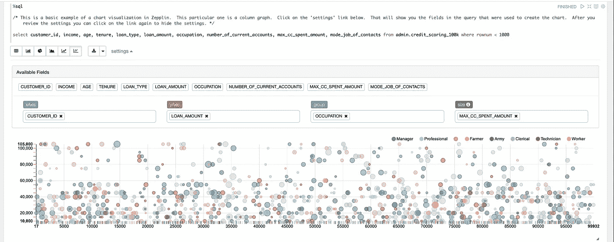

OML4Py 使开源 Python 编程语言和环境能够大规模操作数据库数据。Python 用户可以运行 Python 命令和脚本，对存储在 Oracle 数据库中的数据进行统计分析和机器学习。

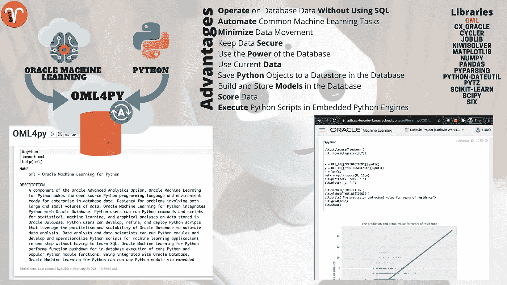

使用 OML4Py，您可以执行以下操作:

*   使用广泛的数据库内机器学习算法
*   最小化数据移动
*   利用 Oracle 数据库作为高性能计算引擎进行数据探索和准备
*   使用 AutoML 进行自动算法选择、功能选择和模型调整
*   以非并行、数据并行和任务并行的方式执行用户定义的 Python 函数

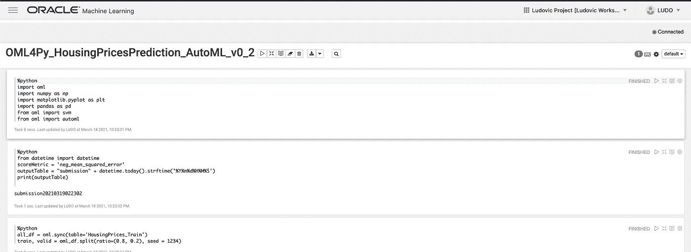

所以我决定测试 OML4Py AutoML 和自动机器学习的自动算法选择、特征选择和超参数调整，以快速创建一个预测房价的机器学习模型。

> 它在看不见的数据上实现了 95%的 R 平方。我的测试数据的均方根误差(RMSE)是 21347。

**RMSE** 可以被**解释为**未解释方差的标准偏差，并且具有与响应变量使用相同单位的有用属性:本例中的**销售价格($)** 。较低的 **RMSE** 值表示更好的拟合。

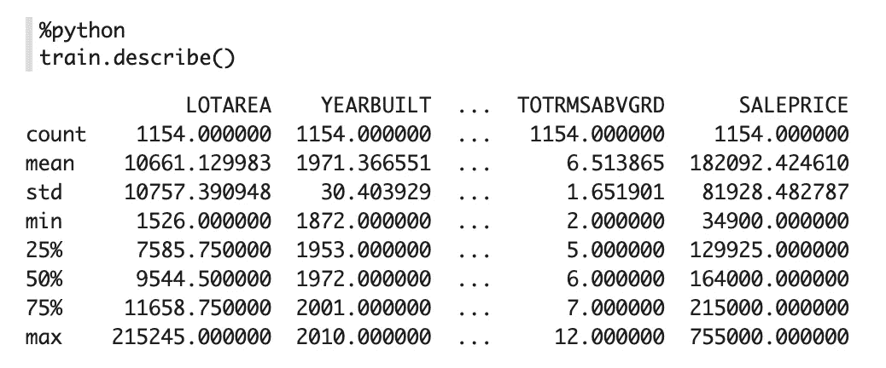

# 5 步流程

1 对于所有这些操作，我在 Oracle 机器学习笔记本(Apache Zeppelin **)** 的自治数据库服务中使用了 OML4SQL。在同一个笔记本中，我们可以使用 3 个解释器:来自 OML4SQL 的 SQL、SCRIPT(用于 PLSQL)和来自 OML4Py 的 Python

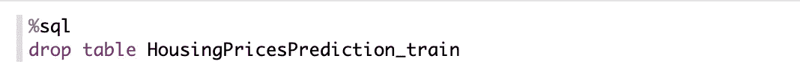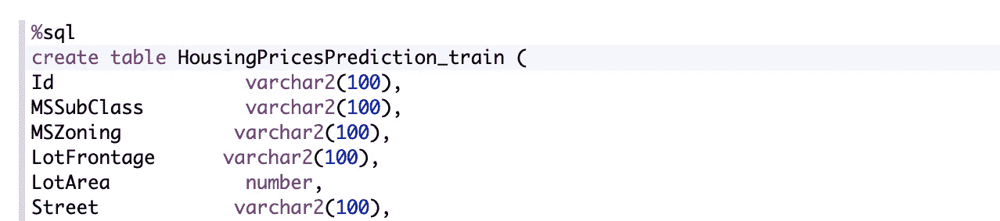

**DBMS _ cloud . create _ credential**将对象存储凭证存储在自治数据库模式中。

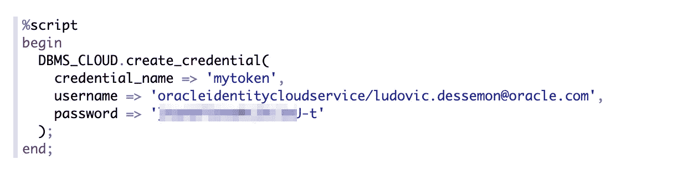

**DBMS_CLOUD.copy_data** 将指定的源文件加载到表格中。

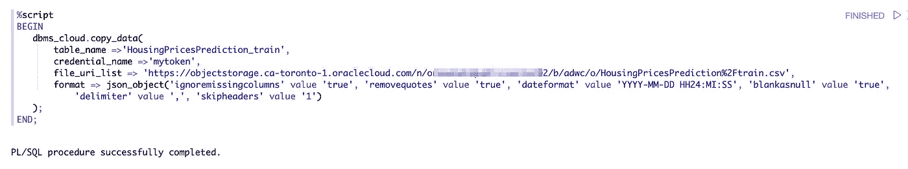

2 当 ML 算法用于对不用于训练模型的数据进行预测时，它用于估计 ML 算法的性能。

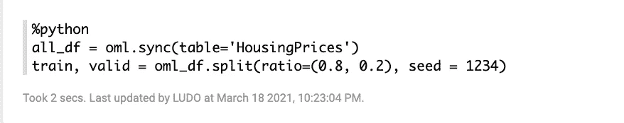

第二个表用于测试模型和创建文件，以便在 Kaggle 上提交结果并获得分数。

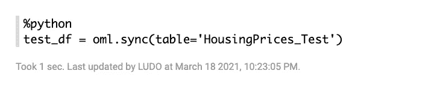

我们有 4 个数据集:
-一个完整的数据集(训练+验证)，它将被传递到 AutoML 上，因为它会进行自己的交叉验证来为您的问题确定最佳模型
-一个适合模型
的训练数据集-一个测试算法
的验证集-一个创建提交文件的测试集

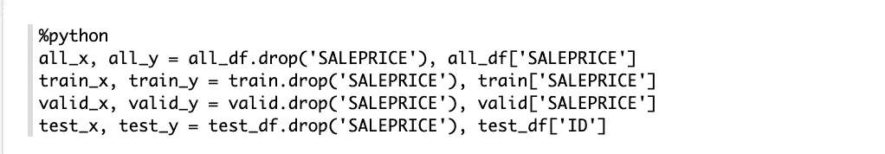

3

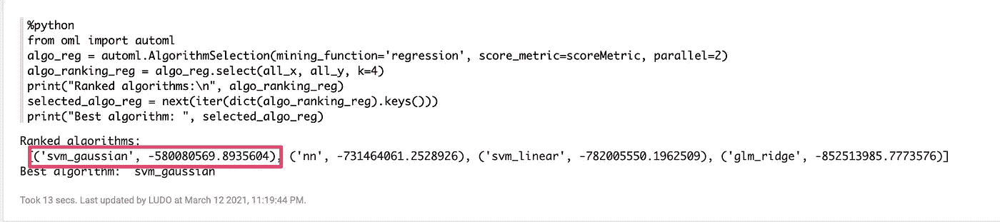

在接下来的步骤中使用的最佳算法将是具有高斯核的支持向量机。

4

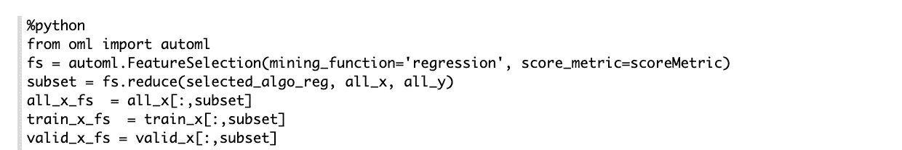

自动功能选择是一个真正的时间节省。如果手动操作，这是最耗时的步骤。如果您想手动处理所有事情，您应该使用数据可视化，这是一种了解数据、了解数据以及确定数据质量的强大方法。OML4Py 提供了用于呈现数据的图形显示的函数。OML4Py 使用`matplotlib`库来呈现输出。

使用 OML4SQL 和/或 OML4Py，您可以可视化您的功能，并尝试找到最好的功能。

OML4Py 提供了用于呈现数据的图形显示的函数。OML4Py 使用`matplotlib`库来呈现输出。

5 **模型调整**
`oml.automl.ModelTuning`对象为指定的分类或回归算法和训练数据调整超参数。

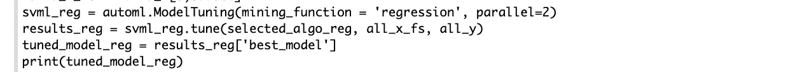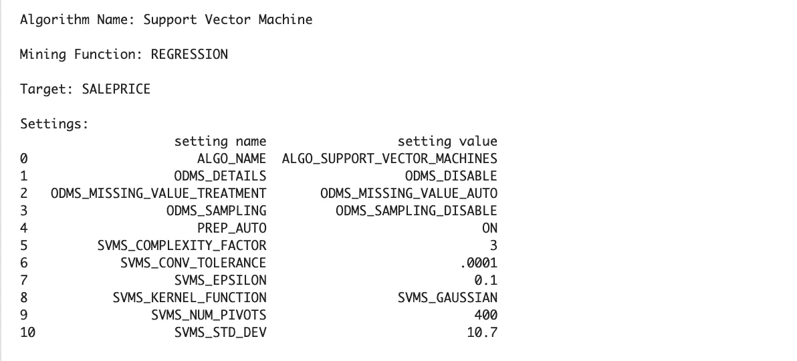

The selected model achieved an R-squared of 95% on validation data.

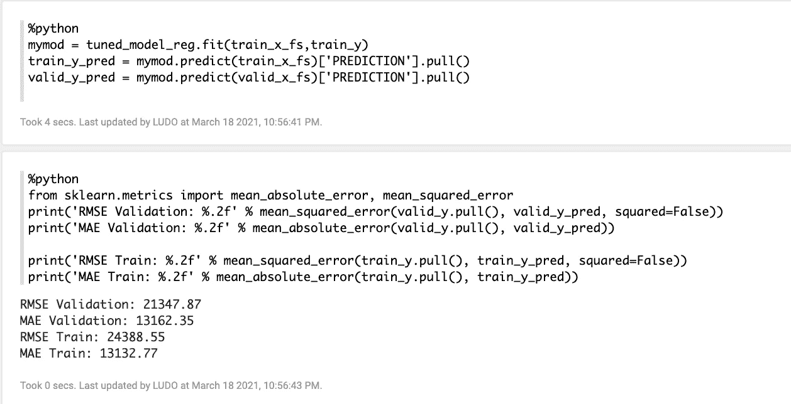

我的验证数据的 RMSE 是 21'347

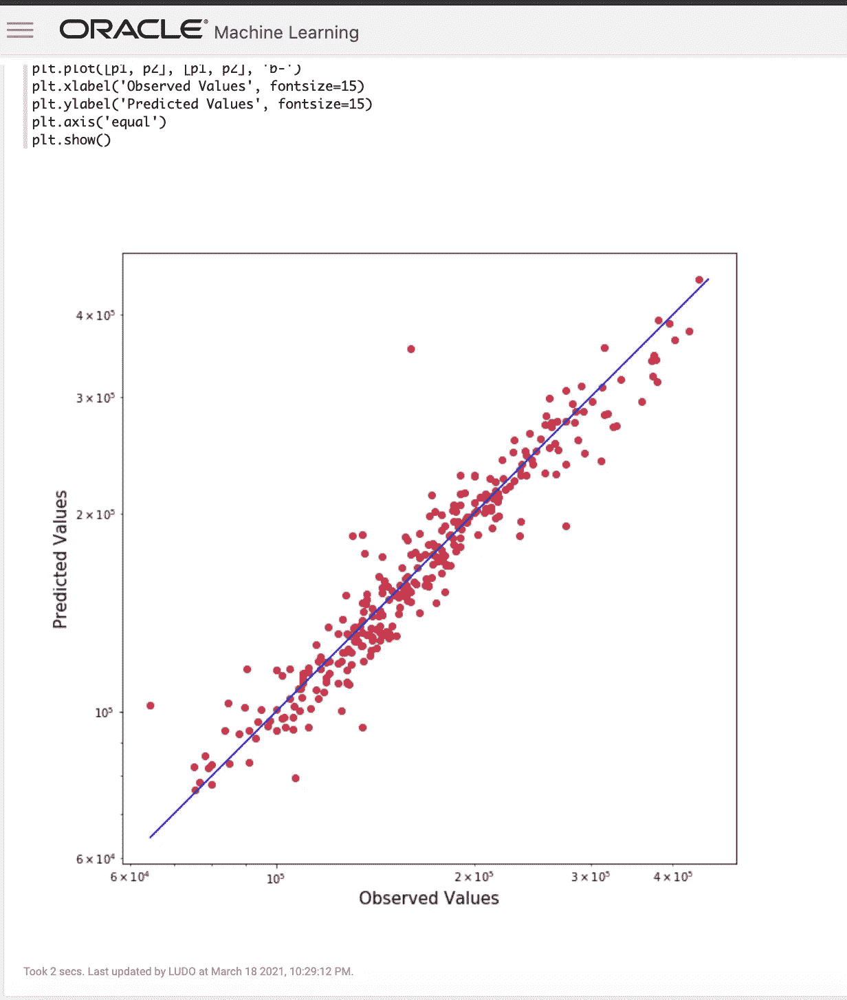

# 结论

仅用了 5 个相对简单的步骤，我就创建了一个预测模型，精确度相当高。我能够预测验证集上的分数在真实值的 21，000 美元之内，这可以通过向这个黑盒优化器提供定制的超参数搜索空间和非默认评分指标来进一步改进。为了提高预测的准确性，您可能需要规范化和准备数据集:OML4Py 提供了探索和准备数据的方法。

我将继续在 OML4Py 和 OML AutoML UI 上分享简化机器学习模型构建的内容，这是 Oracle 自治数据库上 Oracle 机器学习的一个新组件。
-使公民数据科学家更容易
-作为建模加速器为数据科学家提供显著的生产力改进-允许自动化产生初始模型
-使用 OML AutoML UI 发现的最佳算法直接在 OML4Py 笔记本中扩充模型
-部署您的模型

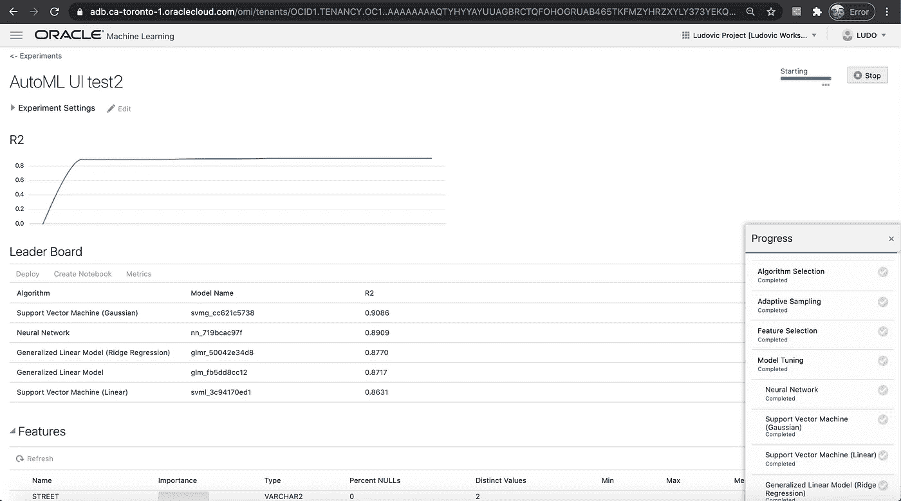

**资源:**

oml 4 py:[https://docs . Oracle . com/en/database/Oracle/machine-learning/oml 4 py/1/ml pug/index . html](https://docs.oracle.com/en/database/oracle/machine-learning/oml4py/1/mlpug/index.html)

Oracle Machine Learning for Python 的优势[://docs . Oracle . com/en/database/Oracle/Machine-Learning/oml 4 py/1/ml pug/about-oml 4 py . html # GUID-8 a0d 254 c-3c de-4 e21-BE2A-ca 258 f1 f 1106](https://docs.oracle.com/en/database/oracle/machine-learning/oml4py/1/mlpug/about-oml4py.html#GUID-8A0D254C-3CDE-4E21-BE2A-CA258F1F1106)

Kaggle 学习用户的房价竞争:[https://www.kaggle.com/c/home-data-for-ml-course](https://www.kaggle.com/c/home-data-for-ml-course)

数据:[https://www.kaggle.com/c/home-data-for-ml-course/data](https://www.kaggle.com/c/home-data-for-ml-course/data)

OML AutoML UI:[https://blogs . Oracle . com/machine learning/introducing-oml-AutoML-user-interface](https://blogs.oracle.com/machinelearning/introducing-oml-automl-user-interface)