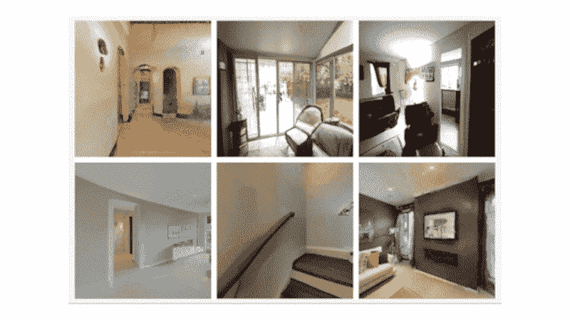

# 神经网络如何从单一图像中幻觉出房屋

> 原文：<https://medium.com/mlearning-ai/how-a-neural-network-hallucinates-houses-from-a-single-image-c256c9df6178?source=collection_archive---------5----------------------->

## [机器学习艺术](https://mlearning.substack.com)

[https://mlearning.substack.com](https://mlearning.substack.com)

单个图像的合成在计算机视觉和计算机图形学中引起了广泛的关注。它通过外推输入像素并生成符合场景几何结构的新像素，赋予照片以生命。同时，生成的像素必须在语义上与目标一致。