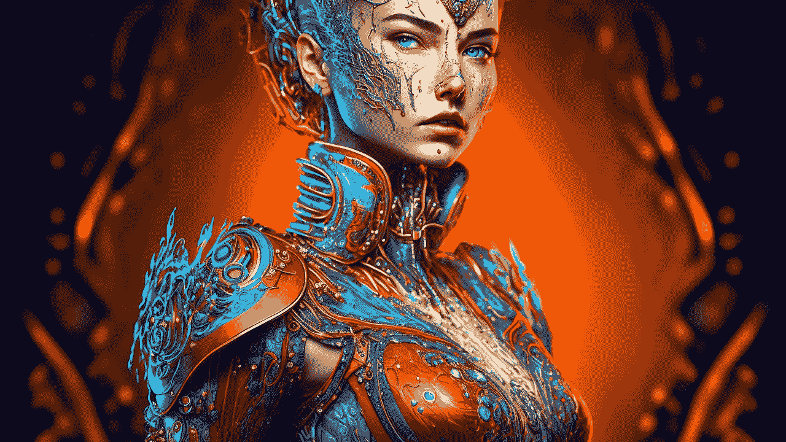

# 人工智能如何能找到像你这样的艺术

> 原文：<https://medium.com/mlearning-ai/how-ai-can-find-art-like-yours-5c4f0af8665a?source=collection_archive---------3----------------------->

## [探索计算机视觉演示](https://evartology.substack.com/)

## 人工智能如何理解图像| [演示](#c922)

[Your AI art is only 2 clicks away — Free Forever](https://open.substack.com/pub/mlearning/p/privately-run-state-of-the-art-generator?r=z7zu8&utm_campaign=post&utm_medium=web)

## 图像如何被[机器学习](https://open.substack.com/pub/mlearning/p/privately-run-state-of-the-art-generator?r=z7zu8&utm_campaign=post&utm_medium=web)识别？

机器不看全貌；他们只关心像素的值和他们制作的图案。他们只是获取一个项目的[像素](https://open.substack.com/pub/mlearning/p/the-true-pixel?r=z7zu8&utm_campaign=post&utm_medium=web)模式，并将其与…