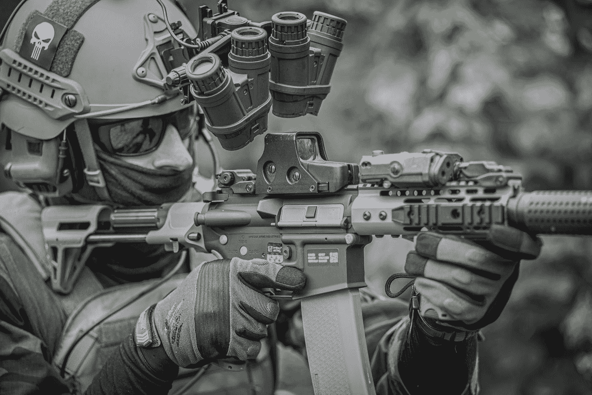

# 人工智能如何帮助乌克兰成功抵御俄罗斯入侵？

> 原文：<https://medium.com/mlearning-ai/how-ai-helps-ukraine-successfully-defend-against-the-russian-invasion-f0403cceec22?source=collection_archive---------5----------------------->

Photo by [Specna Arms](https://unsplash.com/@specna_arms_4s?utm_source=medium&utm_medium=referral) on [Unsplash](https://unsplash.com?utm_source=medium&utm_medium=referral)

## 首先，什么是人工智能？

简而言之，人工智能允许计算机机器使用自己的能力模拟人类思维的能力，顺便说一下，根据摩尔定律，这种能力每 10 个月翻一番。

## 乌克兰士兵对人工智能最实际的应用

> 1.面部识别

乌克兰已经与 [ClearView AI](https://www.clearview.ai) 合作，该公司提供乌克兰软件，该软件使用面部识别处理来自城市摄像机的大量数据，以发现已故士兵的社交媒体档案。当局然后用这个通知亲属，并把尸体移交给他们的家人。此外，这项技术有助于以完整的信息登记可怕的犯罪，目的是在未来逮捕所有罪犯，这是极其重要的。

此外，这项技术有助于确定一名士兵是否是敌人。例如，有一次，多亏了人工智能，才可能找到一个躲在乌克兰医院假装受伤的俄罗斯人。

> 2.预测军事行动的结果

程序[MCOSM](https://www.mcosm.us)——重大军事行动的统计模型预测俄罗斯士兵不会占领乌克兰首都基辅。这个软件根据第一次世界大战最后一年以来发生的 96 次战争行动推出了一些特别设计的算法。人工智能算法给乌克兰队的防守打了 5 分，给俄罗斯队的进攻打了 2 分。如果我们谈论这个模型的准确性——它有 70%的机会预测正确的结果，但随着时间的推移，它肯定会因为新的数据而提高。

但是软件如何预测真实的战争行动呢？

因此，老实说，该模型包括 30 多个条目特征，如准备程度、火力、机动性、后勤、决策以及同步操作的能力，这些特征赋予了进行此类预测的能力。

> 3.来提高无人机的射击精度

随着无人机拍摄相机看到的一切，这意味着它产生了足够多的数据，可用于训练机器学习算法，人工智能会自动检测敌人的设备，并用红色方块标记，并以这种方式帮助乌克兰士兵比敌人更快地工作。

然后准确的坐标被传送给无人机操作员，在指挥官下达攻击或不攻击的命令后。在小型炸弹的帮助下，甚至一辆坦克也能以这种方式被摧毁。一架无人机通常携带几枚炸弹。

> 4.来识别卫星图像

无人机的情况也是如此。使用卫星让我们有可能制作成千上万的图像，然后将它们输入算法，进一步提取一些有价值的信息。

将 AI 与[地理空间数据](https://www.ibm.com/topics/geospatial-data)联系起来，可以给与更大力量竞争的更多机会，为武器系统提供更快更好的情报、速度和准确性。

> 5.分析截获的敌方对话

众所周知，士兵们必须相互交流，因此这一过程产生了人工智能所需的大量语音数据。

乌克兰人正在利用俄罗斯士兵对未加密通信的广泛使用。科技公司 Primer 修改了他们的商业人工智能语音转录和翻译服务，以处理截获的俄罗斯通信，并自动突出显示与乌克兰武装部队有关的信息！

 [## Mlearning.ai 提交建议

### 如何成为 Mlearning.ai 上的作家

medium.com](/mlearning-ai/mlearning-ai-submission-suggestions-b51e2b130bfb)