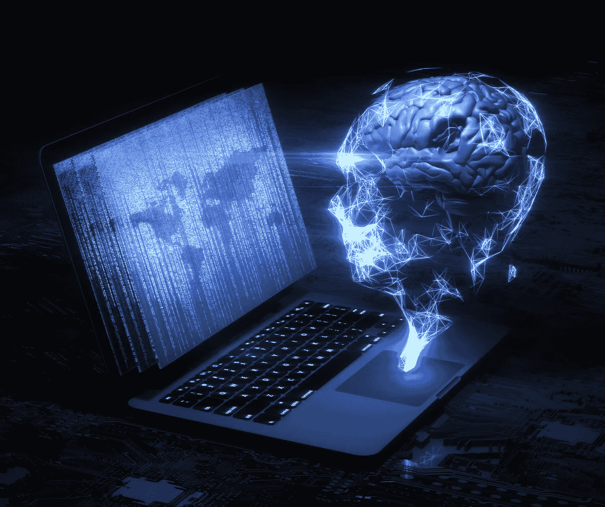

# 人工智能将如何在未来 20 年主导每个领域

> 原文：<https://medium.com/mlearning-ai/how-ai-will-dominate-every-field-in-the-next-20-years-2db8edff957?source=collection_archive---------1----------------------->

未来二十年，人工智能将改变世界

# 介绍

人工智能(AI)是当今最令人兴奋的技术发展之一。除了新的监控技术，它将对每个行业产生影响——不仅仅是让你的手机变得更智能或让你的汽车更快。人工智能将被用来改善我们的健康，拯救生命，让每个人的生活更轻松。它甚至可以帮助我们活得更长——根据一些专家的说法，由于人工智能技术，我们可能会在 2030 年看到死亡率的下降。以下是我对未来 20 年人工智能将如何改变我们生活的一些预测:

# 在不久的将来，机器学习将是最具变革性的人工智能技术。

机器学习是用于数据分析的最流行的人工智能技术，它被用于许多应用中。它可以应用于你能想到的几乎任何问题——从创建解决问题的新算法，到使用机器学习技术改进现有算法。

机器学习是人工智能(AI)的子集。人工智能是指任何未经人类显式编程而表现出智能行为的系统。机器学习算法可以针对特定的问题或任务进行训练，然后在新的案例中反复使用，直到它们在预测结果方面比人类所希望的更好！

# 人工智能将比你想象的更快地改变劳动力。

正如我们之前所说，人工智能已经在改变我们的工作方式。问题是:**这种变化有多少是好的，有多少是坏的？**

需要记住的一点是，人工智能不会取代所有人类工人。虽然它可能会使一些工作过时，但随着自动化提供了新的工作方式，其他任务将变得更加高效——这些新方式甚至可能允许我们做以前不可能做的事情！

Photo by [Marten Bjork](https://unsplash.com/@martenbjork?utm_source=medium&utm_medium=referral) on [Unsplash](https://unsplash.com?utm_source=medium&utm_medium=referral)

例如，IBM 的沃森健康平台(Watson health platform)已经在来自世界各地的专家的数百万份医疗文档上进行训练，以帮助医生以前所未有的准确性诊断疾病。不是只有一个人阅读成千上万页有价值的医疗信息，使用 Watson 可以让多名医生同时工作(甚至只有一名)，因为他们在治疗计划会议或手术预约期间都可以在需要时随时访问:手术后不必每天早上回家，这样有人就可以继续昨晚离开家独自工作的地方；取而代之的是，现在每个人都保持联系，谢谢

# 在医疗保健领域，人工智能系统将很快做出和人类专家一样好的诊断。

人工智能已经被用于医疗诊断。在接下来的几年里，它将能够比人类专家做得更快更准确。

AI 将能够从数百万患者的数据中学习，并检测人类看不到的模式。这些系统也将能够做出比人类更好的决定，因为它们可以获得关于个人健康史、生活习惯和家族史的更广泛的信息。

# 在个人金融领域，人工智能工具将帮助我们更明智地消费、储蓄和投资。

在个人金融领域，人工智能工具将帮助我们更明智地消费、储蓄和投资。这是可以做到的，因为这项技术能够识别人类看不到的数据模式。

例如:

*   人工智能可以判断你是否在某件东西上花了太多钱。
*   它还可以预测你需要多少钱才能在某个年龄(或更早)舒适地退休。
*   这将确保你的储蓄结构合理，使其增长快于通货膨胀。结果呢？更有保障的退休生活！

# 人工智能将有助于推动太空探索。

人工智能将有助于推动太空探索。它可以通过帮助我们找到适合殖民的其他恒星周围的行星和卫星，以及在这些行星上找到生命形式来做到这一点。

Photo by [NASA](https://unsplash.com/@nasa?utm_source=medium&utm_medium=referral) on [Unsplash](https://unsplash.com?utm_source=medium&utm_medium=referral)

当涉及到研究系外行星(太阳系以外的行星)及其大气层的组成时，人工智能还被用于协助数据收集。人工智能算法可以用来根据行星的质量和大小计算行星大气中可能存在的化学物质，然后可以与科学家根据当前关于地球上生命如何发展的理论所预期的进行比较(例如:如果大气中存在氮，那么可能存在水)。

这里的主要优势是，AI 从第一天起就不需要人类的监督或输入；相反，它可以快速分析大量信息，这样科学家就不必在每次观察后花费数小时手动处理数据了！

# 机器人将很快能够在许多行业中做大量的体力工作。

机器人将能够在许多行业中做大量的体力工作。

在未来的 20 年里，机器人将能够做许多现在只有人类才能做的工作。例如，他们将能够在建筑工地焊接和安装管道，而不会被落下的碎片或电击伤害。他们还将能够安全地操作机器，而不会造成损害或伤害——这在目前对人类来说是不可能的，因为他们缺乏灵活性和力量(或者两者都缺乏)。此外，机器人将能够在对人类来说太危险的地方工作:如地下矿井或深海研究站，那里没有气压可用于呼吸保护目的！

Photo by [Andy Kelly](https://unsplash.com/@askkell?utm_source=medium&utm_medium=referral) on [Unsplash](https://unsplash.com?utm_source=medium&utm_medium=referral)

# 人工智能可以帮助我们找到使用地球有限资源的聪明方法。

你可能听说过“可持续性”的概念，它被定义为“在给定条件下无限期维持给定系统或环境的能力。”这个定义的问题是，它假设我们使用多少能源没有限制。然而，在现实中，我们可以从地球有限的资源中提取多少能源存在一些非常现实的限制——如果每个人都消耗掉我们一年可以生产的所有东西，甚至会超过这些限制。

那么这对我们的未来意味着什么呢？当人们因为没有足够的钱而开始负债时，会发生什么？或者当每个人都开始要求生产太阳能电池板和风力涡轮机以及储存多余电力的更有效的方法时(这可能比仅仅购买电池更昂贵)？嗯…

# 自动驾驶车辆就在眼前。

全自动无人驾驶汽车已经开始上路测试，未来几年内就可以买到。自动驾驶汽车比人类司机更有效率，因为它们可以比人类更快、更准确地对不可预测的情况做出反应。

他们将通过消除酒后驾驶或分心驾驶造成的事故来挽救生命和减少交通拥堵。它们还通过减少需要交通信号的十字路口的等待时间使通勤变得更容易，这意味着更少的人不得不坐在车里等着他们改变颜色(没有什么比坐在那里想为什么没有人动更糟糕的了)。

# 大约十年后，许多家庭和工作中的日常任务可以由机器人来处理

在十年左右的时间里，许多家庭和工作中的日常任务可以由机器人来处理。你将能够走进你的客厅，打开一盏灯，只需说“关灯”你可以上网查看是谁在给你打电话，即使他们和你不在同一栋楼里——只需和你的声控助手通话。如果你想在晚餐前吃甜点，只需要一个简单的命令:“点蛋糕。”

当然，这些只是可能的例子——随着时间的推移，机器人可能会接管比这更多的工作。但是重要的是要意识到我们可能再也不需要人类的帮助了！

# 下一代人工智能将是社交和情感的，而不仅仅是逻辑的。

人工智能(AI)是计算机执行通常需要人类智能的任务的能力。它经常与机器学习互换使用，因为这些术语经常互换使用，并且都涉及执行某些任务的人工智能系统。

然而，这些技术之间存在差异:虽然机器学习可以帮助机器自己学习新的东西，但人工智能需要更多的东西，即理解人类情绪并做出相应反应的程序。这让人类对他们的人工智能系统有了更大程度的控制——这也让他们在总体上更好地与人类互动！

# 人工智能将在未来几十年以我们现在甚至无法想象的方式彻底改变我们的生活

人工智能将在未来几十年以我们现在甚至无法想象的方式彻底改变我们的生活。这不仅仅是指计算机能够比人类更好地执行任务，还包括计算机能够做人类根本做不到的事情，并且和 AI 一样好。

# 结论

人工智能世界即将以我们难以想象的方式发生变化。从无人驾驶汽车到为我们工作的机器人，未来看起来越来越光明。这不仅仅是机器控制我们的生活；这也将是关于人类如何利用他们的创造力和技术，以便更好地利用这个新时代。

 [## Mlearning.ai 提交建议

### 如何成为 Mlearning.ai 上的作家

medium.com](/mlearning-ai/mlearning-ai-submission-suggestions-b51e2b130bfb)