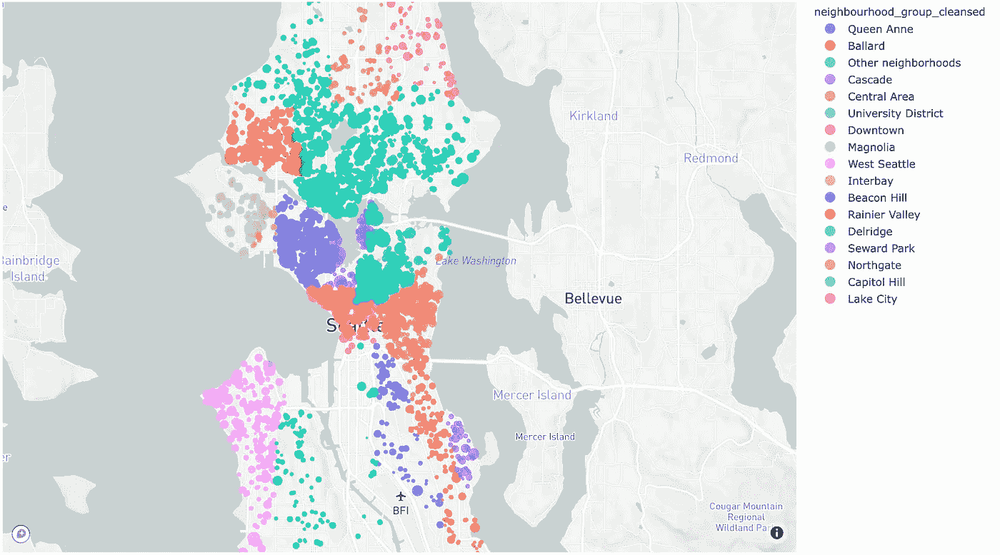
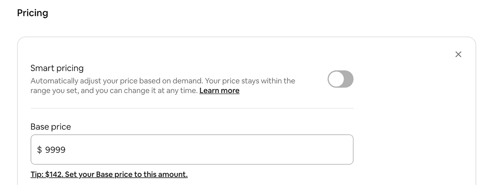
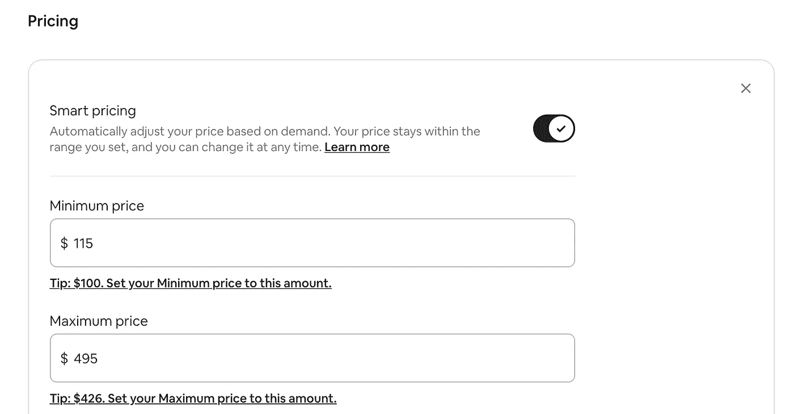
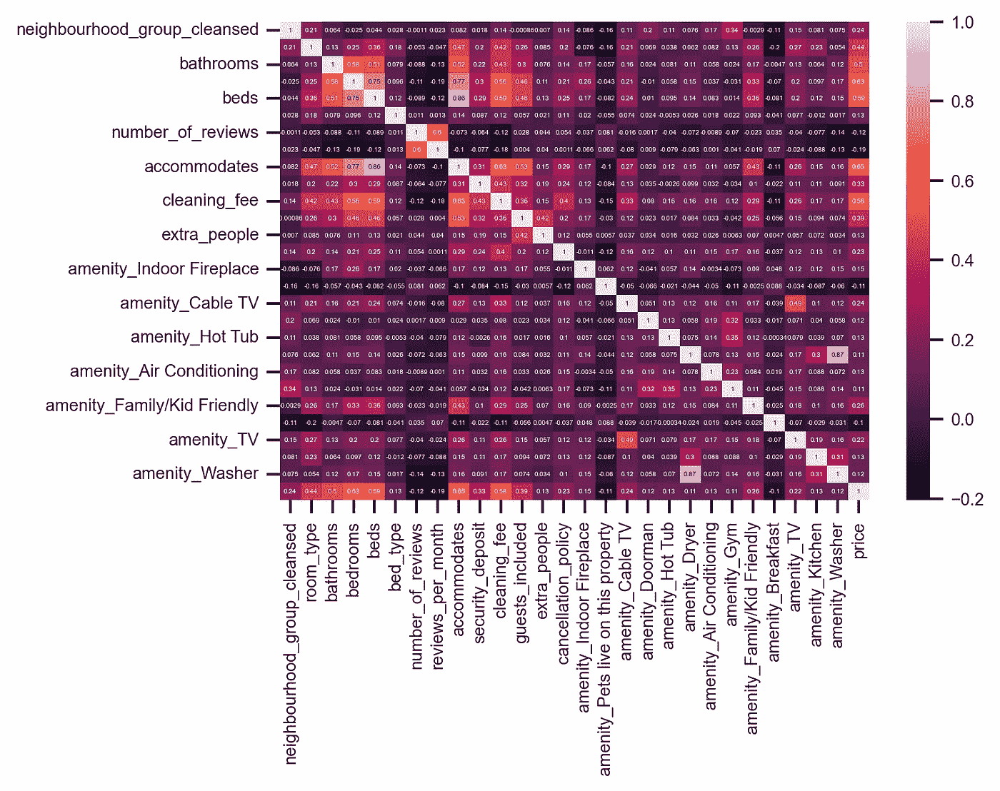
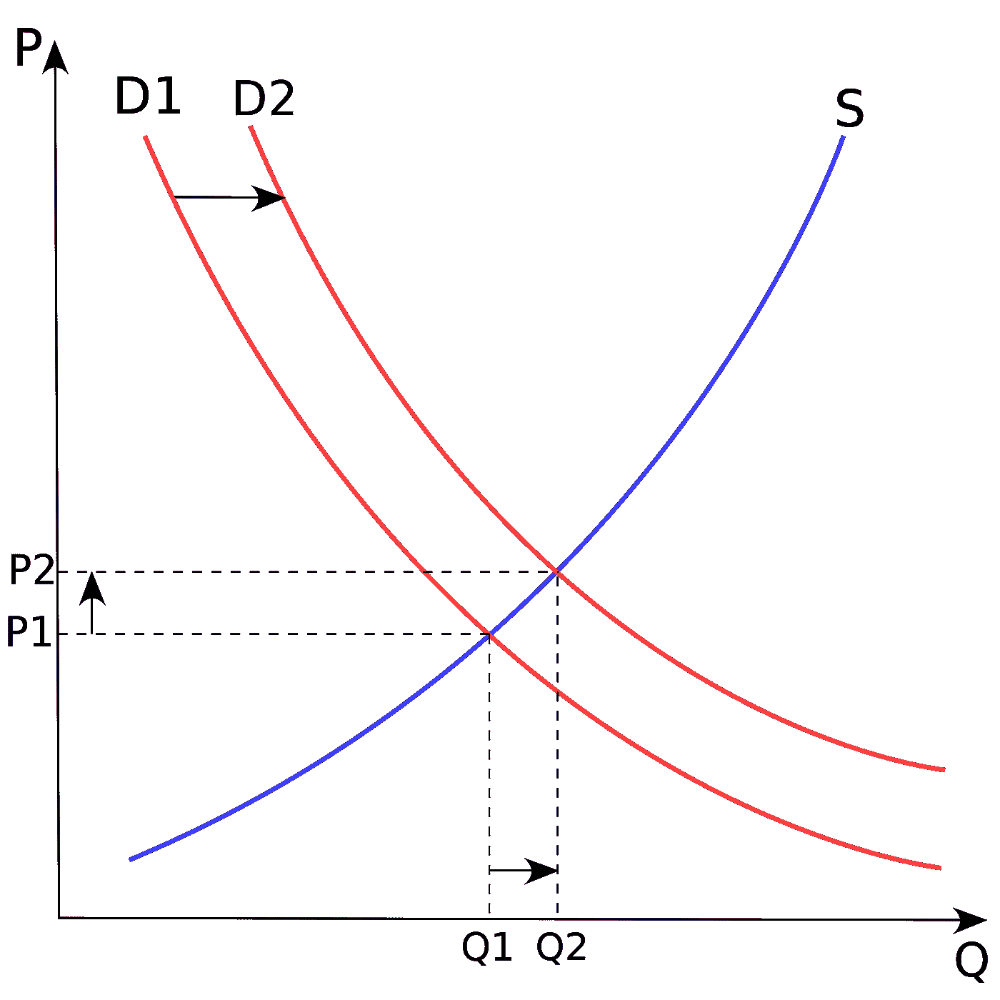

# Airbnb 如何评估房源？

> 原文：<https://medium.com/mlearning-ai/how-airbnb-evaluates-the-listings-b35c5a7890cb?source=collection_archive---------3----------------------->

用户、主机和 Airbnb 的三赢策略。

*   作者:[沈](https://www.linkedin.com/in/zacks-shen/)
*   撰稿人:[凯文·朱](https://www.linkedin.com/in/yen-duo-chu/)

Airbnb Rental Price vs. Neighborhood in Seattle

# 介绍

你是 Airbnb 的主持人吗？还是你是数据科学爱好者？本文将带您了解以下有趣的问题:

*   Airbnb 为什么需要机器学习模型进行价格预测？
*   Airbnb 如何确定房源价格？
*   如何经营一家成功的 Airbnb？

大家好，我是咤克斯，一名数据科学家，也是 Airbnb 的长期用户。我还注册了一个 Airbnb 主机，探索 Airbnb 是如何工作的。此外，我采访了一位 Airbnb 超级房东，他每年可以出租自己的房子 300 多晚，以获得更多有见地的想法。更多科技细节，请访问 [Kaggle Seattle Airbnb](https://www.kaggle.com/zacksshen/kaggle-seattle-airbnb) 了解我是如何实现数据分析、ETL 管道、ML 管道、梯度提升和高级 ML 方法的。

# 为什么要预测价格？

价格预测有利于**完全竞争，**三赢市场。

*   东道主有一个直观的机会将他们的服务和设施与竞争对手进行比较。随着竞争的加剧，租赁住房市场的整体服务质量和市场规模将得到改善。
*   价格预测模型是数据驱动决策的可靠参考。有了 Airbnb 的价格建议，主持人可以制定不同的商业策略。
*   Airbnb 用户有更多的选择，价格更低，质量更高。
*   Airbnb 可以更快地发展，包括吸引更多的用户和主机，从而降低运营和数据中心成本，增加利润。

# Airbnb 如何确定房源价格？

目前，Airbnb 至少有两个机器学习模型用于价格预测。它们都是针对主机的:

> **价格提示**:价格提示是自动每夜价格推荐，你可以选择保存。它们基于你的列表的类型和位置、季节、需求和其他因素。即使你使用价格提示，你总是控制你的价格，并可以在任何时候推翻提示。—引用自 Airbnb。
> 
> **智能定价**:智能定价可以让你根据像你这样的物品的需求变化，自动设定价格上下浮动。您始终对自己的价格负责，因此智能定价由您选择的其他定价设置控制，并且您可以随时调整夜间价格。智能定价是基于你的上市类型和位置，季节，需求和其他因素。—引用自 Airbnb。

*Price Tips*

Smart Pricing with *Price Tips*

# 如何经营一家成功的 Airbnb？

我相信你已经读过类似“[经营一家成功的 Airbnb 房产的 10 个技巧](https://www.investopedia.com/articles/personal-finance/103015/10-tips-running-successful-airbnb-property.asp)”的文章，或者类似“[我如何才能成为最伟大的 Airbnb 主人](https://www.quora.com/How-can-I-become-the-greatest-Airbnb-host) **”的 Quora 问题。**我们来想一个数据科学家同样的问题。

是的，你可以将你的房源与竞争对手的房源进行比较，因为你了解你的社区、便利设施以及 Airbnb 建议的价格。然而，很难确定哪些功能比其他功能更重要。Airbnb 也没有提供其机器学习模型的全部细节。以下是我基于数据分析、机器学习和研究的策略:

如果你不是超级主持人，你需要更多的预约:

1.  要击败 Airbnb 的搜索引擎，你必须是一个超级主播，才能获得更高的排名，从而获得更多的曝光率。超级主机的列表总是出现在第一个搜索结果中。
2.  遵循 ***价格提示*** 降低价格(底价、清洁费或保证金)更有竞争力。
3.  添加便利设施，如室内壁炉、有线电视、电视、门卫、烘干机、洗衣机、空调、健身房、厨房。
4.  提供便利设施之外的额外服务。你可以准备免费的零食、水果和水作为惊喜。
5.  为更多点评设置更短的最低住宿时间。

皮尔逊相关系数(r)揭示了每个特性和价格之间的线性相关性(底线)，越高越好。比如可以考虑增加洗衣机、电视等便利设施，让 Airbnb 模特觉得“你的房源价格应该高一些”。换句话说，保持较高的质量但较低的价格可以帮助你吸引更多的用户，从而带来更多的评论和更高的星级。

Heatmap of Pearson Correlation Coefficient

如果你已经是一个超级主持人，或者你有足够的预定量:

*   可以考虑加价，根据事件设置特价，或者启用 ***智能定价*** 实现利润最大化。

By Paweł Zdziarski (faxe), Astarot

> 一种产品的价格是由每种价格下的产量(供给 *S* 和每种价格下有[购买力](https://en.wikipedia.org/wiki/Purchasing_power)的人的欲望(需求 *D* )之间的平衡决定的。参考[供需](https://en.wikipedia.org/wiki/Supply_and_demand)。

您每年的最大供应量是 365 天。如果你已经达到了需要的需求，你可以提高你的价格来获得更多的收入；如果你没有足够的预订，设定一个较低的价格，并改善您的服务，成为一个超级主持人。

# 结论

Airbnb 使用机器学习模型来加剧竞争。他们可以向主持人提供价格提示、智能定价和改进建议。作为一个主持人，你可以结合模型和良好的策略，以最大限度地提高你的竞争力和利润。Airbnb 用户也从完全竞争中受益。