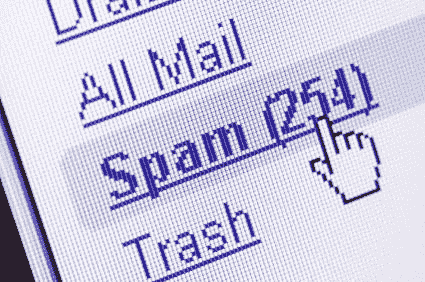

# 人工智能如何确定一条短信是火腿还是垃圾短信

> 原文：<https://medium.com/mlearning-ai/how-artificial-intelligence-can-determine-if-a-text-message-is-ham-or-spam-ba69dac84af4?source=collection_archive---------4----------------------->

作为电脑用户，我们被手机上的信息淹没了，尤其是短信。一些文本消息是真实的，或者是虚假的，但是其他的不是，被称为垃圾邮件。对于计算机来说，确定哪些短信是垃圾短信，哪些不是很重要，这就是人工智能的用武之地。一个计算机程序可以是…