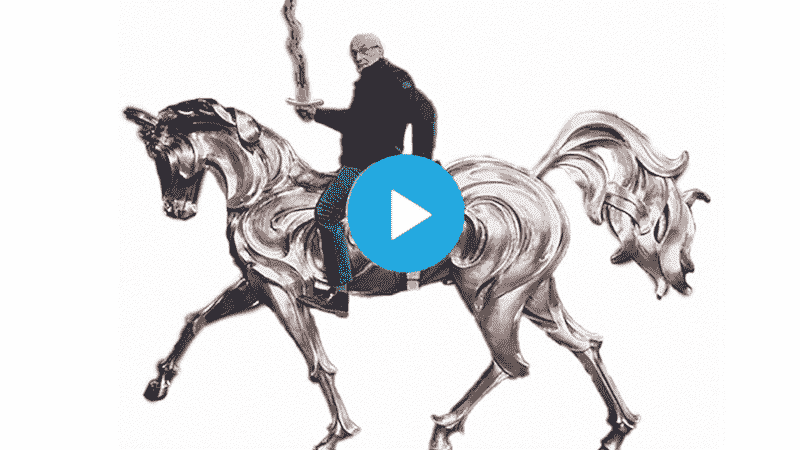

# 如何才能创作出 AI 艺术？

> 原文：<https://medium.com/mlearning-ai/how-can-i-create-ai-art-37b82d9cda56?source=collection_archive---------1----------------------->

## [机器学习艺术](https://mlearning.substack.com/p/waiting-for-godot?r=z7zu8&s=w&utm_campaign=post&utm_medium=web)

## Dalle-2 的方法；没有等候名单

[How to create AI art like DALL-E2 today](https://mlearning.substack.com/p/waiting-for-godot?r=z7zu8&s=w&utm_campaign=post&utm_medium=web)

乍一看，DALL-E 2 的人工智能艺术生成过程似乎是一场梦。尤其是如果你不在 DALL-E 2 的等候名单上，这个名单很长。

但是，如果另一个软件可以引导你以相似的成功率得到相同的结果，那该怎么办呢？