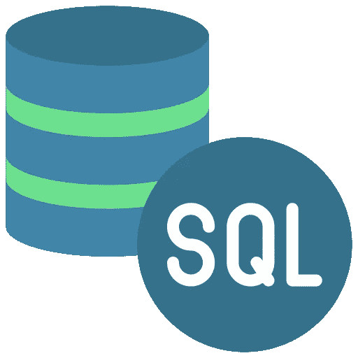

# 如何使用 SQL 进行数据分析？！

> 原文：<https://medium.com/mlearning-ai/how-can-i-perform-data-analysis-with-sql-d3e34a0c323f?source=collection_archive---------5----------------------->

在进入本文的主题之前，我们应该知道

## 什么是 SQL？

1970 年，雷蒙德·FF。IBM 的 Boyce 和 Donald D. Chamberline 开发了一个准关系数据库管理系统(DBMS ),称为 SEQUEL(顺序英语查询语言)。然而，SQL 的第一个商业实现是在 1979 年由 VAX 计算机的关系软件引入的。

SQL 由五个基本命令组成，用于控制结构、执行事务处理和数据分析。SQL 有很多版本和框架，最常用的是 MySQL workbench。它是一个促进集成开发环境的开源工具，广泛用于数据仓库、日志和库存管理。

SQL 以表格格式存储数据，表格由代表许多记录的行和对应于各种功能的列组成。所有后端数据存储和分析过程都使用包含三个阶段的 SQL 查询—解析、绑定和优化。与其他编程语言相比，SQL 查询使用一组简单的英语单词与数据库进行交互。

SQL 是几乎每个组织用来获取数据和开发定制业务模型的主要数据库管理语言之一。它有助于精确管理数据并提供最佳结果。凭借技术、存储和 IT 解决方案的即兴创作，SQL 正在提供数据存储、处理、检索和分析，以支持从复杂数据中发现真知灼见。

在我们了解了什么是 SQL 之后，我们应该问另一个问题

## SQL 如何在我们的数据分析项目中帮助我们？

*   用于数据分析的 SQL 易于理解和学习，从而使其成为一种用户友好的语言。
*   SQL for Data Analysis 在快速查询处理方面非常高效，有助于高效地从多个数据库中检索大数据。
*   SQL for Data Analysis 支持异常处理，因为它为用户提供了标准文档。

## 了解用于数据分析的 SQL

## 1.用于数据分析的 SQL:SQL 查询

SQL 查询可以分为五个部分，因为它们在任何 RDBMS 系统上执行特定的查询角色，它们是:

## a)数据定义语言

DDL 命令包括创建、更改、删除、重命名和截断，处理数据库的结构。它操作数据库对象，如视图、表、索引和触发器。

## b)数据操作语言

DML 命令包括插入、更新和删除操作，用于修改现有数据库中的数据。

## c)数据查询语言(DQL)

该命令包括一个选择操作，用于检索用户指定的数据匹配标准。为了有效地压缩数据，DQL 命令还包含嵌套查询。

## d)数据控制语言

数据管理员使用此命令授予和撤销访问组织数据库中数据的权限。

## e)交易控制语言

TCL 命令有助于管理数据库中的事务，以提交或回滚当前事务。TCL 命令用于提交 DML 操作，它能够在单个操作中加入多个命令。

# 2.用于数据分析的 SQL:SQL 连接

SQL join 子句用于组合数据库中的不同表，其中使用主键和外键进行连接。有四个主要连接，包括与' from '子句结合使用的**内连接、左连接、右连接和全连接**。

主键是一个表中的一列，在两个表中充当唯一标识符，而外键指定到另一个表中主键的链接。例如，customer-id 更有可能作为销售和客户详细信息表中的一列，使其成为主键。SQL 连接的选择取决于要执行的分析。

本课程旨在让您更好地了解 SQL 连接

[**通过 datacamp** 在 SQL](https://app.datacamp.com/learn/courses/joining-data-in-sql) **中加入数据**

# 3.用于数据分析的 SQL:SQL 聚合

数据分析的唯一目的是获得有意义的信息，而一个组合多个实体的过程可以通过 SQL 聚合查询来完成。聚合是一种确定性函数，它涉及对一组给出单个实体的值的计算。

使用聚合函数进行数据分析可以从数据中理清头绪，因为它对多行进行操作，从而从表中的列中获得大量数据。SQL 附带了一些标准函数，如计数、求和、最小、最大和平均运算。

这些函数通常与 **"groupby "、" orderby"** 和' having 子句一起使用，以评估特定的列。

这两个课程解释了 datacamp 的 SQL 聚合

[SQL 介绍](https://app.datacamp.com/learn/courses/introduction-to-sql)和[中间 SQL](https://app.datacamp.com/learn/courses/intermediate-sql)

# 4.用于数据分析的 SQL:SQL 视图和存储过程

SQL 视图是虚拟表，其内容是从现有的表中获取的，它通过限制用户从数据库中获取完整的信息来优化数据库，从而提供额外的安全级别。视图代表创建数据窗口的子集，用于消除基本查询。

创建存储过程是为了处理数据库上的一个或多个 DML 操作，并且能够接受用户输入来执行一组 SQL 命令。数据分析通常需要一个重复的过程来生成报告，而存储过程有助于克服这个问题。

要了解这些主题，您可以了解这些课程的相关信息

[**汇总统计和窗口功能**](https://app.datacamp.com/learn/courses/postgresql-summary-stats-and-window-functions) **和** [用于操作数据的功能](https://app.datacamp.com/learn/courses/functions-for-manipulating-data-in-postgresql)

# SQL 用于数据分析的局限性

*   SQL 缺乏用户界面，这使得它在处理大型数据库时变得复杂。
*   使用 SQL，您不能执行复杂的统计分析，这对于任何数据分析任务都是至关重要的。
*   SQL 需要行列格式的数据，其中架构表示列的数据类型；因此，它无法处理非结构化数据。

在这篇文章的最后，谈到了 SQL 对于数据分析的重要性。它简要概述了 SQL 以及它促进业务流程中的数据分析的方式，我希望这对您有用，如果您能关注我并鼓掌支持我，我将非常高兴😊。

 [## Mlearning.ai 提交建议

### 如何成为 Mlearning.ai 上的作家

medium.com](/mlearning-ai/mlearning-ai-submission-suggestions-b51e2b130bfb)