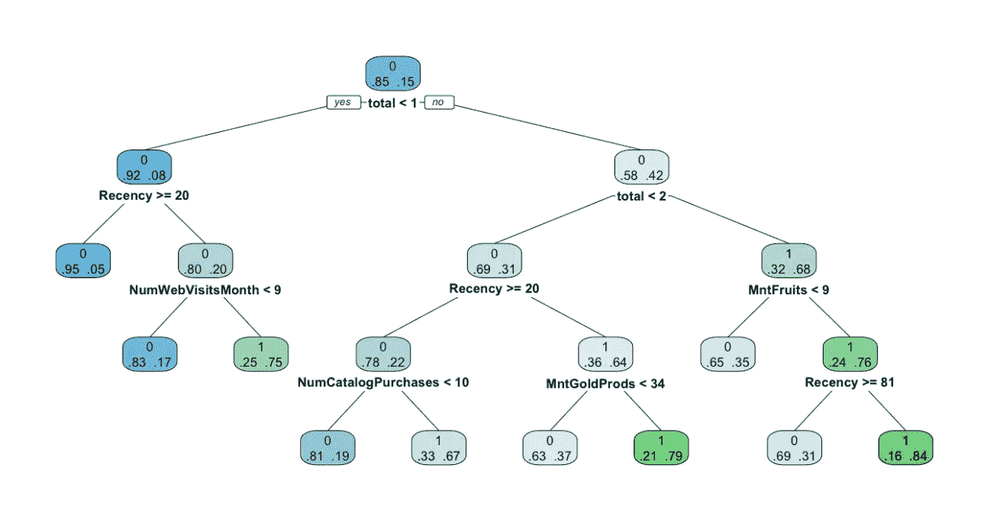
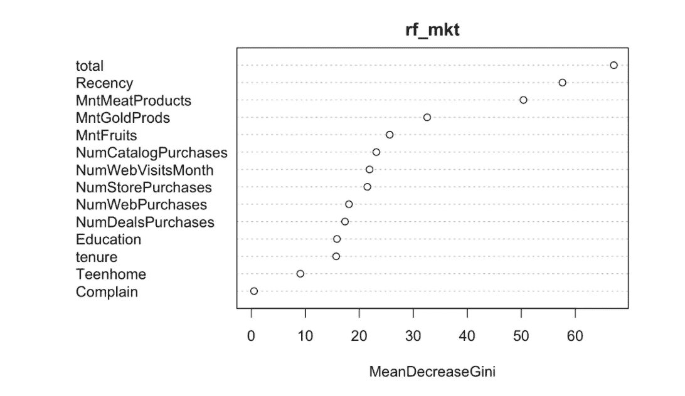

# 如何提高营销活动的回应率？

> 原文：<https://medium.com/mlearning-ai/how-can-we-increase-marketing-campaign-response-rate-81376afdb2f4?source=collection_archive---------0----------------------->

*设计基于模型的目标定位策略，以锁定正确的客户，并最大化营销活动的效用。*

根据 Statista 网站 2019 年的数据，美国公司平均在营销活动上花费了 152.09 亿美元，此后这一数字一直在快速增长。营销活动已经成为公司吸引新客户的重要工具。成功且具有成本效益的营销策略可以帮助公司保持竞争力并赢得更多市场份额。有很多因素会影响营销活动的成功，如客户的个人生活状况和购买行为。此外，针对特定和狭窄客户群的营销活动产生的利润是针对所有客户的营销活动的 4.3 倍。因此，选择一群能够产生最高利润的客户对于一个公司的营销部门来说至关重要，是这个项目的主要目的。

在 Kaggle 上找到的数据集属于零售公司 X。通过分析客户信息数据集，我可以找到哪些因素与其市场活动的成功显著相关，并生成基于模型的目标定位策略，以帮助 X 公司锁定正确的客户，并最大化其活动效用。

**数据清理和准备**

为了找到可能影响活动响应率的因素，我使用“响应”作为因变量，如果客户在上次活动中接受了报价，则为 1，否则为 0。其余 29 个变量被认为是预测因子。我首先检查缺失值，注意到“收入”中有几个缺失值。考虑到简单地删除所有带有缺失值的观察值可能不是最好的主意，我决定用这些观察值的变量平均值替换缺失值。然后，我做了一些数据操作，比如创建一个名为“Total”的新列，它表示一个客户响应的活动的数量，根据之前的五个活动结果进行计算。对于“婚姻状况”这样的分类变量，有许多不同的值，但可能代表相同的婚姻状况。所以我把这些价值观分为 4 类，单身，已婚，单身，不确定。

在完成数据操作之后，我开始进行探索性的数据分析。我画了一维边际分布图，看看每个个体变量的分布，看看有没有变量需要转换。为了找到最适合“反应”的模型，我不得不去掉一些不重要的变量。我通过绘制二维相关图来做到这一点，看看单个变量是否对因变量有影响。如果有明显的相关性，我会保留它，否则，我会放弃它。在分析了相关图后，我保留了 21 个变量。

下面是我**探索性数据分析**的链接:file:///Users/唐文静/桌面/课程/MQM/秋季%201/Data % 20 科学/个人% 20 项目% 20/个人-项目-DS.html

**建模与评估**

在运行模型之前，我将数据随机分成 80%的训练数据集和 20%的测试数据集。我还使用了套索变量选择方法，在剩下的 21 个变量中选择变量，使用套索后还剩 17 个变量。

**后套索——逻辑回归:**我用逻辑回归作为我的后套索模型之一来预测竞选响应率。混淆矩阵显示，该模型的预测准确率达到 0.80。根据回归模型，教育水平、总数(以前的活动响应率)、最近、肉类购买量、网络购买频率和任期具有 P 值小于 0.05 的正系数，这表明这些变量是显著的。受教育程度较高、更喜欢购买肉制品、喜欢网上购物、先前活动响应率较高、与公司相处时间较长的客户更有可能接受活动报价。所以我建议 X 公司多关注具备以上属性的客户。

**Post Lasso —决策树:**决策树在每个分支的末端生成概率，因此很容易解释。由于我的因变量是一个分类变量，我决定运行一个分类决策树模型。模型给我的预测精度是 0.86。正如我们从树形图中看到的，模型选择了总量(以前的活动响应率)、最近度、水果购买量、网络购买频率作为标准。这是有道理的，因为那些对之前的活动反应更大的人和最近购买的人将有更大的机会对现在的活动做出反应。X 公司可以根据这些类别收集其客户数据，然后根据决策规则选择一组客户作为目标。

Classification Decision Tree Plot

**Post Lasso——随机森林**:我还对我的测试数据运行了一个随机森林，它产生了 0.89 的预测精度。正如我们所看到的，前几个重要变量是总量(以前的活动响应率)、近期、肉类、黄金和水果的购买量。结果与之前的逻辑模型和决策树非常一致。随机森林的预测能力很好；但是，很难解读。这是一种黑盒算法。通过查看变量重要性图，我将得出结论，在预测回复率时，重要性图顶部显示的变量非常重要。但是，我无法具体说明哪些变量对回复率有正面影响，哪些变量对回复率有负面影响。

Random Forest Variable Importance Plot

随机森林具有最高的预测准确性，因此我决定使用随机森林作为我的最终模型。基于我的模型结果， ***(前一次活动响应率)、近期、肉类、黄金和水果购买量*** 是重要的预测因素。对于 X 公司来说，这是一个很有价值的决策规则，在启动未来的活动之前必须知道。如果 X 公司关注具有上述属性的客户群体，而不是针对所有客户，它可以产生更多的目标广告，提高活动响应率，以及降低总体成本。一个缺点是随机森林没有为结果指明方向，有时使用领域知识不足以决定具体的标准。在这种情况下，我建议 X 公司结合其他模型，例如，物流回归，以获得每个重要变量的方向。

使用 A/B 测试来比较目标群体和所有客户之间产生的收入也是一个好主意。X 公司可以使用 Lift(目标群体产生的收入/所有客户产生的收入)作为比较标准。一个更高的提升表明更多的收入来自目标群体，而不是全部客户。如果出现更高的提升，我会建议 X 公司在未来的营销活动中使用基于模型的目标战略(针对具有某些属性的客户)。

**部署**

瞄准所有客户可能成本高昂且效率低下。使用随机森林模型，X 公司将准确预测可能影响活动响应率的变量，然后结合逻辑回归模型来获得每个变量的准确方向。这被认为是一个有价值的决策规则制定过程。然而，它仍然有一些缺陷和局限性。

**陷阱和局限:**X 公司应该考虑两类错误。第一种是 X 公司预测客户不会回应；然而，客户会在现实生活中接受报价。X 公司将失去这些客户，因为营销活动材料不会首先发送给这些客户。这种类型的错误将导致利润的损失，甚至从长远来看失去客户。第二类错误是 X 公司预测客户会接受报价；然而，他们没有。这种类型的错误更为严重，因为它导致了一定数量的无法收回的成本。

**风险和缓解:**为了减少上面讨论的错误，我建议 X 公司收集尽可能多的数据，以便做出更好的预测。当使用机器算法进行预测时，结果只能依赖于我们在数据库中的信息。因此，如果数据库包含有偏见的数据，某些客户群体可能不会得到足够的重视。拥有一个试点项目也是一个好主意。比较使用基于模型的选择之前和之后产生的收入，X 公司可以看到收入的增加是否足以支付建模成本。拥有多个模型并进行多次测试也有助于降低错误率。

有伦理方面的考虑。每当涉及到数据收集，隐私总是一个巨大的问题。X 公司必须非常小心地保护这些客户数据的安全。如果这些客户数据被窃取或被他人使用，那将是一场灾难。声誉将会受损，还可能涉及诉讼。

感谢您的阅读，如果您对最大化活动效用感兴趣，请随时联系我！