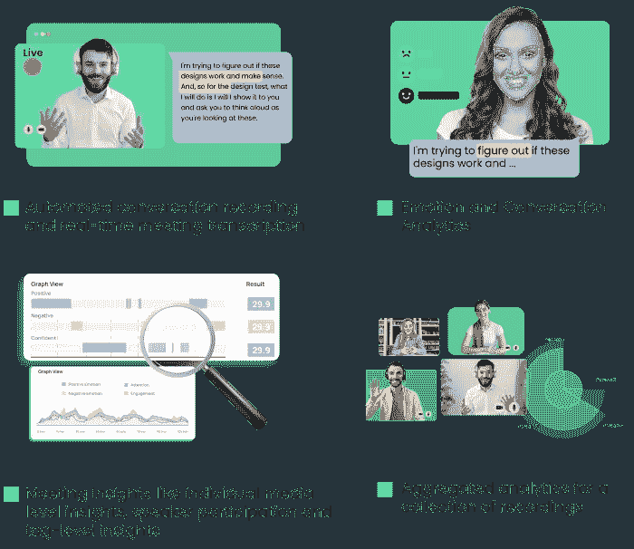
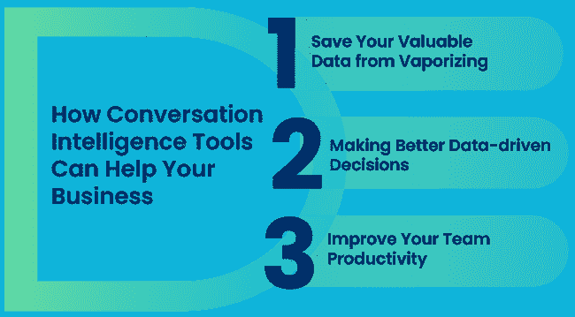

# 对话智能如何让您的企业受益

> 原文：<https://medium.com/mlearning-ai/how-conversational-intelligence-can-benefit-your-business-92aa335e5afd?source=collection_archive---------5----------------------->

如今，我们的业务运行在虚拟对话上，我们都在收集对话数据。但很难从这些数据中获得价值，这就是为什么如此多的企业迅速采用对话智能技术解决方案来从这些对话数据中获得洞察力。

如果你还没有投资一个对话智能平台，现在是时候让它成为你的技术堆栈的一部分了。因为分析这些对话对每个企业来说变得越来越重要。

如果您想了解更多关于对话智能(CI)的信息，它是什么，它是如何工作的，以及对话智能平台如何帮助您的业务，请继续阅读！

# 什么是对话智能？

众所周知，自从疫情开始以来，我们已经举行了多次虚拟会议。从每天与同事、客户和候选人联系，我们在这些对话上花了很多时间。确切地说，在新冠肺炎期间，我们在这些对话中花费了超过[55 亿分钟](https://www.entrepreneur.com/article/353419)。但是你利用了隐藏在这些对话中的有价值的信息吗？嗯，大多数人不知道——因为很难分析这些对话。这就是对话智能技术可以发挥作用的地方——它可以分析这些虚拟对话，并提供可操作的见解。

换句话说，对话智能是记录和分析对话以从中获得关键见解的实践。

几个月来，我们都在记录会议，尤其是与客户或潜在客户的会议，因为它们包含了有价值的见解，有助于增加我们的销售。但是我们不能利用这些对话，因为从中提取见解涉及到审查这些录音并在它们出现时记下重要片段的乏味任务。重温这些片段并就其进行合作本身就需要额外的努力。

通过对话智能，这些对话可以被转录和分析，以提供对消费者思想的可行见解。

想知道怎么做？

嗯，对话智能平台使用 ML(机器学习)和 NLP(自然语言处理)的组合，以及面部编码技术，从这些对话数据中自发地推断出意图、情感和意义。这使得组织能够更深入、更快速地评估他们的对话数据。

简而言之，这些平台使用对话式 AI(人工智能)从你的虚拟对话中获得洞察力。

# 为什么对话智能对您企业的未来至关重要？

自从疫情启动以来，大多数企业都仅仅依靠视频会议工具来联系他们的客户、候选人和团队。他们在这些平台上投入了大量资金，因为他们知道虚拟对话和协作对于管理和运营业务的重要性。

但是，孤立的对话数据往往使企业难以从这些对话中获得价值。不同的工具和数据蔓延使得几乎不可能找到这些对话并从中获得深刻见解。

但是，如果你没有利用这些对话并从中获得价值，那就是白白浪费了很多钱。即使一些与会者从这些对话中写出了关键信息，也很难跟踪所有这些对话并获得见解，尤其是在参与了许多这样的对话之后。

进入对话智能，旨在解决这个问题。它可以通过大规模分析这些对话，帮助您从虚拟对话中获得数据驱动的洞察力。因此，今天的组织不应该忽视对话智能的力量。

现在，在我们开始讨论对话智能技术可以为您的业务带来的宝贵优势之前，让我们先来讨论一下这项技术是如何工作的。

# 对话智能平台如何提供帮助？

过去的两年改变了我们相互交流的方式。如今，我们的大多数对话都是在虚拟环境中进行的，为此我们使用视频会议平台。对话式智能平台与标准的视频会议平台(如 Zoom)截然不同。这些平台不仅让你记录这些对话，还可以转录、创建这些对话的单一存储库，并分析这些对话。

这些平台让你从虚拟对话中获得洞察力。例如，如果您在网上进行客户会议，您可以通过分析客户的声音音调、面部暗示和行为细微差别来实时了解他们的兴趣水平。简而言之，通过对话智能平台，您的会议可以被转录和分析，以提供对客户思想的可行见解。

以下是对话智能平台如何帮助您从在线会议中获得更多信息:

*   自动化对话记录和实时会议记录
*   情绪和对话分析
*   会议洞察，如单个媒体层面的洞察、演讲者参与和标签层面的洞察
*   针对记录集合的聚合分析

## 1.自动化对话记录和实时会议记录

虚拟会议的自动记录和转录有助于从这些对话中获得更多价值。此外，他们可以使这些会议更有成效，节省时间。怎么会？

与会者可以专注于对话，因为他们不必担心记笔记，这是非常困难的，特别是在视频通话中。这样，他们就可以专注于谈话。此外，人们很少解密和整理他们的手写笔记，这导致重要信息丢失，但会议记录也解决了这个问题。

由于对话智能平台将记录和转录对话，人们可以快速浏览这些会议记录，以找到重要的东西。此外，CI 工具允许您在这些录音中搜索每个单词或片段，并突出显示对话中最重要的部分，从而无需收听整个会议录音。

## 2.对话分析

如今，我们都通过视频会议平台进行虚拟交流。这些平台帮助我们保持联系，保持业务运营。此外，这些平台让我们可以记录这些工作对话。但是，你从这些对话中获得了真知灼见吗？有了对话分析，你可以做到这一点。

对话分析是评估这些对话并从中获得洞察力的过程。这项技术使用人工智能(AI)、机器学习(ML)、自然语言处理和(NLP)来分析虚拟对话，并从中找到见解。

打造更好的客户体验始于倾听对话，终于行动。对话数据是公司提供良好体验的关键，但前提是你能打开这些数据。CI 可帮助您从这些数据中获得洞察力。通过使用面部编码、语音语调和基于文本的情绪分析等技术，它可以让您挖掘客户的情绪，并理解这些虚拟对话中微妙的人类元素、行为细微差别和上下文。

例如，您可以使用这项技术分析您的客户对话的情感，您将深入了解这些对话的背景和情感内容。通过了解情绪，你可以很快发现客户真正想要的是什么。并通过利用这些见解改善您的客户体验(CX)。

## 3.利用对话智能取得成功

众所周知，如今，我们的业务是在虚拟会议上运行的，为了利用这些对话，大多数组织都在记录它们。问题是，在一个工作周内，这可能会导致一系列会议记录堆积在书架上——因为很难找到并浏览这些对话，所以忘了从中获得见解。

[对话智能平台](https://entropiktech.com/decode/)可以帮助企业克服这些障碍；这些软件的标准功能是对话记录、实时转录、对话管理、MOM 生成、洞察生成、搜索、突出显示和共享。

Conversation intelligence 软件可以分析大量的对话数据以产生洞察力，但大多数企业认为它只能[分析销售对话(通话)](https://entropiktech.com/whitepapers/conversational-intelligence-in-sales-how-ci-is-helping-sales-teams/)。然而，您可以使用对话智能来分析任何对话，从人力资源对话(招聘)到客户服务电话到市场研究对话，等等。你可以在任何地方使用 CI 工具——有很多对话发生的地方，需要对话洞察力的地方。

我们都知道虚拟对话会一直存在，所以你也可以开始利用这些对话并从中获得价值。

# 对话智能工具如何帮助您的企业

想要使用 CI 工具，但不确定它们如何帮助您的业务？以下是 CI 可以让你的整个公司更上一层楼的几种方法。

## 1.保护您宝贵的数据不被蒸发

记录和转录 100%的对话，让它们触手可及。CI 平台让您的团队记录并内化所有会议的知识。无论是全体会议、销售会议、设计评审、站立会议还是客户会议，组织中的每个成员都可以访问并利用这些对话数据。

## 2.做出更好的数据驱动型决策

记录会议很容易；从他们身上获取洞察力并不容易。借助 CI 工具，您可以从公司现有的最大数据源之一(即虚拟对话)中获取洞察力。在这些尚未开发的录音系统中，你可以找到任何你想知道的关于你的客户、销售代表、团队成员和商业决策的信息。

## 3.提高您的团队生产力

在这个遥远的第一世界，虚拟会议是人类合作的支柱，对话智能让你专注于这些对话，而不是匆忙做笔记。想让自己的沟通更有效率？CI 工具使向不能参加会议的队友发送笔记和会议摘要变得容易。

此外，这些工具使您的虚拟对话变得可搜索，因此您可以穿过噪音，快速从这些对话中找到您想要的任何内容，帮助企业从这些对话中发掘新的数据和见解。

# 不要忽视对话智能

这些天我们都有很多虚拟对话。如果你想从这些对话中获得更多，你尤其需要投资 CI 工具，因为分析你的对话数据变得越来越重要。是的，对话智能是一项相对较新的技术，但有很多关于公司从使用 CI 解决方案中获得的价值的讨论。事实上，今天许多组织都在使用它来提高其销售和支持团队的效率，但这项技术可以做的远不止这些，因此这些 CI 平台应该是您技术堆栈的一部分。

*最初发表于*[*【https://entropiktech.com】*](https://entropiktech.com/blogs/conversational-intelligence-what-why-how-top-benefits-of-ci-for-business/)*。*

 [## Mlearning.ai 提交建议

### 如何成为 Mlearning.ai 上的作家

medium.com](/mlearning-ai/mlearning-ai-submission-suggestions-b51e2b130bfb)