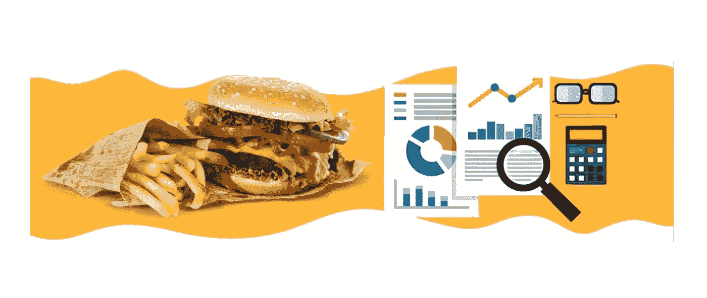
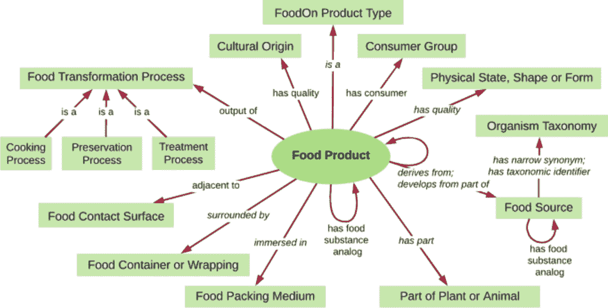
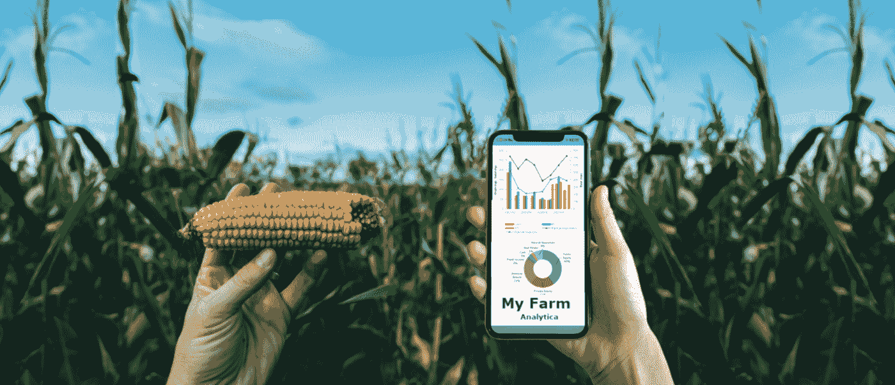
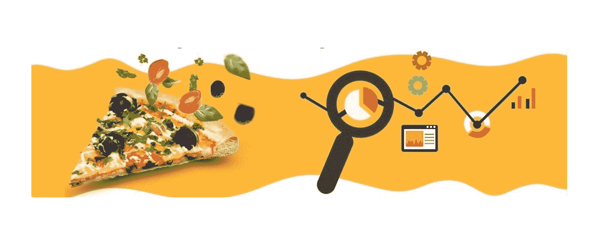
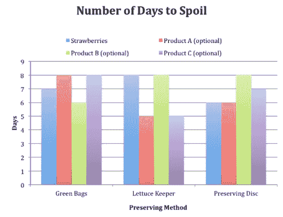
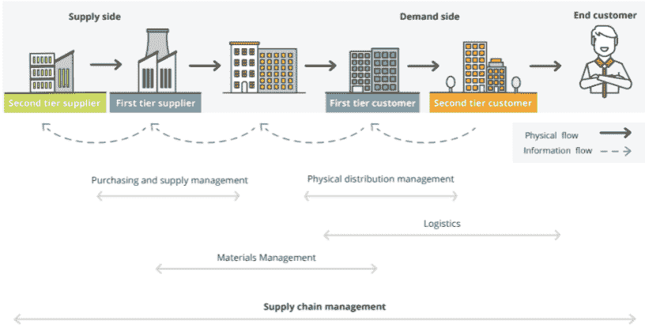
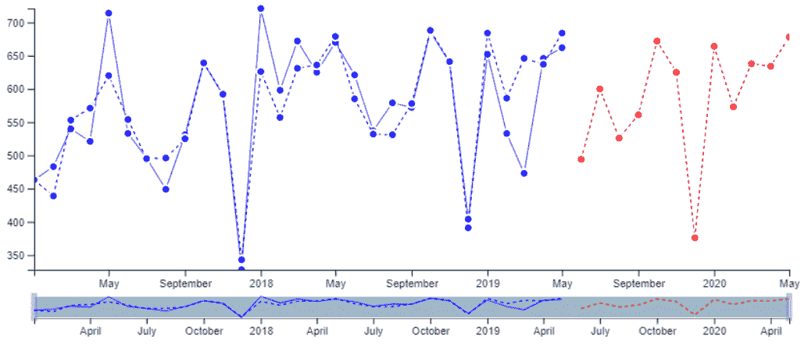

# 数据科学如何推动食品行业的发展？

> 原文：<https://medium.com/mlearning-ai/how-data-science-is-evolving-the-food-industry-1ad02f3f9952?source=collection_archive---------0----------------------->

## 数据科学在食品行业中的作用/应用

Reference: [Link](https://www.brsoftech.com/blog/big-data-analytics-in-the-food-and-beverage-industry/)

# 介绍

毫不奇怪，食品工业是世界上最重要的工业部门。作为顾客，我们需要新鲜、干净、健康的食品，而作为利益相关者，我们需要为食品制造、食品发现、顾客问题、顾客偏好、供应链管理等找到有效的输出。与此同时，数据科学和大数据凭借其巨大的应用在各个领域蓬勃发展也就不足为奇了。因此，许多食品科技行业正在机器学习和人工智能(AI)的帮助下解决问题。

在当今时代，由于新的食品发现和食品配送选择，食品工业正在不断发展。此外，食品制造公司越来越多地了解客户的偏好，临时制定质量标准，并使用大数据分析和机器学习算法来满足客户的需求。

# 食品行业的数据科学/大数据分析如何？

*   质量控制——健康管理
*   提高效率
*   即兴见解
*   营销
*   顾客情感分析
*   预测产品的寿命
*   供应链管理——准时交付
*   请求预报

## **健康管理—质量控制**

*   各种蔬菜和水果、乳制品等都是温度敏感物品，需要监控温度。因此，可以使用大数据分析来监控这些项目，同时考虑整个供应链周期。这些都给予充分的机会来更换或返回这些项目，并采取预防措施时，质量受到损害。
*   大数据驱动的解决方案也可用于在产品生产过程中检查材料质量。
*   此外，进行关于供应变化管理和来自消费者的产品质量的反馈调查可以帮助品牌通过数据分析和机器学习即兴进行客户服务管理和不充分的食品质量管理。

Reference: [Link](https://www.nature.com/articles/s41538-018-0032-6)

## **提高效率**

*   通过对获取的数据应用数据分析和各种 ML 算法，可以提高产品的效率。例如，天气预报可以帮助农民收割庄稼，帮助运输公司，帮助餐馆了解顾客的情况和价格，等等。
*   此外，农场区域的温度、湿度、土壤中的养分等信息可以指导了解特定农场区域中作物生产可以使用的严重影响。
*   预测算法的应用可以避免大量产品受损。因此，了解天气状况将指导托运人有效地运输产品。
*   数据科学可以作为一种强有力的工具，帮助餐馆老板制定他们的商业战略，以建立或维护他们的品牌。

Reference: [Link](/trends-in-data-science/data-science-in-agriculture-bd172cf5cdb9)

## **即兴见解**

*   数据分析和数据科学可以应用于餐馆或任何食品细分行业，以了解客户满意度、定价、品牌价值或受欢迎程度、产品质量、产品受欢迎程度、市场情况等。因此，创新的解决方案可以用来有效地分析获得的数据，以制定业务战略。

Reference: [Link](https://www.brsoftech.com/blog/big-data-analytics-in-the-food-and-beverage-industry/)

## **营销**

*   即兴见解可以帮助公司营销传播意识和获得潜在客户。
*   数据科学有助于根据订单价值、人口统计、产品购买模式、客户反馈等来了解各种客户及其需求。这最终有助于策划营销活动。
*   比如 Zomato(在线订餐 app)，根据之前的购买和位置识别给出推荐。而且对于具体的餐厅，根据以往的订单给出优惠和折扣。因此，数据科学有助于吸引潜在客户。

Reference: [Link](https://engineerbabu.com/blog/implementing-data-science-to-a-food-ordering-app/)

## **客户情绪分析**

*   客户情感分析是指当客户与某些产品、服务或品牌互动时，检测客户情感的过程。
*   了解顾客想要什么以及如何保持供应有助于食品行业留住老客户并获得新客户。
*   这可以通过使用自然语言处理(NLP)将客户的反馈或评论分类为正面、负面或中性部分，并基于这些部分和相应的部分要求来改进决策来实现。

Reference: [Link](https://technogeekstmr.wordpress.com/2020/08/04/global-emotion-recognition-and-sentiment-analysis-software-market-2020-2026-growth-trends-covid-19-impact-analysis-leading-players-competitive-strategies-and-2026-future-prospect/)

## **预测产品寿命**

*   一切都有一定的时间表，食品也是如此。在一段时间后，它可能会改变或过期。
*   管理不同保质期的食品和饮料对行业来说是一个巨大的挑战，因为每一类都有不同的程序。
*   数据科学和数据分析可用于预测各种产品的寿命，如乳制品、烘焙产品、葡萄酒、含糖饮料等。
*   这可以有助于避免产品浪费(节省金钱和时间)并引导用户在过期前消费以避免副作用(保护健康)。

Reference: [Link](https://www.education.com/science-fair/article/preserving-foods/)

## **供应链管理**

*   消费者希望了解食品是如何生产的，使用了哪种材料，产品是如何储存的，使用了什么化学品等等。
*   数据科学有助于在供应链中建立透明度，因此他们可以对客户更加诚实。
*   透明度也有助于解决问题，提高供应和物流的效率。例如，将更容易跟踪受污染的食品供应到它们的存储位置，减少食源性疾病的机会。
*   数据科学也有助于按时交付产品。它有助于理解可能影响交付的因素，如交通、路线、气候条件等。然后，可以创建模型来估计交货时间。

Reference: [Link](https://www.maersk.com/supply-chain-logistics/management?&msclkid=7dc11f9e59de1518e7577f4f832f5dcb&utm_source=bing&utm_medium=cpc&utm_campaign=INDIA%7CEN%7CBI%7CGEN%7CE%7CSupply-Chain-Management&utm_term=supply%20chain&utm_content=INDIA%7CEN%7CGO%7CGEN%7CE%7CSupply-Chain-Management_Pure&gclid=7dc11f9e59de1518e7577f4f832f5dcb&gclsrc=3p.ds)

## **需求预测**

*   为了使组织的收入最大化，保持有效的生产计划需求预测、降低底线费用和精确的资源分配是至关重要的。
*   例如，一家连锁餐厅可以跟踪其顾客来访的时间和重复次数，并估计他们是否(以及何时)会再次光临。
*   他们还可以使用情感分析来了解客户最喜欢的食谱，并相应地计划产品交付和厨师的工作。

Reference: [Link](https://www.skuscience.com/)

# **实时应用**

一些公司正在为食品产品创新和解决方案实施数据科学和分析，因为他们意识到了业务的变化和他们合理的利润。

*   [**芝士蛋糕工厂**](https://www.thecheesecakefactory.com/) 利用大数据驱动软件来处理和分析来自美国 175 个地点的庞大数据集
*   [**FreshDirect**](https://www.freshdirect.com/) 使用传感器、处理和分析数据来监控运输过程中的产品状态和环境条件。
*   [**Connecterra**](https://www.connecterra.io/) 设计了一个基于预测分析的工具，帮助农民确定牛的健康问题。
*   [**Yield**](https://www.theyield.com/)公司已开发出监控种植床和整个农业生态系统的解决方案，并预见任何出现的问题。
*   众所周知的 [**餐厅肯德基**](https://www.kfc.com/) 利用大数据分析顾客反馈和食物偏好，从而提供更好的顾客体验和销售。
*   [**亮籽**](https://brightseedbio.com/) 利用 AI、预测分析、大数据识别有益植物化合物。数据被用来创造生物活性物质，这些生物活性物质可以被添加到食物中使其变得健康。
*   [**Quantzig**](https://www.quantzig.com/) 专注于食品行业的商业端。其产品帮助公司进行战略规划，以做出更好的营销、销售和定价决策。

# **最终想法**

尽管如此，数据科学和分析解决方案在任何食品行业都有各种各样的使用案例。这种技术使得最有效的策略可以坚持下去。尤其是在预测分析能力方面，这要归功于人工智能驱动的能力。

有很多公司提供这样的食品技术解决方案，但通常他们不能满足你所有的具体要求，这使得很难找到你到底需要什么。

## 参考

*   [https://www . byteant . com/blog/how-big-data-is-boosting-food-industry-the-best-examples/](https://www.byteant.com/blog/how-big-data-is-boosting-food-industry-the-best-examples/)
*   [https://juhi 95 . medium . com/data-science-in-food-industry-d85ce 303 e 744](https://juhi95.medium.com/data-science-in-food-industry-d85ce303e744)
*   [https://seleritysas . com/blog/2019/07/30/how-data-science-and-analytics-changes-the-food-industry/](https://seleritysas.com/blog/2019/07/30/how-data-science-and-analytics-changes-the-food-industry/)
*   [https://blog . umetrics . com/four-uses-of-data-analytics-in-the-food and-beverage-industry](https://blog.umetrics.com/four-uses-of-data-analytics-in-the-food-and-beverage-industry)