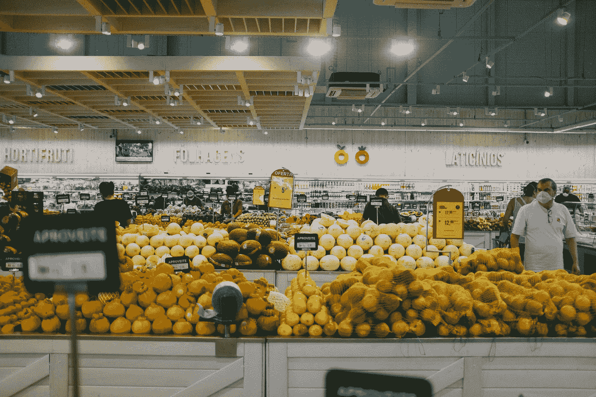
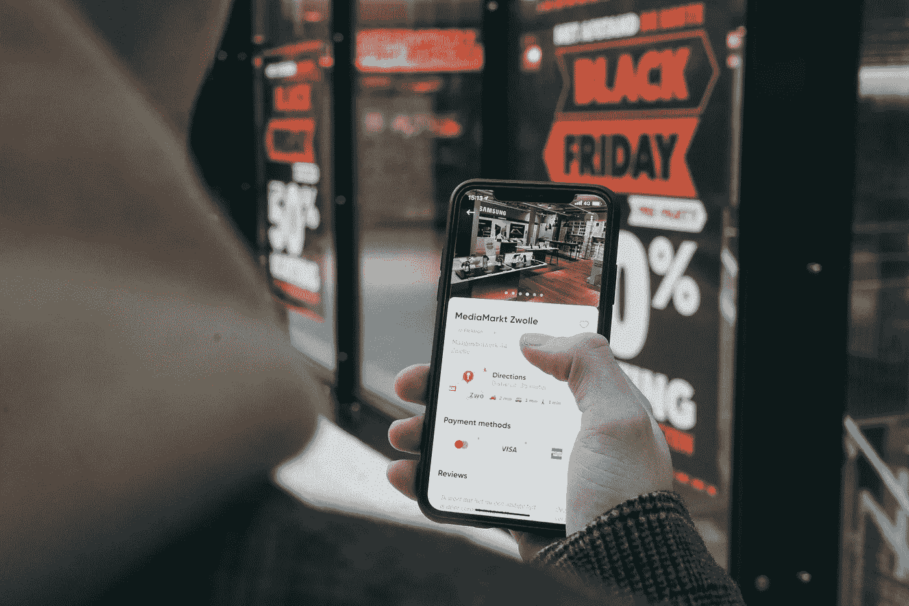
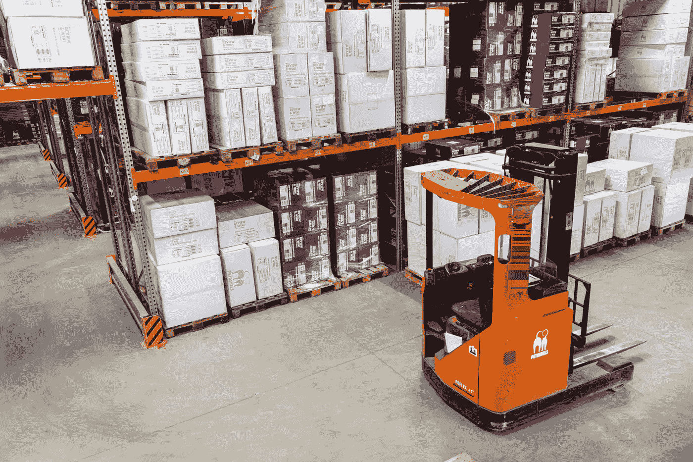

# 数据科学如何应用于零售业

> 原文：<https://medium.com/mlearning-ai/how-data-science-is-used-in-retail-ad43a2b77f7c?source=collection_archive---------3----------------------->

> 问题是，当我走进商店时，我不想被推销。我希望受到欢迎。苹果公司零售高级副总裁安吉拉·阿伦茨

Photo by [Dennis Siqueira](https://unsplash.com/@densiq?utm_source=unsplash&utm_medium=referral&utm_content=creditCopyText) on [Unsplash](https://unsplash.com/?utm_source=unsplash&utm_medium=referral&utm_content=creditCopyText)

数据科学帮助零售企业捕捉行为和利用客户数据，并将其转化为可操作的见解，从而增加收入。以下是零售业如何使用数据的几个例子:

*   大多数购物者在进入零售店时会转向右侧(Underchill，2009 年，第 77-79 页)
*   大部分不太贵的产品或者对高收益没有贡献的产品都保持在某个高度。
*   零售商根据销售季节改变产品的位置。

现在让我们一个一个的了解大图:

## 营销

***交叉销售***

Photo by [John Schnobrich](https://unsplash.com/@johnschno?utm_source=unsplash&utm_medium=referral&utm_content=creditCopyText) on [Unsplash](https://unsplash.com/s/photos/online-shopping?utm_source=unsplash&utm_medium=referral&utm_content=creditCopyText)

当你去做一个简单的发型时，你的发型师会推荐一个打折的水疗中心，或者当你买一台笔记本电脑时，你会得到一个打折的包或者一个笔筒。我们认为这是一笔好交易，但这是一种营销策略，已经使用了很长时间。交叉销售是向现有客户销售额外产品或服务的行为或实践([维基](https://en.wikipedia.org/wiki/Cross-selling))。数据科学用于优化商店促销，以链接补充项目和更好的促销捆绑包。电子商务网站也用同样的方法。我们浏览电子商务网站只买一件商品，但最终总是买不止一件。

***基于位置的营销***

LMS 或基于位置的营销是一种策略，其中组织通过在线和离线消息传递在粒度级别上锁定消费者。数据用于了解基于用户运动或行为的趋势和模式。这些数据用于基于位置的细分，并实施有针对性的营销策略。

***购物行为分析***

Photo by [CardMapr.nl](https://unsplash.com/@cardmapr?utm_source=unsplash&utm_medium=referral&utm_content=creditCopyText) on [Unsplash](https://unsplash.com/s/photos/shopping?utm_source=unsplash&utm_medium=referral&utm_content=creditCopyText)

收集数据以跟踪零售店中买家行为的过程。它回答了买家购买更多的是什么样的产品，一次有多少顾客在商店里，预测买家什么时候会再来，下次会买什么样的产品。零售商利用这些数据制定不同产品的折扣策略。

为什么买家会在商场花更多时间？也许他们找不到所需的产品，或者买家感到困惑。买家在结账柜台花了多长时间？针对所有这些问题，实施了数据驱动的解决方案。

***情绪分析***

Photo by [Clay Banks](https://unsplash.com/@claybanks?utm_source=unsplash&utm_medium=referral&utm_content=creditCopyText) on [Unsplash](https://unsplash.com/?utm_source=unsplash&utm_medium=referral&utm_content=creditCopyText)

情感分析是对文本的挖掘，了解产品的社会情感。我相信现在当数据科学家分析评论或任何其他文本数据时，情感分析不仅限于文本挖掘。Moder 面部识别软件将帮助零售商捕捉商店内买家的情绪，这将有助于零售商同时采取行动。有了情感分析，零售商可以专注于反馈，他们可以找出讨论更多的产品。他们对员工的行为满意吗？以及许多其他的问题。

## **供应链**

***库存管理***

Photo by [Petrebels](https://unsplash.com/@petrebels?utm_source=unsplash&utm_medium=referral&utm_content=creditCopyText) on [Unsplash](https://unsplash.com/s/photos/inventory?utm_source=unsplash&utm_medium=referral&utm_content=creditCopyText)

小型零售企业使用固定的规则来预测产品需求，比如只考虑上个月售出的产品。但通过机器学习，库存优化是通过缩短客户订单履行时间来实现的，通过预测实际需要的产品来减少存储空间。拥有适量的库存总是一个挑战，如果产品缺货，客户会转向竞争对手。这个想法是顾客可以随时购买任何他们想要的东西，任何时候不能提供任何产品都会给组织带来损失。

## 推荐产品

推荐系统无处不在，零售商也可以通过推荐新产品(替代产品)或其他产品来利用它。这有助于增加收入。

## 开一家新店

Photo by [Mike Petrucci](https://unsplash.com/@mikepetrucci?utm_source=unsplash&utm_medium=referral&utm_content=creditCopyText) on [Unsplash](https://unsplash.com/s/photos/new-store?utm_source=unsplash&utm_medium=referral&utm_content=creditCopyText)

我们都会注意到的一件事是，大多数多米诺骨牌商店都在商业区或科技园区。星巴克也只专注于特定的领域，其他企业也是如此。在数据的帮助下，零售商可以找到哪里的销售额会高，或者他们从哪里获得更多的在线订单，并可以在那个位置建立一个新的商店。食品配送应用程序知道从哪里订购最多的在线食品，这可以帮助餐馆开设新的分店。同样，零售商也可以利用这些数据。

其他应用包括:

*   产品评估，哪些产品可以在店内推出。
*   商品
*   麻省理工学院发现，当人们的“停留时间”增加时，销售额也会增加。“大脑购买的方式”，*经济学家*，2009 年 12 月 20 日。零售商可以采取哪些措施来增加停留时间，比如吸引人的横幅、更好更干净的货架？

爱情！活下去！笑！干杯

参考:

 [## 大数据分析时代的零售和零售研究

### 作为一个研究领域，零售部门一直有许多吸引人的特点，如其规模，其多面性和…

www.sciencedirect.com](https://www.sciencedirect.com/science/article/pii/S016781161930062X)  [## 2020 年基于位置的营销和广告最佳指南+示例

### 再加上查看竞争对手和其他物理位置数据的能力，您就拥有了一个强大的工具包…

www.tamoco.com](https://www.tamoco.com/blog/marketing-advertising-location-data-intelligence/)