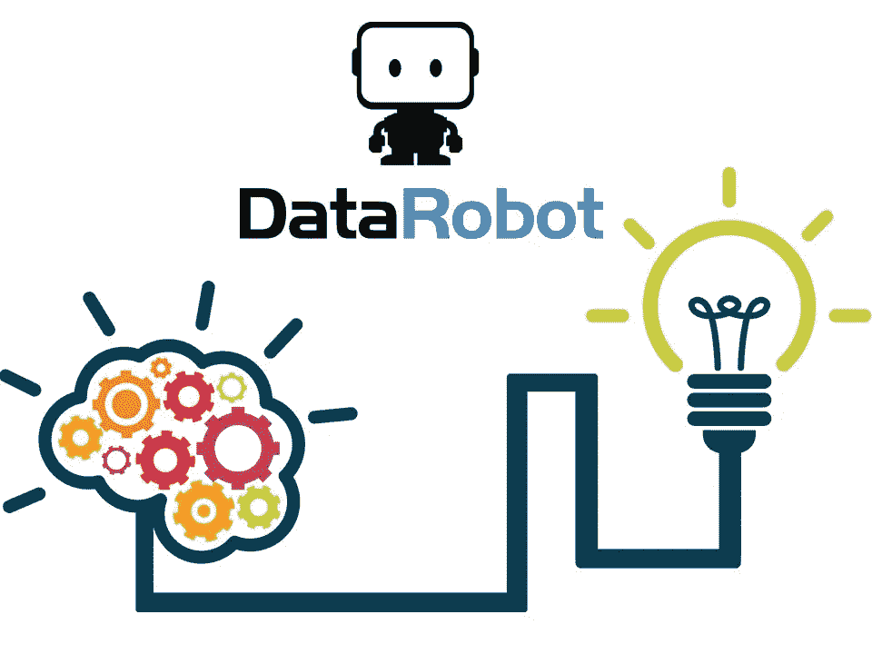
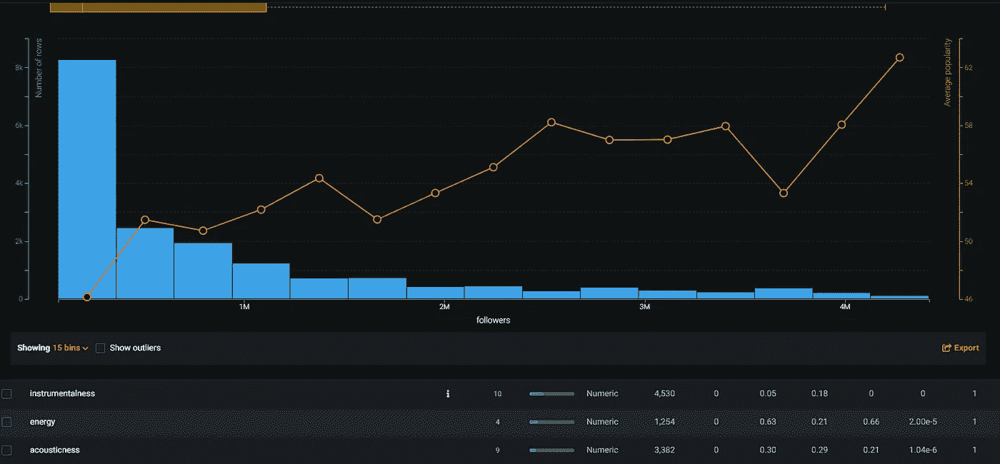
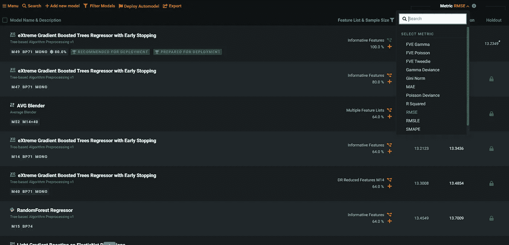
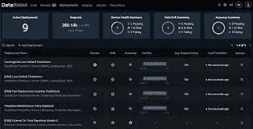
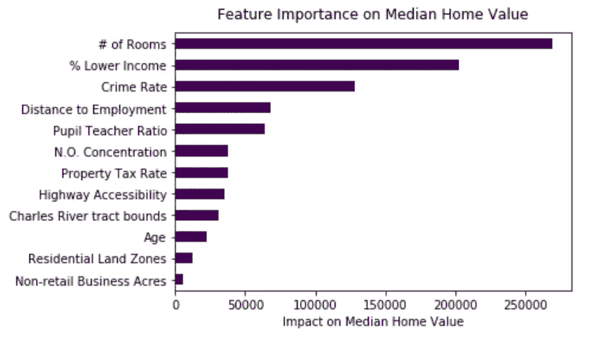
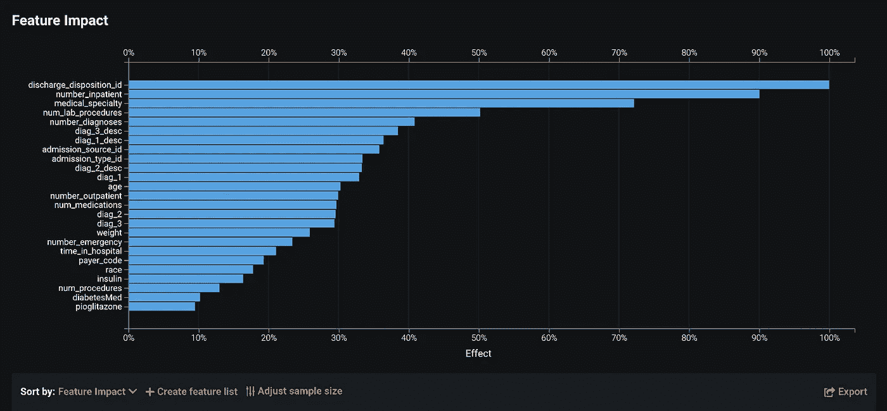
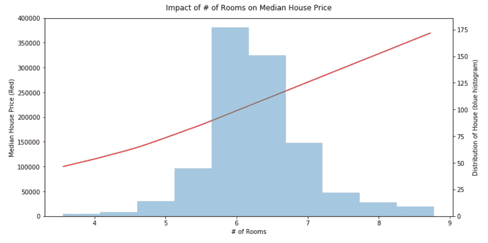
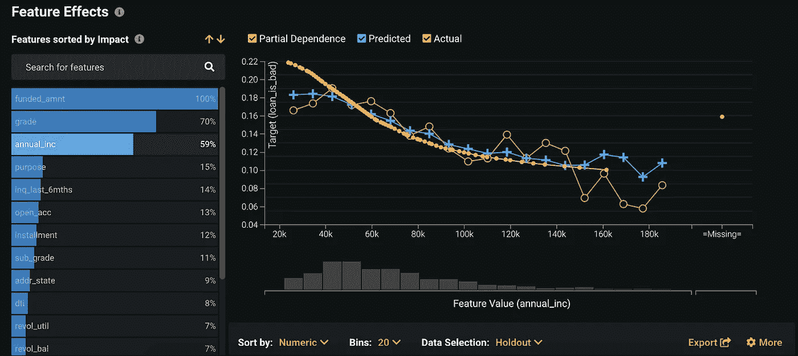

# DataRobot 如何解决机器学习

> 原文：<https://medium.com/mlearning-ai/how-datarobot-solved-machine-learning-29fb318d6308?source=collection_archive---------0----------------------->

# 快速介绍

机器学习已经解决了！我们可以庆祝一下，然后继续下一件事。不相信我？我将向你展示为什么以及如何 [DataRobot](http://datarobot.com) 释放机器学习的所有潜力。以及为什么我们终于可以开始专注于手头的问题，而不是被“你使用了哪个模型”和“你如何优化你的 hyerparameters”的技术细节所分散。现在，问题将更集中于“您如何设计问题和解决方案”以及“您使用了哪些数据”。

此外，在我们开始之前，重要的是要注意到，除了我是该产品的狂热用户和粉丝之外，我并不隶属于 DataRobot。我已经用了几年了，它对我的职业生涯和整体业务能力有很大帮助。

我们开始吧！

# DataRobot 做了什么

好吧，实际上 DataRobot 做了很多事情，只是加速了机器学习和模型创建的所有方面。下面列出主要的。

1.  **自动化探索性数据分析(EDA)**

EDA 是处理任何数据集的第一个关键步骤(许多人跳过它，但请不要…)。当您将数据集拖放到 DataRobot 中时，它将执行自动化 EDA，并突出显示一些重要内容:

*   为每一列分配数据类型，以及高级统计信息(obs 的数量、空值的数量、平均值、中间值等)。如果您不同意某个数据类型，您可以简单地更改它
*   识别数据中的异常值或问题，例如列中有太多的 0 或空值
*   识别可能导致多重共线性问题的重复或冗余列

2.**创建几十个模型，并根据性能对它们进行排名**

这是被称为“AutoML”的部分，代表自动机器学习。这也是你受益最大的部分！对数据集运行 autoML 有什么好处？

*   **让您确信**您正在使用**最具性能的模型**来处理您的数据集，而不是您可能感到舒适或习惯的数据集。您甚至可以选择您想要对您的模型进行排名的指标(参见屏幕截图中的下拉列表)。它将你的技术偏见减少了许多倍。
*   得益于自动化超参数优化，它**优化了您的超参数**。他们是如何做到如此出色的？第一，这家公司是由许多 Kaggle 大师创立的。而且，他们在机器学习上执行机器学习！也就是说，他们从人们在 DR 上运行的数百万个模型中学习，并了解什么最适合每种类型的数据集。您甚至可以在“描述”选项卡中访问超参数值。
*   这会节省你大量的时间。想想仅仅创建一个模型需要多少时间(不管你有多优秀)。现在，将这个乘以 60+倍，这就是自动驾驶运行将为您创建的模型数量。

3.**您可以快速部署您的模型并监控它们**

当您手动创建一个模型(比如使用 scikit-learn 或 Tensorflow)时，您需要部署一次手动模型，这意味着您必须自己创建 API、数据模式等，这又要花费很多时间和精力。DataRobot 只需点击一个按钮就可以自动完成这一过程！它甚至告诉你如何调用 API(为你提供 Python 代码等等)。

不仅如此，您还可以跟踪对您的模型进行了多少次调用，最重要的是，跟踪任何**数据漂移**，当您正在评估的数据与您的原始训练数据集相差太大时，就会发生这种情况。

他们真的考虑清楚了！

# 讲述你的模型的故事

这是 DataRobot 的另一个超级重要的方面。现在你已经创建了你的完美模型，你如何向你的利益相关者推销它呢？这里有两个关键部分。

1.  **功能影响**

特征影响组件列出了**哪些特征**或数据元素，您用来创建您的模型**对您的目标预测**具有最大的影响。

比如说你想预测房价，想用房子的很多方面来预测价格，比如平方英尺，到学校的距离，到高速公路的通路等等，你怎么知道哪个元素对预测房价最有冲击力呢？这就是特性影响发挥作用的地方。

基于上图(基于我[上一篇](https://www.thepythonacademy.com/post/neural-network-feature-importance-and-feature-effect-with-simple-scientific-trick)关于神经网络特征影响的文章)，可以看出卧室#对房价的影响最大，有道理！特性影响将帮助您验证您的模型的逻辑是否具有商业和逻辑意义。

DataRobot **自动为其创建的每个模型自动生成特征影响**(您可能需要为底层模型运行它)。

2.**功能效果**

功能效果将功能影响提升到一个新的水平。它不仅会告诉您哪些特性最具预测性，还会深入每个特性，并告诉您每个特性的每个值如何影响您的最终结果。

在我们之前的例子中，我们看到了卧室数量是如何预测房价的。但是它到底是如何影响 it 的呢？以下是该功能的功能效果图:

红线测量的是在改变“# of Rooms”(x 轴)时房价中位数 (y 轴)的**变化。红线清楚地表明，房间数越高，房价越高。事实上，看起来房价中值可以从 100，000 美元的 1 BR 到 360，000 美元的 9 间房，**其他一切保持不变**，这是一个**260，000 美元的波动。仅仅一个变量就让人印象深刻！****

**浅蓝色分布图将帮助您查看波士顿数据集中房间数量的实际分布。这让您了解每个值出现的频率。看起来房间数服从正态分布，最常见的值是 6。请注意，在我们的例子中,“房间数”是指不是浴室的房子中的房间数。例如，如果某人有一个客厅/餐厅(1) +一个厨房(1) +一个主卧室(1)，那就是一个 3 室公寓。**

**同样，DataRobot 允许您自动为任何模型**和用于该模型的所有变量**创建您的特征效果**。疯了！****

****

# **使用 DataRobot API 自动化 AutoML**

**这是蛋糕上的樱桃。 [DataRobot API](https://datarobot-public-api-client.readthedocs-hosted.com/en/v2.25.0/) 允许您使用上面提到的所有 DataRobot 特性，但只需在 Jupyter 笔记本上舒适地使用……这意味着您可以创建您的 AutoML 项目、启动 auto-pilot、选择您想要的任何模型、获得特性影响和效果、部署您的模型等……所有这些都只需非常简单的 Python 命令！**

**为什么这个更厉害？**

> ****data robot API 允许您自动化 AutoML****

**这意味着您可以在任何数据集上连续运行 AutoML，部署您的模型，监控它，并使用 Python 代码以自动化的方式重复一遍。我将会写一篇关于如何更详细地实现这一点的完整文章，敬请关注！**

# **结论**

**我只是触及了冰山的一角。我是这个工具的狂热用户，它是我日常生活的一部分。如果您还没有这样做，我强烈建议您根据您的专业需求来探索这个工具。**

**我希望你喜欢读这篇文章，就像我喜欢写它一样！我在[www.thepythonacademy.com](http://www.thepythonacademy.com/)兼职教授数据科学，所以如果你想要进一步的培训，或者甚至想从头开始学习，请随时在网站上联系我们。我还计划在这里发表许多关于机器学习和人工智能的文章，所以请随时关注我。请分享、喜欢、联系和评论，因为我总是喜欢收到你的来信。谢谢大家！**