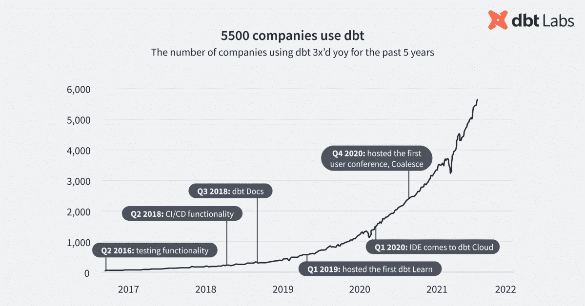

# dbt 实验室是如何建立起如此优秀的社区的？

> 原文：<https://medium.com/mlearning-ai/how-dbt-labs-built-such-an-excellent-community-3743ef014e84?source=collection_archive---------1----------------------->

## 笔记和关键见解:前 dbt 社区经理 Claire Carroll 的“如何建立社区”

from [https://theorg.com/org/dbt-labs/wires/fishtown-analytics-rebran-2e3c87dd](https://theorg.com/org/dbt-labs/wires/fishtown-analytics-rebran-2e3c87dd)

上周，分析工程领域的先驱 [dbt Labs](https://www.getdbt.com/) 宣布，它已经筹集了新一轮资金——2.22 亿美元，估值为 42 亿美元。([*)https://blog . get dbt . com/next-layer-of-the-modern-data-stack/*](https://blog.getdbt.com/next-layer-of-the-modern-data-stack/)*)*