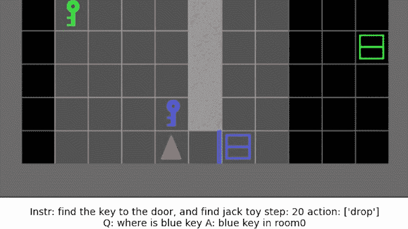

# AI 如何求知？

> 原文：<https://medium.com/mlearning-ai/how-do-ai-ask-for-knowledge-9991e2903799?source=collection_archive---------1----------------------->

## [机器学习艺术](https://mlearning.substack.com)

## SOTA —强化学习代理—代码

## 求知

AI 如何求知？这是 [**机器学习中最难回答的问题之一。**](https://mlearning.substack.com) 我们如何要求智慧？大脑被设计成从环境中提取信息并创建模型…