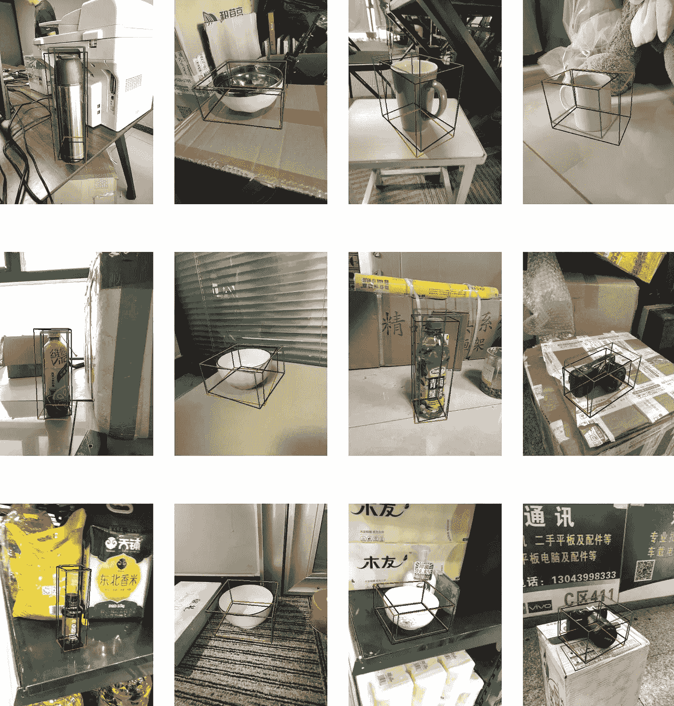

# 自主机器人是如何工作的？

> 原文：<https://medium.com/mlearning-ai/how-do-autonomous-robots-work-7e3bb8b9573?source=collection_archive---------3----------------------->

## [机器学习艺术](https://mlearning.substack.com)

## 在野外识别物体

[https://mlearning.substack.com](https://mlearning.substack.com)

## 自主机器人是 AI 吗？

自主机器人可以通过使用激光扫描仪、摄像机、麦克风、力-扭矩传感器和光谱仪等获取周围环境的信息。更简单的自动驾驶机器人，如 Roomba，使用红外线或…