# GPU 是如何工作的？

> 原文：<https://medium.com/mlearning-ai/how-do-gpus-work-13bb243c17d?source=collection_archive---------3----------------------->

这篇文章回顾了理解 GPU 如何执行代码所需要的一切。假设您了解计算机体系结构的基础知识，能够完全理解这个概念。

这篇文章从 Flynn 的分类法开始，然后进入单指令多数据(SIMD)处理器。之后，讨论了用于在英特尔、AMD CPUs 内部进行 SIMD 运算的 **x86 指令扩展**。Alos，它深入研究了**并行**和**多线程**。最后，我们到达单指令多线程处理( **SIMT** )，这是基于 GPU 的执行范例，最后以 **GPU 微架构**结束。

# 弗林的分类学[1]

弗林先生发表了一篇题为“超高速计算系统”的论文，其中他将计算系统分为四类。

注意，流指的是在程序执行期间由处理器接收的数据或指令序列。

1.  **S** 单个 **I** 指令流—S 单个 **D** 数据流( **SISD**
2.  单个指令流-多个数据流( **SIMD** )
3.  **M** 多路 **I** 指令流——S 单个 **D** 数据流( **MISD**
4.  **M** 多路 **I** 指令流— **M** 多路 **D** 数据流( **MIMD**

这些类别的示例如下。

1.  ( **SISD** )单核单线程处理器被归类为 **SISD** 计算系统。单线程意味着处理器上只有一个应用程序及其上下文。处理器的硬件资源仅被设计用于执行单个应用。

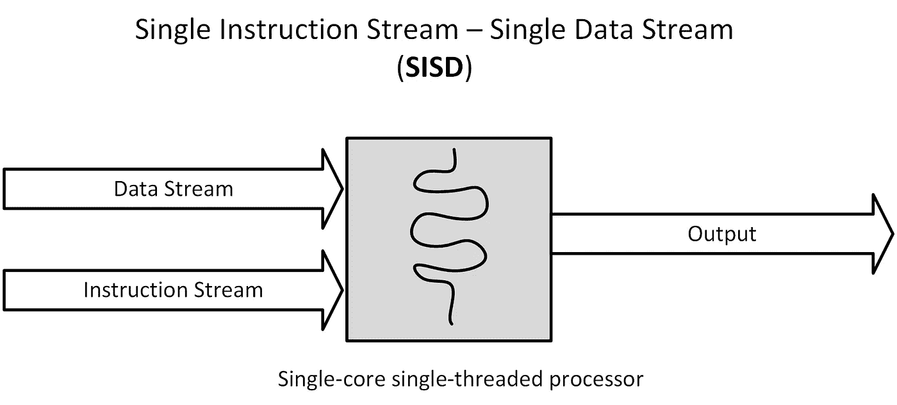

这个模型的实际例子有轩尼诗和帕特森书中的**马诺的初级计算机**和**简单 MIPS 处理器**。这些处理器一次处理一条指令。该指令可以使数据从存储器流向计算核心，或者仅对引入的数据进行计算。要了解该处理器如何工作，以及如何在 Verilog 和 Modelsim 中实现和仿真，请查看[此处](https://github.com/ehsanyousefzadehasl/MBC)和以下视频。

How to use Modelsim for Verilog Simulation

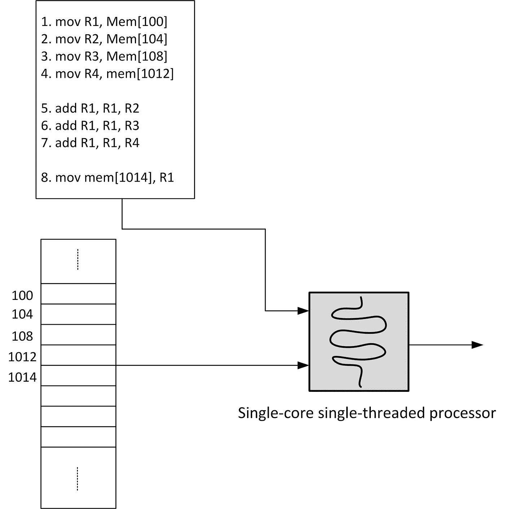

**Single Instruction stream Single Data stream**

2.( **SMID** )英特尔的 X86 SIMD 扩展是 SIMD 计算范式的范例。下图显示了 SIMD 计算机的架构[2，3，4]。

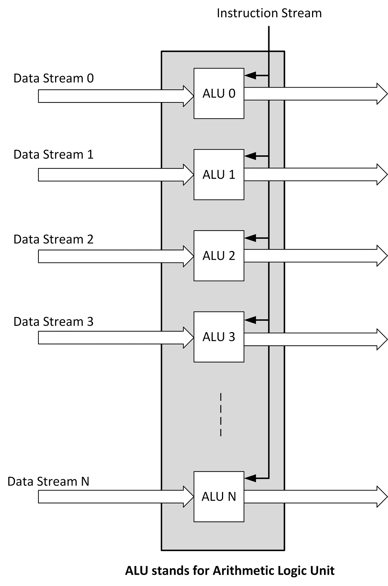

3.( **MISD** )如果我们不争论数据是如何随着时钟节拍移动的，脉动阵列可以被归类为 MISD。下图和视频展示了脉动阵列如何编排数据和进行计算。

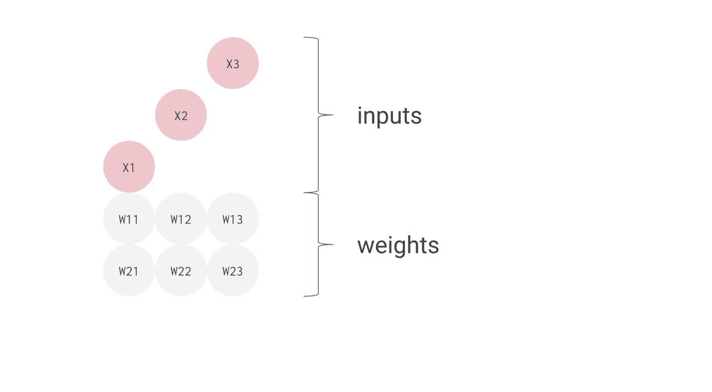

image credit [[from makegif website](https://makeagif.com/gif/systolic-array-for-neural-network-1-fsATfl)]

4.( **MIMD** )像英特尔至强融核和 AMD EPYC 这样的多核多线程处理器就是 MIMD 处理器的例子。每个内核可以使用不同的指令处理不同的数据。下图显示了 MIMD 系统的一个示例。

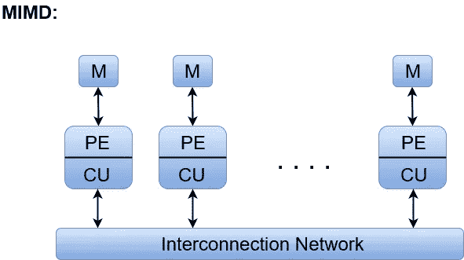

[image credited](https://www.javatpoint.com/mimd)

# 单指令多线程(SIMT)

在 SIMT 中，多个线程在不同的数据点上执行相同的指令。SIMT 的优势在于它减少了指令预取带来的延迟。下图同时显示了 SIMD 和 SIMT。

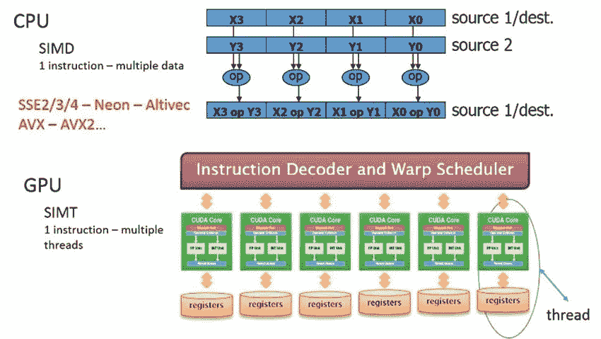

[Image credit](https://www.hardwaretimes.com/simd-vs-simt-vs-smt-whats-the-difference-between-parallel-processing-models/)

SIMT 一般用在**超标量处理器**中实现 SIMD。因此，从技术上讲，每个内核本质上都是标量，但它的工作方式仍然类似于 SIMD 模型，即利用多个线程在各种数据集上执行相同的任务。

# 多线程与多处理

多线程是具有一个处理元素**(一个计算核心)的处理器运行多个线程**的能力。具有这种能力的处理器有足够的资源(**通常寄存器**)来有效地在线程间执行**上下文切换**。下图显示了多线程的工作原理。

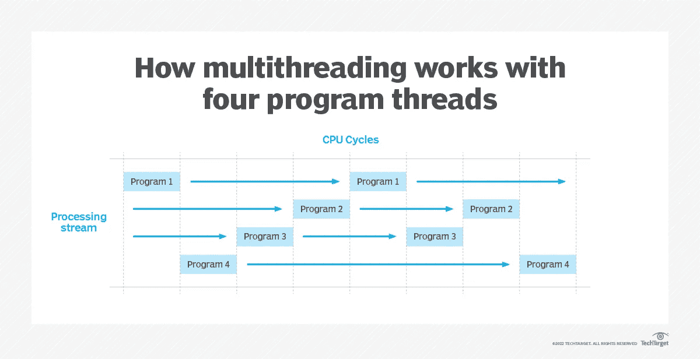

[Image credit](https://www.techtarget.com/whatis/definition/multithreading)

当我们有不止一个处理器时，就会出现多处理。下图显示了多线程和多处理的区别。

[image credit](https://www.educba.com/multithreading-vs-multiprocessing/)

多核处理器以并行方式执行线程，这意味着每个线程都有自己的内核，无需进行**上下文切换**。下图显示了多核处理器。

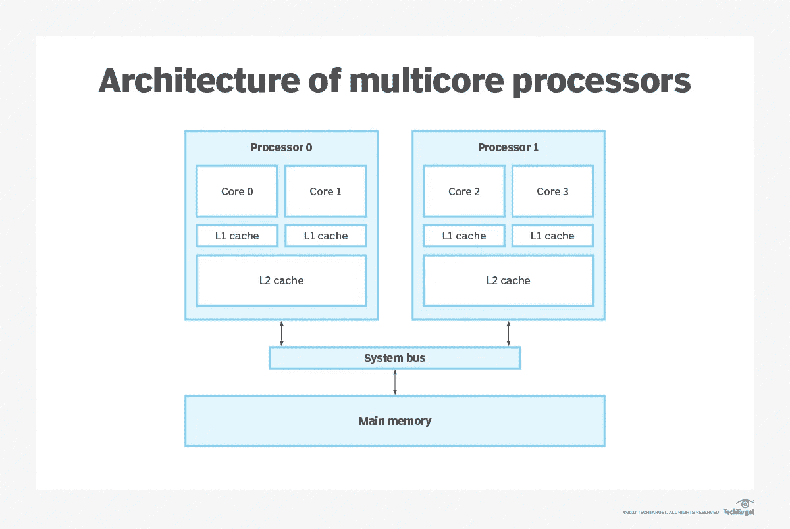

[image credit](https://www.techtarget.com/whatis/definition/multithreading)

# GPU 微体系结构

在这一点上，我们回顾了弗林的分类法，SIMD，SIMT，多线程，多处理，多核系统，这对于理解 GPU 如何工作是很重要的。

一个现代的 GPU，**采用 NVIDIA Fermi 或更新架构的 GPU**，由执行 SIMT 范式代码的多核处理器组成。这些多核处理器被称为流式多处理器(SM)。它们由较小的内核组成，能够在一个周期内完成一项操作。这些数量众多的小而简单的核心是 GPU 区别于 CPU 的关键。在现代 CPU 中，我们通常只有不到 100 个强大的核心(通常是 64 个，如 AMD EPYC 7763)。当我们说强大时，我们指的是它们可以比 GPU 核心更快地执行代码，因为它们内部有更复杂的代码执行架构。但是，由于它们的复杂性，它们也消耗更多的能量。下图显示了现代 CPU 和 GPU 的不同之处。

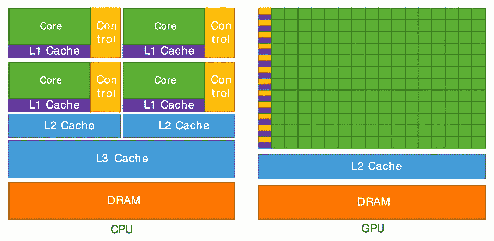

image credit [[Cornel University Virtual Workshop on GPUs](https://cvw.cac.cornell.edu/GPUarch/gpu_characteristics)]

为了更深入地了解 GPU，下图显示了英伟达的费米架构。

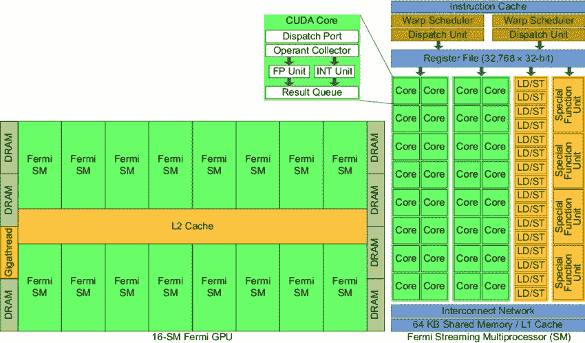

[image credit](https://www.researchgate.net/figure/Nvidias-Fermi-GPU-Architecture_fig1_288930312)

在 CUDA 框架(一个使 GPU 程序员的生活变得简单的框架，在它之前，开发人员使用图形编程语言将数据映射到图形，处理，然后将其映射回——CUDA 在 2007 年由 NVIDIA 推出，它是 C 编程语言的扩展)中开发的 GPU 程序由许多线程块组成。线程块被分派在 SMs 上执行。从行业的角度来看，他们被派遣的方式并不明显，这也不重要，因为他们应该是相互独立的。因此，它们的执行顺序并不明显。

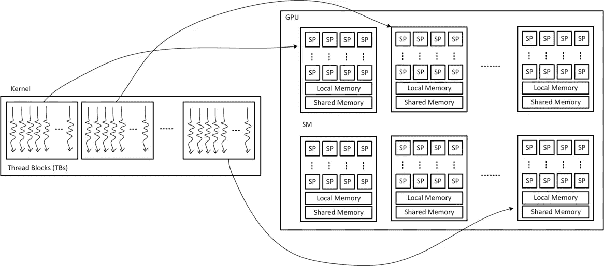

[image credit](https://github.com/ehsanyousefzadehasl/PCwGPGPUs)

每个线块被认为是一束经线。每根经纱中的纱线数量通常为 32 根**。SM 调度器单元调度 warps 以 SIMT 方式执行。每当一个 warp 的指令等待数据时，另一个 warp 被选择并开始执行。下图显示了 SM 计划如何扭曲。**

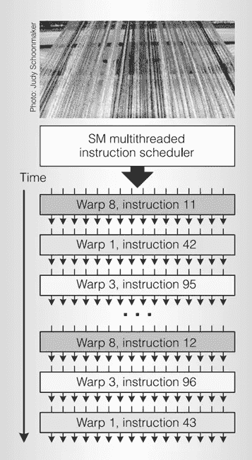

[**6**]

提到 SIMT 的问题是很重要的，在为 GPU 开发程序时要记住这一点，以避免使用像 if else 结构这样的条件语句。条件语句导致分歧。SMs 让执行到经线中的一部分线程，它们选择一条路径，而其他线程等到它们完成，然后将拥有计算核心。一些人正在执行而其他人正在等待的这个过程被称为掩蔽。这通常会导致性能下降或执行时间延长。下图显示了分歧如何发生以及如何增加执行时间的想法。

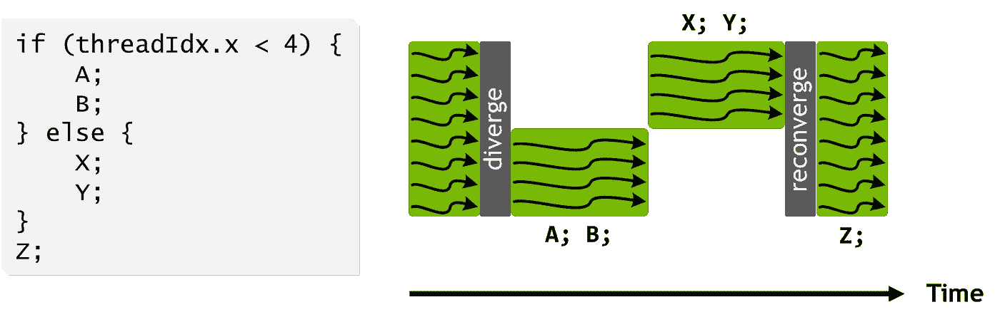

image credit [[NVIDIA blog post about inside Volta](https://developer.nvidia.com/blog/inside-volta/)]

在 NVIDIA Kepler 架构之前，从 GPU 代码部分启动线程是不可能的。从开普勒架构开始，**动态并行**启用如下图所示的这一功能。

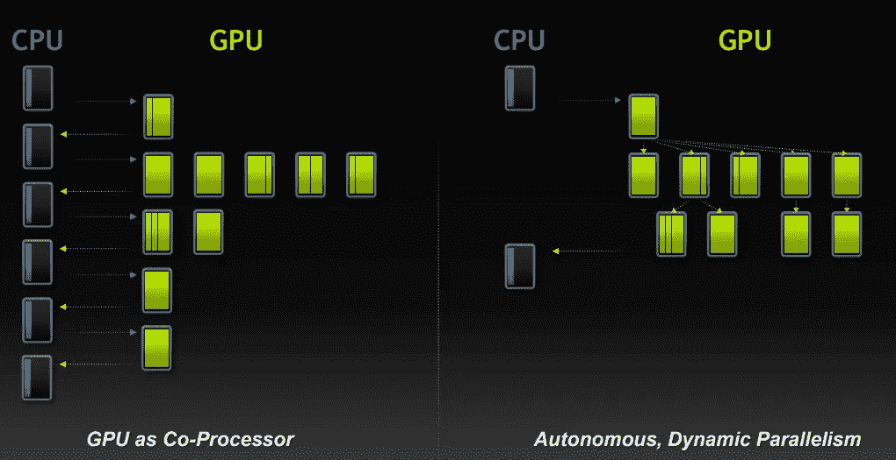

关于 GPU 如何工作和执行代码，以及如何编程和有效使用它们，还有很多东西需要学习。然而，这篇文章试图让人们更容易理解 GPU 如何执行代码。

# 结论

这篇文章回顾了 GPU 如何执行代码，并需要术语来理解差异。但是要了解更多细节，NVIDIA 白皮书会很有帮助。

非常欢迎关于如何将这个帖子发展得更加清晰和信息丰富的问题或意见。

# 参考

[**1**m . j . Flynn，**超高速计算系统，**， **IEEE** 会议录，第 54 卷，第 12 期，第 1901–1909 页，1966 年 12 月**日**，DOI: 10.1109/PROC.1966.5273

[**2**][https://www . Intel . com/content/www/us/en/develop/documentation/CPP-compiler-developer-guide-and-reference/top/compiler-reference/libraries/Intel-c-class-libraries/c-classes-and-SIMD-operations . html](https://www.intel.com/content/www/us/en/develop/documentation/cpp-compiler-developer-guide-and-reference/top/compiler-reference/libraries/intel-c-class-libraries/c-classes-and-simd-operations.html)

3[https://www.officedaytime.com/simd512e/](https://www.officedaytime.com/simd512e/)

**4**[https://www.cs.uaf.edu/courses/cs441/notes/sse-avx/](https://www.cs.uaf.edu/courses/cs441/notes/sse-avx/)

[**5**][https://stack overflow . com/questions/31490853/are-different-MMX-SSE-and-avx-versions-complementary-or-supersets-of-each-other](https://stackoverflow.com/questions/31490853/are-different-mmx-sse-and-avx-versions-complementary-or-supersets-of-each-other)

[ **6** ] Lindholm，e .、Nickolls，J.R .、奥伯曼，S.F .、& Montrym，j .、 **NVIDIA Tesla:统一的图形和计算架构。***IEEE Micro，2008* 。

 [## Mlearning.ai 提交建议

### 如何成为 Mlearning.ai 上的作家

medium.com](/mlearning-ai/mlearning-ai-submission-suggestions-b51e2b130bfb)