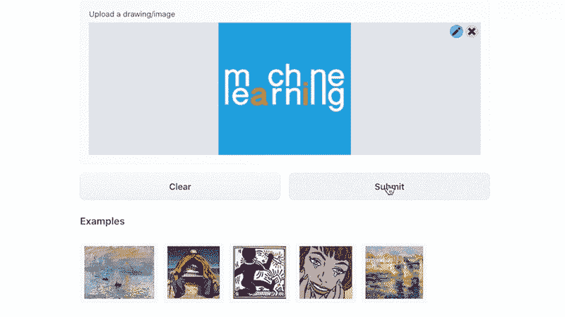

# 我如何识别我的艺术风格？

> 原文：<https://medium.com/mlearning-ai/how-do-i-identify-my-art-style-6c9c04b83ffb?source=collection_archive---------4----------------------->

## [机器学习艺术](https://mlearning.substack.com)

## 机器学习预测的艺术风格

[jkang / demo-artist-classifier](https://mlearning.substack.com)

怎样才能发现自己的艺术风格是什么？
像任何艺术家一样，发现自己的风格需要时间和努力。相反，今天就开始吧！现在就在这里使用**机器学习**模型。你只需要你的艺术品。