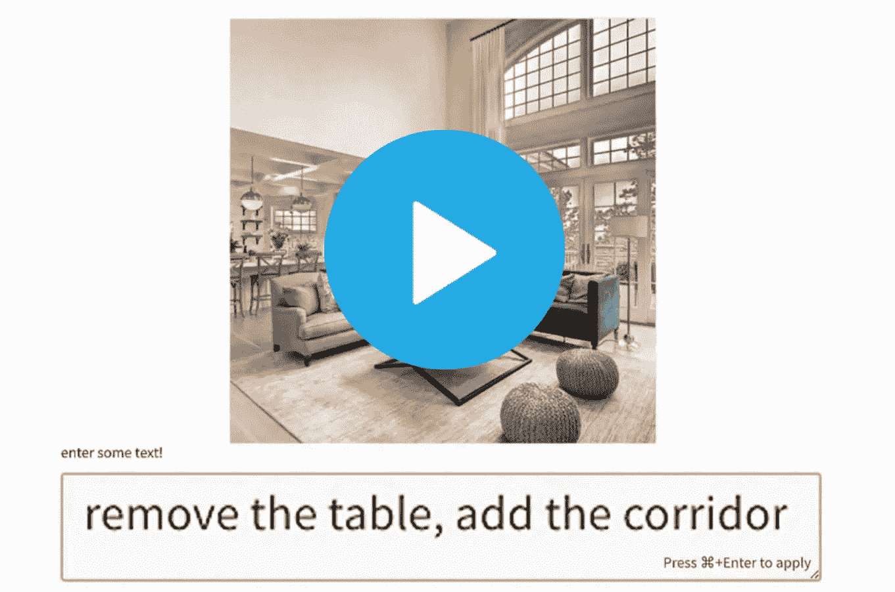

# 我如何想象我梦想中的家？

> 原文：<https://medium.com/mlearning-ai/how-do-i-visualise-my-dream-home-1b3d26e78817?source=collection_archive---------4----------------------->

## [机器学习艺术](https://mlearning.substack.com/p/how-to-design-a-house-without-an?r=z7zu8&s=w&utm_campaign=post&utm_medium=web)

## 立即尝试人工智能演示

[How to design a house without an architect?](https://mlearning.substack.com/p/how-to-design-a-house-without-an?r=z7zu8&s=w&utm_campaign=post&utm_medium=web)

## 我如何看到我理想中的家？

可视化你的设计的老方法:
1。做一个灵感板。设计师经常使用 Adobe Photoshop 来创建情绪板，但是您可以轻松地使用 Canva 来获得更直接的解决方案
2。收集样本……
3。看看你的地板…