# 自我关注面具是如何工作的？

> 原文：<https://medium.com/mlearning-ai/how-do-self-attention-masks-work-72ed9382510f?source=collection_archive---------0----------------------->

当我和[自我关注](https://towardsdatascience.com/illustrated-self-attention-2d627e33b20a)一起工作的时候，我发现有很多关于这个功能如何工作的信息，但是在网上没有很多解释面具为什么以及如何工作的信息。此外，我还有几个关于面具的问题。例如:

*   为什么要将注意力遮罩应用于多个图层？
*   为什么不在键和查询中应用注意屏蔽？
*   键、查询和值的权重是否混淆了原始矩阵的顺序？

我决定通过写出矩阵来解决这个问题。现在，我想我对口罩的工作原理有了更好的理解。我还了解到，我并不确切地知道一个线性层如何跨越二维工作，这将澄清我上面列出的最后一点。

我想分享我研究注意力如何工作的过程。也许能帮助到和我有同样困惑的人。

这篇文章将使用很少的数字，因为我觉得它分散了注意力到底在做什么的意义。用数字做一堆矩阵乘法只会产生更多的数字，从全局来看很难想象。相反，我会用很多变量。

# 问题设置

先说单矩阵***X***4 个字。当这些单词被转换成它们的标记嵌入时，每个标记将具有 3 个值的嵌入大小。下面是我们的句子:

"甲乙丙丁"

多好的句子啊！现在让我们把这些单词变成代币。

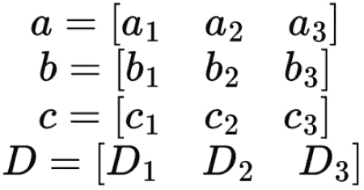

Vectors *a*, b, c, and D each with 3 components

我们的序列基本上由 4 个令牌组成。每个令牌是一个由 3 个值组成的向量。现在让我们把这些令牌变成一个矩阵， ***X*** 。

X, a 4✕3 matrix made of the vectors, a, b, c, and D

这是我们想用自我关注来转换的矩阵。

# 准备接受关注

为了引起注意，我们必须首先使用加权矩阵生成键、查询和值。对于这句话，我们想把它转换成 4✕2 矩阵。所以，每个权重矩阵都是 3✕2.形状例如，下面是名为 *QW 的 *Q* 的权重矩阵。*

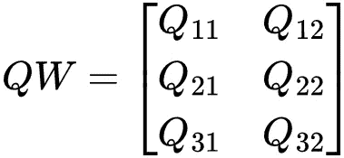

Weights to transform the X matrix into the Q (Query) matrix

使用 *QW* 矩阵，我们可以获得查询矩阵 *Q.*

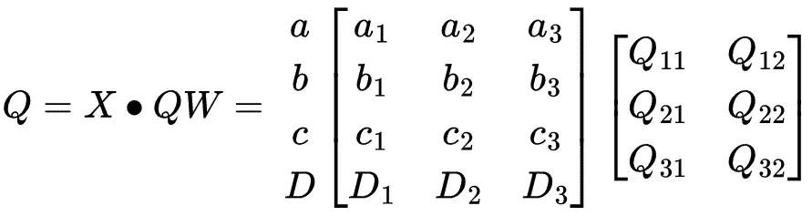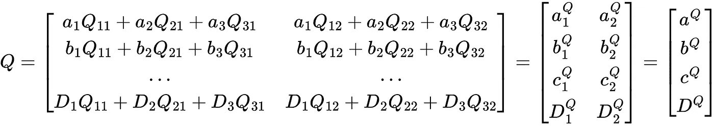

The query matrix computed from the X matrix and the query weights

现在我们有了一个表示法 *Q* 。注意结果矩阵中的每个向量是如何**而不是**所有其他记号的线性组合。相反，每个向量是其自身和一些权重的线性组合。第一个向量只是*和*的线性组合。第二种只是 *b* 的线性组合。这种转换不会打乱矩阵中的序列顺序。 *a* 仍在矩阵的顶部，而 *D* 仍在矩阵的底部。对于未来的操作，我将使用最右边的矩阵来表示 *Q* 的条目，以便于可视化 *a* 、 *b* 、 *c* 和 *D* 的向量，以及这些向量如何没有被转换成彼此的某种组合。

这种转换对于产生以下矩阵的键和值是相同的。

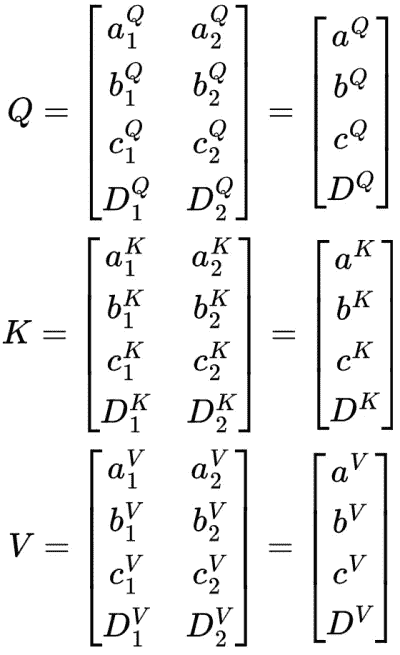

The query, key, and values computed from the X matrix and the corresponding matrix weights

我们的设置完成了。现在来计算这个序列的注意力。

# *QKᵀ* 矩阵

注意力由下面的公式定义。

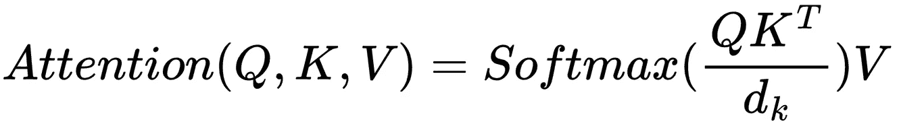

Original self-attention formulation

为了更容易地形象化正在发生的事情，我将移除 *dₖ* 常数。 [*注意力是你所需要的全部*](https://arxiv.org/abs/1706.03762) 作者声明使用标量 *dₖ* 是因为“我们怀疑对于 *dₖ* 的大值，点积在量值上变大，将 softmax 函数推到它具有极小梯度的区域。”dₖ只是一个帮助渐变的标量，在本文中我们并不关心。所以，我会用下面的公式来代替。

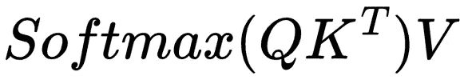

Self-attention formulation without d*ₖ*

有了遮罩，等式会有一点不同，我将在下一节解释。

QKᵀ矩阵*计算如下。*

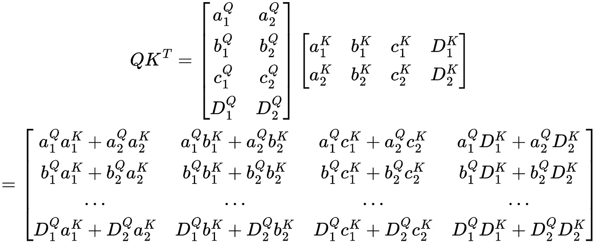

Matrix result from the product of the queries and transposed keys

这个矩阵在目前的形式下看起来非常混乱。所以，我要把它简化成它的矢量积表示。我还将标记行和列，以帮助形象化矩阵所代表的内容。

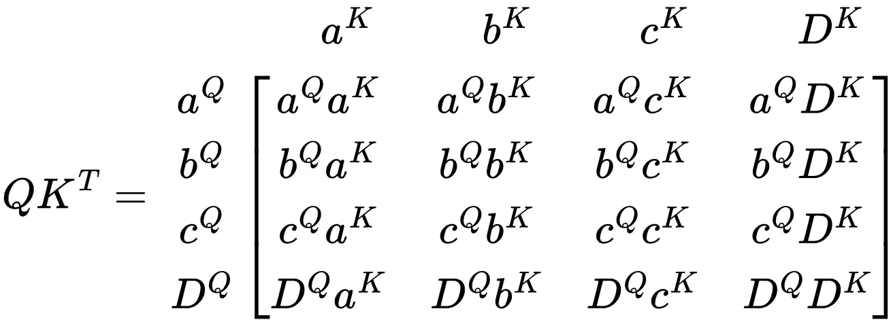

Matrix result from the product of the queries and transposed keys in its vector representation

好多了。在矩阵中，每个值基本上都要与其他值相乘，包括自身。该值表示当将 *V* 应用于该矩阵时， *V* 中的每个组件将接收多少重量。

# 不带面具的关注

在讨论如何掩饰注意力之前，让我们先看看没有面具时注意力是如何工作的。

计算序列关注度的下一步是将 softmax 函数应用于 *QKᵀ* 矩阵。虽然出现了一个问题，应该在哪个维度上应用 softmax？在注意的情况下，softmax 函数应用于每一行。

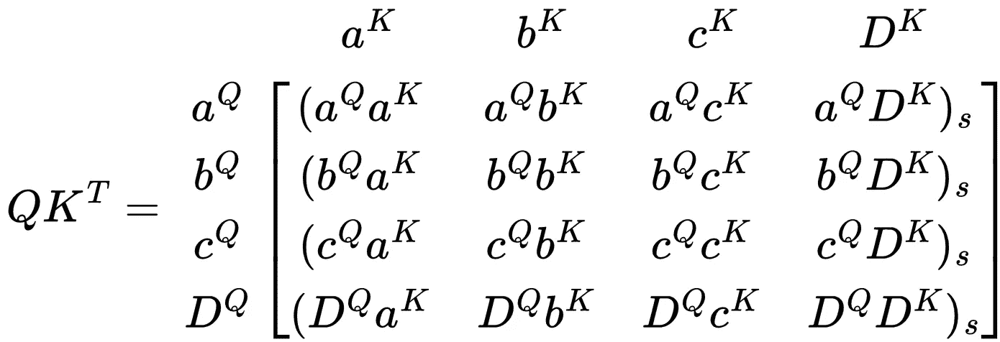

Softmax of the query-key matrix

在当前没有掩码的情况下，softmax 函数只是一个归一化函数。为了减少混乱，我不打算在这个矩阵中表示它。

现在是最后一步，将 *QKᵀ* 矩阵乘以值矩阵。

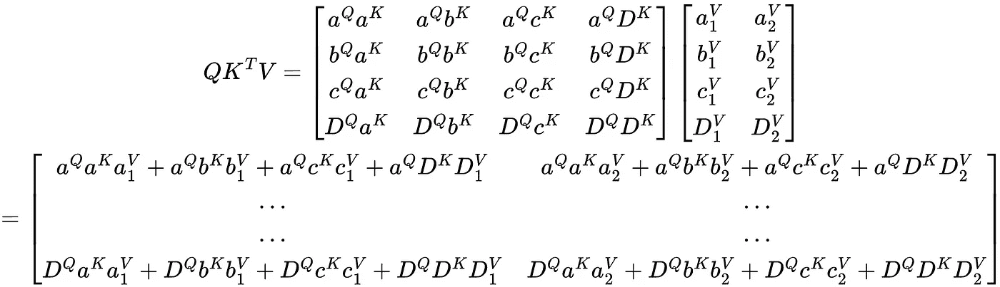

Matrix result from the product of the query-key matrix and the values matrix

注意矩阵中的每个编码是如何线性组合 *QKᵀ* 矩阵中的值和权重的。本质上，结果矩阵中的每一行都是 *QKᵀ* 矩阵中相应行和数值矩阵中相应列的线性组合。

没有掩码的注意模块的输出使每个令牌注意所有其他令牌。这意味着所有标记对所有其他标记都有影响。

生成的矩阵可以重新格式化，如下所示:

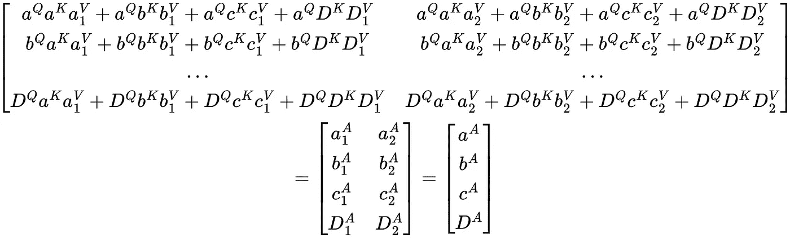

Vector representation of the product of the query-key matrix and the values matrix

注意力转换实质上产生了一组新的向量，序列中的每个单词一个向量。

# 注意用衬垫面具

在使用填充掩码计算注意力之前，我们需要将掩码 *M* 添加到等式中:

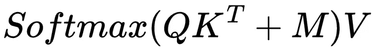

Self-attention equation with a mask

我们已经有了 *QKᵀ* 和 *V* ，但是 *M* 长什么样？记住我们的顺序是

"甲乙丙丁"

如果我们用一个例子来代替这些任意值会怎么样:

“我喜欢咖啡<pad></pad>

请注意，这里有一个填充令牌。这个令牌可能会出现，因为我们要把很多句子批量放在一起。唯一的问题是句子有不同的长度，矩阵不能处理不同的大小。为了解决这个问题，我们可以在句子中添加<pad>标记，使所有句子长度相同。</pad>

<pad>标记的一个问题是<pad>标记成为句子中最常见的部分。该模型可能会注意到这一点，并了解到许多<pad>标记是一个句子的基础。很好的工作模式。</pad></pad></pad>

为了防止模型对<pad>记号建模，我们可以屏蔽 *QKᵀ* 矩阵中<焊盘>以特定方式存在的位置。如上例所示， *D* 是一个< PAD >令牌，我们想要屏蔽它。为此，我们将使用一个与 *QKᵀ* 尺寸相同的掩码，沿着表示我们想要屏蔽的令牌的列使用-∞。该掩码将如下所示:</pad>

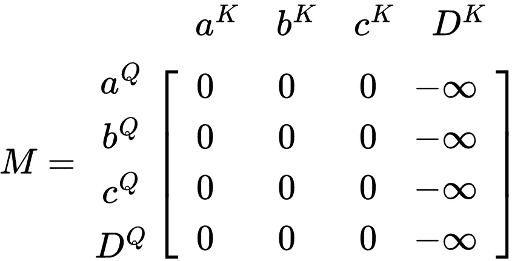

Matrix representation of the padding mask

注意列 *Dᴷ* 是如何被屏蔽的，但是行 *DQ* 没有被屏蔽(显然 *Q* 上标不是 Unicode 字符，所以我将使用 *DQ* 作为占位符)。当矩阵 *QKᵀ* 乘以 *V* 时，将得出掩模位置的原因。下一步是将 *M* 添加到 *QKᵀ*

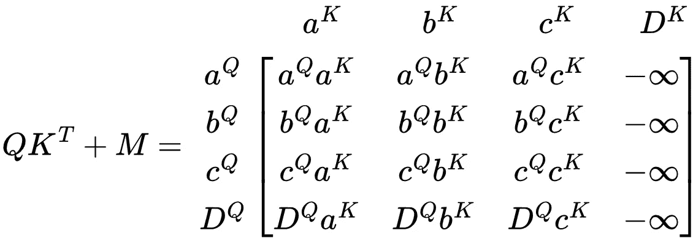

Query-key matrix added to the padding mask matrix

加到-∞上的任何东西都变成-∞，所以得到的列 *Dᴷ* 是-∞的列。现在，当 softmax 应用于矩阵时会发生什么？

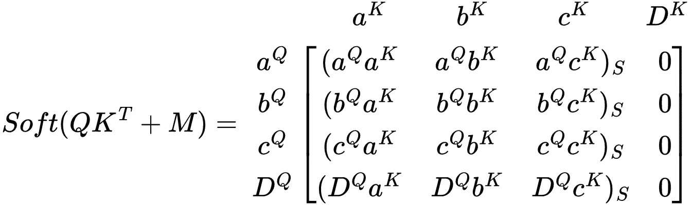

Softmax of the result from adding the query-key matrix to the mask matrix

*Dᴷ* 现在全是 0，基本上不会影响权重矩阵中其他值的权重。请注意 *D* 不属于任何其他行，只属于自己的 *DQ* 行。与上一节一样，我不会担心非∞值的 softmax 值，因为该函数只是作为归一化。最后，让我们看看当权重矩阵乘以 *V* 矩阵时得到的矩阵是什么样子。

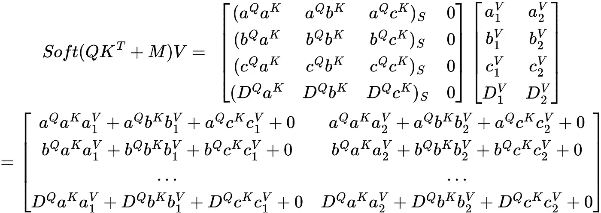

Final self-attention result by multiplying the masked query-key matrix with the values matrix

让我们更仔细地看看最终的矩阵。

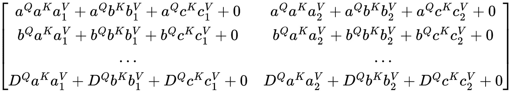

请注意，结果矩阵中的每一行都没有 *Dᴷ* 组件。因此， *D* 组件对任何其他组件都没有任何影响，这意味着任何填充的屏蔽组件对序列的其余部分都没有影响。这就是使用填充掩码的原因，我们不希望它影响序列中的任何其他标记。

那么 *DQ* 呢，它依然存在，没有被掩盖。如果 *DQ* 被屏蔽，那么矩阵中的 *DQ* 向量将在应用 softmax 变换后产生统一值的向量。这意味着 *DQ* 将会丢失之前拥有的所有信息。屏蔽的目标不是完全删除 D 令牌的所有信息，而是让它不影响任何其他令牌。在生成的矩阵中，我们仍然需要关于 *D* 的信息，这样模型就知道那里有一个< PAD >标记。我们只是不想让< PAD >标记引起其他标记的组件之间的关系。

假设我们屏蔽掉了 *DQ* 和 *Dᴷ* ，那么得到的矩阵将如下所示:

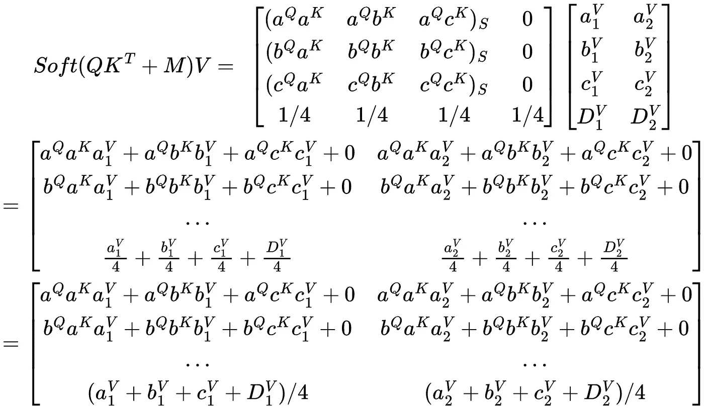

Self-attention result when the padding mask covers both DQ and D*ᴷ*

由于 *DQ* 和 *Dᴷ* 是常数，它们不会给结果增加太多。矩阵最后一部分的结果向量只是由 1/4 加权的 *V* 分量的组合。这不是一个非常有用的表示，并且会导致 *D* 丢失自身的所有信息，这意味着在结果向量中 *D* 的新表示将是 *D* 的糟糕表示。

# 带着前瞻面具的注意

这个前瞻遮罩原本是用在 [*注意就是你所需要的*](https://arxiv.org/abs/1706.03762) 纸上的原始变形金刚。使用前瞻掩码，使得可以一次对整个文本序列训练模型，而不是一次一个单词地训练模型。最初的变压器模型是所谓的*自回归模型*。这意味着它只使用过去的数据进行预测。最初的 transformer 是为翻译而制造的，所以这种类型的模型是有意义的。在预测翻译的句子时，模型将一次预测一个单词。说我有句话:

“你好吗”

该模型会将句子翻译成西班牙语，一次一个单词:

预测 1:给定“”，模型预测下一个单词是“cómo”

预测 2:给定“cómo”，模型预测下一个单词是“estás”

预测 3:给定“cómo estás”，模型预测下一个单词是“<end>”，表示序列的结束</end>

如果我们想让模特学会这种翻译呢？然后我们可以一次输入一个单词，从模型中得到三个预测。这个过程非常慢，因为它需要从模型中进行 *S* (序列长度)推断，以从模型中获得单句翻译预测。相反，我们给它输入整个句子“cómo estás<END>……”，并使用一个聪明的屏蔽技巧，这样模型就不能预测未来的标记，只能预测过去的标记。这样，只需要一个推理步骤就可以从模型中获得完整的句子翻译。

使用前瞻遮罩的自我关注公式与填充遮罩相同。唯一的变化与面具本身有关。

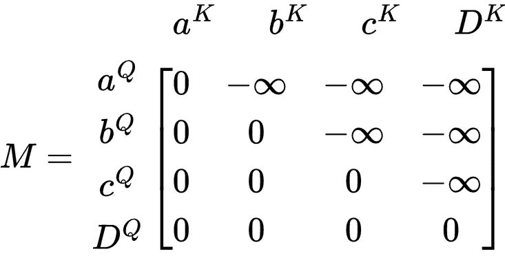

Matrix representation of the look-ahead mask

掩码的右上角有一个-∞三角形，其他地方有 0。让我们看看这是如何影响权重矩阵的 softmax 的。

Softmax of the masked query-key matrix using the look-ahead mask

权重矩阵有一些有趣的结果。第一排 *aQ* 仅自身加权 *aᴷ* 。由于 *a* 是序列中的第一个标记，它不会受到序列中任何其他标记的影响，因为其他标记都不存在。

在第二行， *b* 同时受到 *a* 和 *b* 的影响。既然 *b* 是第二个令牌，那么它应该只会受到第一个令牌 *a* 的影响。

在最后一行中，序列中的最后一个标记 *D* 受到所有其他标记的影响，因为序列中的最后一个标记应该具有序列中所有其他标记的上下文。

最后，我们来看看面具是如何影响注意力函数的输出的。

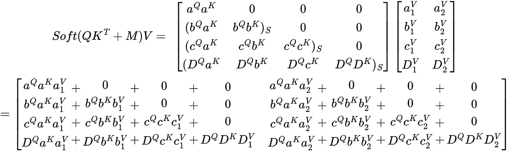

Final result of the self-attention function when using the look-ahead mask

类似于权重矩阵，得到的向量仅受该向量中表示的标记之前的标记的影响。 *a* 的新令牌嵌入在结果向量的第一行。因为这个令牌只有它自己的上下文，所以它只能是它自己的组合。

第二个令牌 *b* 具有 *a* 的上下文，因此得到的向量是 *a* 和 *b* 的组合。

最后一个记号 *D* 具有所有其他记号的上下文，因此得到的向量是所有其他记号的组合。

# 结果矩阵

为了容易地形象化结果矩阵是如何不同的，我将把它们从下到上放在这里

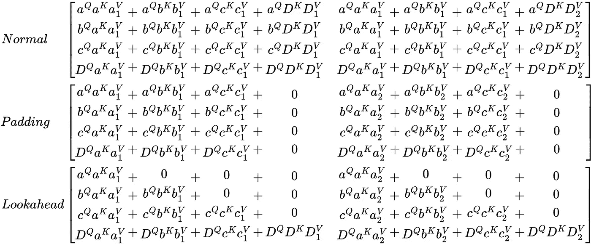

Final result of the self-attention function when using no mask, a padding mask, and a look-ahead mask

# 对多个层使用蒙版

我想做的最后一个说明是为什么一个遮罩被用在多层中。直到我更仔细地看了矩阵，我才立即意识到这一点。

注意力函数可以总结为从矩阵 *X* 到矩阵*a*的单个变换

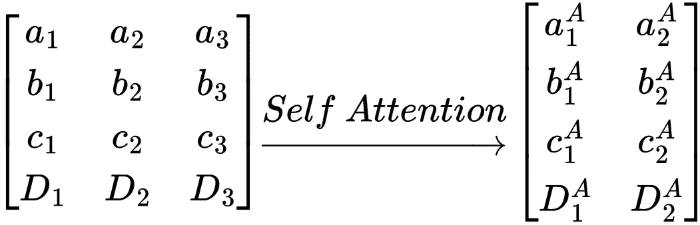

Self-attention transformation between matrices

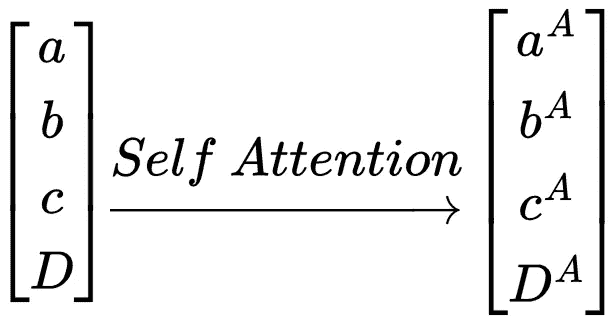

Self-attention transformation between vectors of vectors

如前所述，自我注意转换保留了每个向量的上下文。输出序列只是输入序列的一种变换形式。

假设我们想要屏蔽所有的<pad>令牌，并说 *D* 是一个< PAD >令牌，就像上面的例子中使用的一样。那么输出 *Dᴬ* 仍然是一个<填充>令牌，只是表示为一个变换后的嵌入。因此，任何正在进行的自关注功能都需要一个掩码来确保< PAD >令牌不会影响任何其他令牌。</pad>

你可以把变形金刚想象成一系列自我关注功能。线性层和规范层不会打乱记号之间的顺序关系，因此在本例中可以忽略不计。

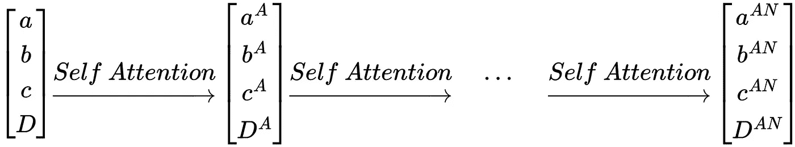

Multiple self-attention transformations between vectors of vectors

由于自我关注层之间的序列保持，每个自我关注功能将需要使用相同的掩模。在填充掩码的例子中，如果掩码仅用于第一自关注层，那么序列将不受第一自关注层中的<pad>令牌的影响。在所有其他层中，序列将受到<pad>标记的影响，因为掩码丢失。</pad></pad>

# 结论

注意力面具本质上是一种阻止模型看我们不想让它看的信息的方法。这不是一个非常复杂的方法，但是非常有效。我希望这篇文章能让你更好地理解掩蔽是如何在自我注意功能中起作用的。希望我能把所有的矩阵乘法都做对。

如果你有兴趣了解更多关于注意力机制的知识，下面这篇文章非常详细地解释了它是如何工作的:[http://jalammar.github.io/illustrated-transformer/](http://jalammar.github.io/illustrated-transformer/)

 [## Mlearning.ai 提交建议

### 如何成为 Mlearning.ai 上的作家

medium.com](/mlearning-ai/mlearning-ai-submission-suggestions-b51e2b130bfb)