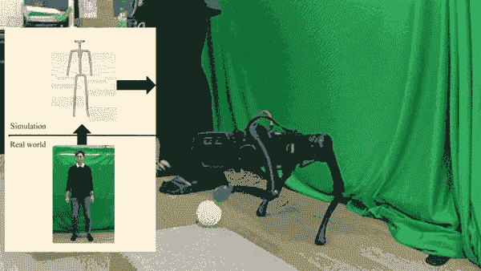

# 我们如何控制机器人？

> 原文：<https://medium.com/mlearning-ai/how-do-we-control-robots-6d0fb4de3962?source=collection_archive---------7----------------------->

## [机器学习艺术](https://mlearning.substack.com)

## 深度强化学习

[https://mlearning.substack.com](https://mlearning.substack.com)

## 到底什么是受控机器人？

受控机器人没有同样的独立性。想象一个受控机器人，就像你用遥控器来移动它，并指示它去哪里。这并不是说一个**遥控器**不能或者不会…