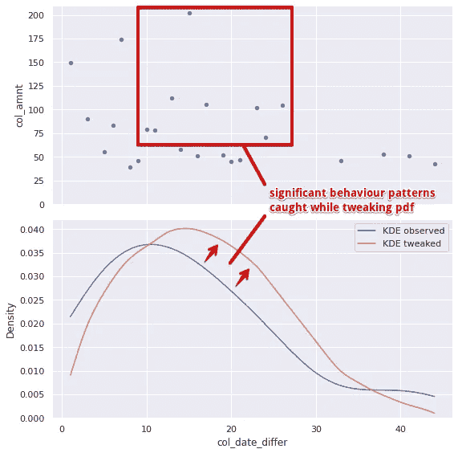

# 我们如何知道你的客户正在离开？

> 原文：<https://medium.com/mlearning-ai/how-do-we-know-that-your-customers-are-leaving-8cc8a70f86b1?source=collection_archive---------7----------------------->

Photo by [Alain Pham](https://unsplash.com/@alain_pham?utm_source=medium&utm_medium=referral) on [Unsplash](https://unsplash.com?utm_source=medium&utm_medium=referral)

ML 分类算法可以通过预测客户流失来为公司省钱。为了建立这样一个分类器，你需要访问你的客户的个人资料和初始流失标签。因此，这是所谓的监督学习的典型任务。

但首先，企业可能需要准确预测这些损失将在何时发生。因为他们知道，他们将能够推出早期的个人促销优惠，以试图留住客户。

后者似乎是一个更棘手的挑战，因为在现实生活中，您通常只需要处理每个客户的订单列表。在 [RBC Group](https://www.rbcgrp.com/ua/rozshirena-analitika/) ,我们已经定义了一个解决方案，完全基于客户先前订单的频率和总和，为流失客户获取(几乎)在线标签。

## 数据生成和核心概念

因此，根据上述内容，我们将用于演示我们的方法的唯一数据是随机生成的数据集，该数据集包含两年内 1000 个不同客户的订单金额和日期记录。订单频率将被视为两个后续订单之间的差异。

因此，我们的最终目标是预测自上次已知订单以来的天数是否在给定客户的“常规”订单频率范围内。换句话说，我们将通过客户订单频率的已知[累积分布函数](https://en.wikipedia.org/wiki/Cumulative_distribution_function) (1 - CDF)来计算上述天数大于预期的概率。如果这种可能性高于某个阈值，客户很可能会离开。

## 调整概率分布函数

通过 [scipy.stats.truncnorm](https://docs.scipy.org/doc/scipy/reference/generated/scipy.stats.truncnorm.html) 进一步拟合客户的生命周期(即他的常规订单频率)。然而，我们建议不仅要考虑订单之间的间断(即订单频率)，还要考虑这些订单的总和。这是我们可以用来模拟客户行为的第二个预测因素。人们可以假设订单的平均总和(作为一种消费模式)与其规律性一样重要。这意味着我们应该更加依赖支付金额(以下简称订单金额)接近客户平均支出水平的订单。

因此，在拟合我们的经验 CDF 时，我们将给定客户的平均订单频率计算为加权平均值，其权重与订单金额到所有已知客户订单平均金额的距离成反比(即*)(即*[*【zscore】*](https://en.wikipedia.org/wiki/Standard_score)*)*。**

**这就是我们所说的调整概率分布函数。**

****

**这就是我们的方法在实践中的表现，假装使用最后一个客户的订单作为测试。*(请注意，在“流失风险”区域内的所有概率都是假阳性，因为测试订单毕竟是由客户做出的，我们只是在建模 ECDF 时将它们从相应的子集中删除)*。**

## **评估绩效**

**为此，我们需要使用[三西格马经验法则](https://en.wikipedia.org/wiki/68%E2%80%9395%E2%80%9399.7_rule)将我们生成的数据集划分为训练和测试，这意味着我们将按照如下方式计算测试周期的持续时间:
*(所有客户的平均订单频率(天数)+ 3 x SD)***

**所有在测试期内至少购买过一次的顾客都被认为是 *stay_true* ，而所有其余的顾客(即那些仅在培训期内进行过最后一次购买的顾客)都是 *churn_true* 。**

**训练期的结束是所谓的*检查日期*，这意味着我们将计算最后一个客户的订单与*检查日期*之间的差异，以使用调整后的 ECDF 估计该差异(以天为单位)超出常规订单频率的置信度(概率)。**

**作为基本方法，我们将使用上述三西格马经验法则:如果 check_date 和最后一个订单的日期之间的差异大于*(平均值+ 3 x SD)* —客户被标记为 *churn_pred* 。或者，我们将应用我们的 ECDF 方法，使用不同的标签函数阈值，根据客户的订单日历对客户进行分类。**

**这是所有实验的混淆矩阵。*(注意:由于数据是随机生成的，流失率可能看起来不可信)。***

**因此，在这里你可以看到我们提出的方法如何在更准确地检测离开客户方面优于三西格马规则。还要注意提高阈值如何减少假阴性错误的数量，这意味着更少的客户会收到来自您的潜在恼人的提醒(又名垃圾邮件)。像往常一样，选择取决于你的业务性质。**

** [## Mlearning.ai 提交建议

### 如何成为 Mlearning.ai 上的作家

medium.com](/mlearning-ai/mlearning-ai-submission-suggestions-b51e2b130bfb)**