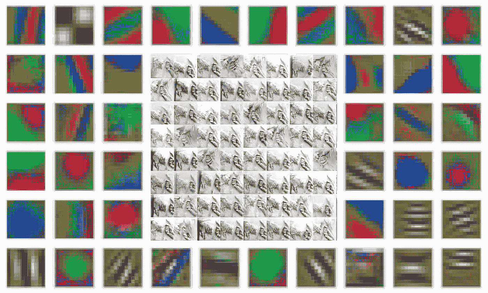

# 如何分析数据集？

> 原文：<https://medium.com/mlearning-ai/how-do-you-analyze-a-dataset-35783a577e58?source=collection_archive---------1----------------------->

## [机器学习艺术](https://mlearning.substack.comhttps://mlearning.substack.com)

## 理解的可视化—计算机视觉

[Visualization Techniques for Computer Vision Datasets](https://mlearning.substack.com)

我每天的创造性工作通常是一个**数据驱动的项目**。因此，确保您使用的 CV 数据集是可靠的并提供可使用的数据是至关重要的。下面你会发现如何借助可视化来检查它。