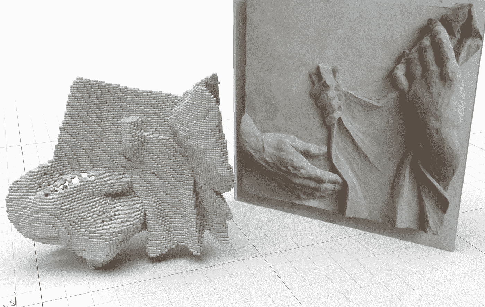

# 3D 重建是如何工作的？

> 原文：<https://medium.com/mlearning-ai/how-does-3d-reconstruction-work-112c6505dc0b?source=collection_archive---------4----------------------->

## [机器学习艺术](https://mlearning.substack.com)

## DPT + 3D 体素—视觉变形金刚演示

[https://mlearning.substack.com](https://mlearning.substack.com)

在[T3T5【数据】中，三维重建是工作的基础。以下文章描述了基于深度估计的 **3D 体素重建**技术。](https://towardsdatascience.com/datasculpting-af39f677f4f3)

*   【2022 年 4 月— AI 美工工具更新可以在这里找到➡️****⬅️****