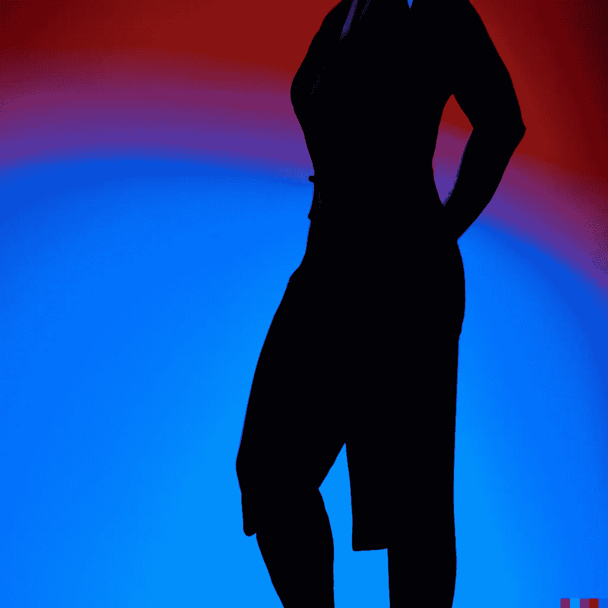

# 3D 人工智能生成的虚拟形象是如何工作的？

> 原文：<https://medium.com/mlearning-ai/how-does-a-3d-ai-generated-avatar-work-2701ed0dae20?source=collection_archive---------2----------------------->

## [机器学习艺术](https://mlearning.substack.com/p/how-are-realistic-virtual-humans?r=z7zu8&s=w&utm_campaign=post&utm_medium=web)

## 最先进的解决方案

[Convert a Dalle generated image to 3D | CODE + MODELS | New Method](https://mlearning.substack.com/p/how-are-realistic-virtual-humans?r=z7zu8&s=w&utm_campaign=post&utm_medium=web)

一个 **3D 化身**是你自己的数字副本，你可以在互联网上使用。有了 3D 头像，你可以加入在线虚拟游戏的有趣世界，在那里每个人都有一个 [3D 头像。](#cda6)

## [**一种方法**](https://mlearning.substack.com/p/how-are-realistic-virtual-humans?r=z7zu8&s=w&utm_campaign=post&utm_medium=web) **可以让你从任何图片中构建一个 3D 化身**