# DALL-E 2 是如何工作的？

> 原文：<https://medium.com/mlearning-ai/how-does-dall-e-2-work-b6a7f912fc5f?source=collection_archive---------3----------------------->

Photo by [laura adai](https://unsplash.com/@lauraadaiphoto?utm_source=medium&utm_medium=referral) on [Unsplash](https://unsplash.com?utm_source=medium&utm_medium=referral)

最近，OpenAI 发布了一个惊人的深度学习模型，名为 [DALL-E 2](https://openai.com/dall-e-2/) ，它可以使用简单的文本创建图像。

所以，让我们深入研究一下吧！

## 什么是 DALL-E 2？

DALL-E 2 是一个人工智能系统，能够使用自然语言形式的描述生成逼真的高分辨率图像。它还可以使用自然语言形式的字幕来编辑现有的图像。

以下是 DALL-E 2 的一些例子:

A bowl of soup that is a portal to another dimension as digital art

An astronaut riding a horse in a photorealistic style

Teddy bears mixing sparkling chemicals as mad scientists as digital art

这是惊人的权利！上面所有的图片都是用简单的文字描述创建的，你可以用自然文字创建更多的图片！

但是这个东西实际上是如何工作的呢？

## 建筑:

DALL-E 2 由两部分组成:

1.  将字幕或文本输入转换成图像的表示，这在之前被称为**。**
2.  将图像的这种表示转换成实际图像，这被称为**解码器**。

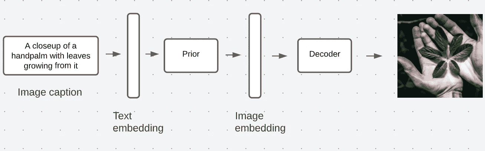

Image by author

该架构中存在的文本和图像嵌入是通过使用 OpenAI 的一个模型创建的，该模型被称为 **CLIP(对比语言-图像预训练)**。这是一个神经网络模型，它返回给定图像的最佳可能标题。我们也可以说，它与我们试图用 DALL-E 2 实现的目标正好相反。

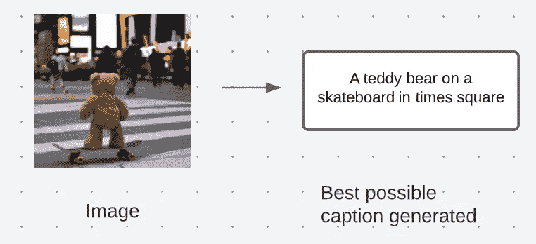

Image by author

CLIP 是一个对比模型，因此它不会对图像进行分类，而是尝试将图像与其对应的标题进行匹配，因此它是在图像和标题对上进行训练的。CLIP 试图解决的问题是，最大化图像嵌入与其字幕(文本)嵌入之间的相似性得分。

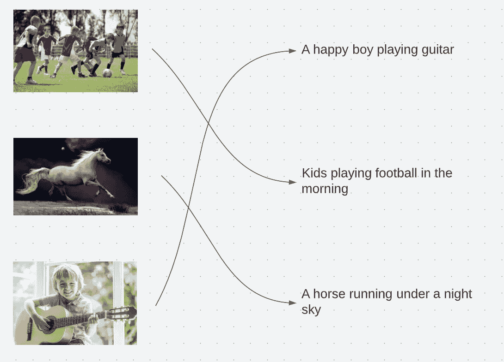

Matching pairs using CLIP

为了让 CLIP 进行匹配，它训练了两个编码器，一个**图像编码器**，一个**文本编码器**。

图像编码器将图像编码成图像嵌入，文本编码器将标题(或文本)编码成文本嵌入。

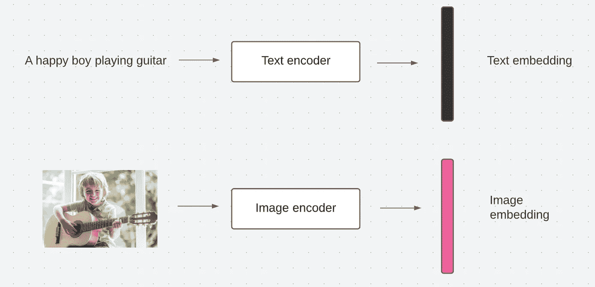

Image by author

如果你不熟悉嵌入这个术语，就把它理解为一种用数学形式表示一条信息的方式。

在下图中，黑色的是剪辑文本嵌入，由剪辑文本编码器将字幕作为输入生成，粉红色的是由先验生成的剪辑图像嵌入。

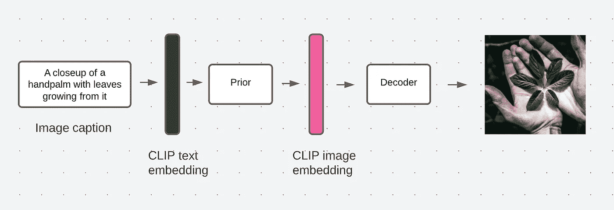

Image by author

在剪辑在剪辑文本编码器的帮助下生成剪辑文本嵌入之后，文本嵌入然后被馈送给进一步生成剪辑图像嵌入的先验。根据关于 DALL-E 2 的[研究论文](https://cdn.openai.com/papers/dall-e-2.pdf)，OpenAI 的研究科学家为 DALL-E 2 尝试了两种类型的先验，即自回归先验和扩散先验。经过实验，他们得出结论，扩散先验比自回归先验表现更好。

为了理解什么是扩散先验，让我们首先讨论什么是扩散模型！

扩散模型是一种生成模型，它采用一种类型的数据(比如一幅图像)并逐渐添加一些噪声，直到该图像(数据)不再可见或不可识别。一旦实现了这一点，它就逆转相同的过程，并试图将图像重建到其初始状态。如果你有兴趣了解更多关于扩散模型的知识，这里有一个很好的博客。

一旦先验创建了剪辑图像嵌入，我们的下一个目标是从剪辑图像嵌入创建图像本身，并且解码器对此负责。当我试图理解 DALL-E 2 的工作原理时，我想知道我们是否可以忽略 prior 并直接将剪辑文本嵌入到解码器中，或者如果我们从架构中移除 prior 会发生什么？

来自 OpenAI 的科学家们也思考过这个问题，并且用三种方式进行了同样的实验。他们得到了以下结果:

1.  将图像标题(输入文本)直接传递给解码器:

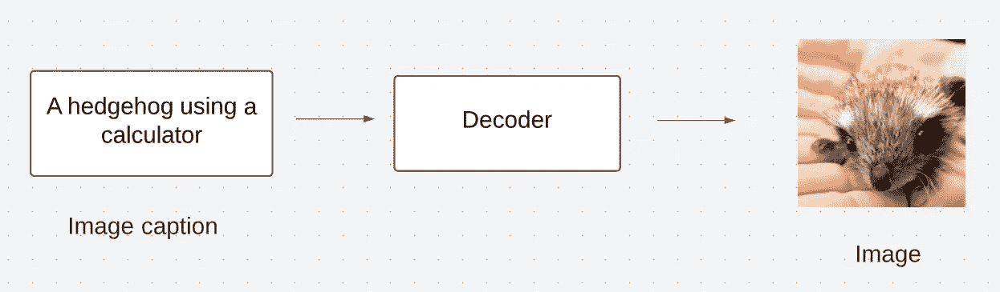

Image by author

2.使用图像标题生成剪辑文本嵌入，并将其传递给解码器。

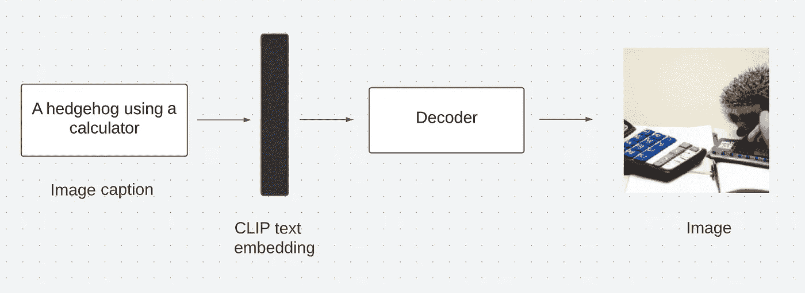

Image by author

3.使用图像标题生成剪辑文本嵌入，将其馈送给先验，生成剪辑图像嵌入，然后将其传递给解码器。

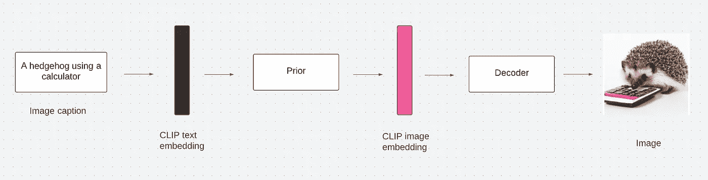

Image by author

从上面的实验中，我们可以得出结论，包括先验给出了更加准确和有效的图像。但是有人可能会说，直接将剪辑文本嵌入传递给解码器会产生可接受的输出，那么为什么不选择这种架构呢？这样做，我们将失去产生图像变化的能力。如果你想了解更多关于 CLIP 的信息，请参考 OpenAI 的[帖子](https://openai.com/blog/clip/)。

现在我们来讨论一下解码器！

解码器也是一个扩散模型，但调整或修改扩散模型。为了达到解码器的目的，OpenAI 使用了另一种称为 **GLIDE** 的模型，这是 OpenAI 开发的另一种图像生成模型。这种图像生成模型不同于传统的扩散模型，因为它不仅使用图像(数据)，还包括图像的文本嵌入，因此 GLIDE 将基于这种文本嵌入生成图像。如果你想了解更多关于 GLIDE 的信息，请参考它的[研究论文](https://arxiv.org/abs/2112.10741)。

在 DALL-E 2 中，解码器不仅包括文本嵌入，还包括剪辑嵌入，以支持图像生成。一旦生成了初始的 64 x 64 图像，还需要两个步骤来将该图像进一步上采样到 256 x 256，然后再上采样到 1024 x 1024。

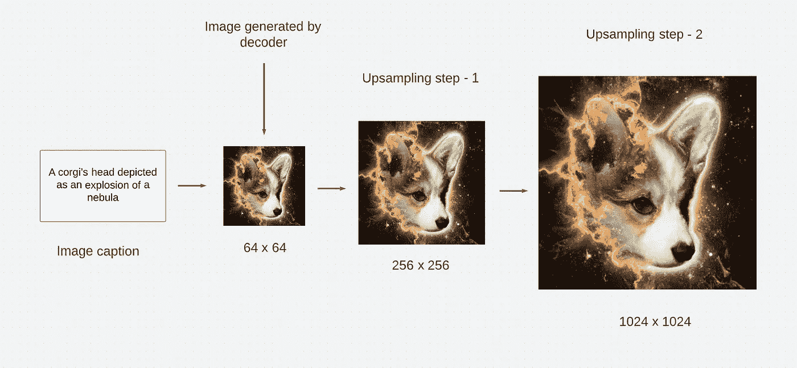

Image by author

这就是 DALL-E 2 中高分辨率图像生成的方式！

DALL-E 2 还能够生成图像的变体，这意味着保留图像的主要风格和组成部分，但改变图像的琐碎细节。

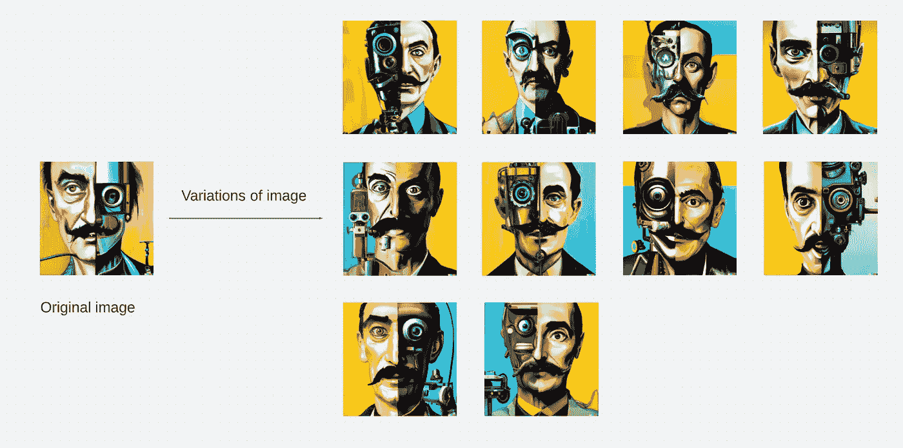

Image by author

这些变化是通过使用剪辑图像编码器创建剪辑图像嵌入并将这些嵌入馈送到解码器来生成的。

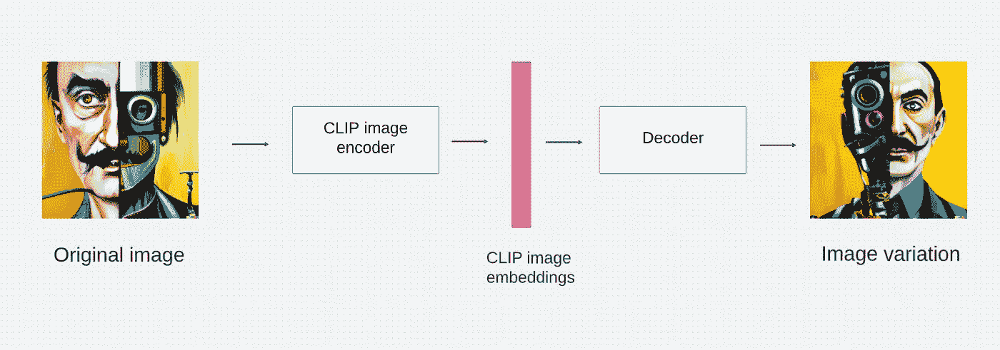

Image by author

这就完成了 DALL-E 2 的工作！

## 模型评估:

在创建一个人工智能模型后，评估它以了解我们的模型是否满足所需的期望是很重要的。那么让我们来了解一下 DALL-E 2 的评估过程是什么样的！

DALL-E 2 是在所谓的**系统人类评估**的基础上进行评估的，这是通过比较特定的参数来完成的，如**照片真实感**、**字幕相似度**和**样本多样性**。

## 风险和限制:

尽管 DALL-E 2 功能强大，非常擅长它所做的事情，但它也有一些限制:

1.  它还不能结合物体的物理属性(颜色、形状等)。

例如。

对于输入“蓝色立方体上的红色立方体”，它有点令人困惑，哪个立方体应该是红色的，哪个应该是蓝色的。

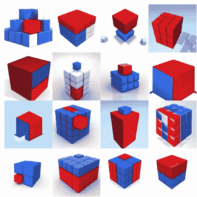

DALL-E 2 output

而另一种生成模型如 GLIDE 能够对相同的字幕表现得更好。

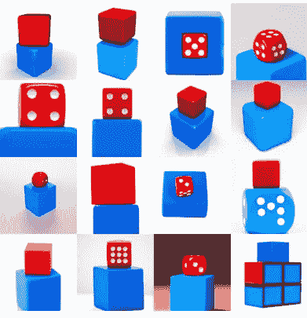

GLIDE output

2.当被要求这样做时，它不能生成逻辑和一致的文本。

例如。

对于输入“表示深度学习的标志”,它生成了以下图像。

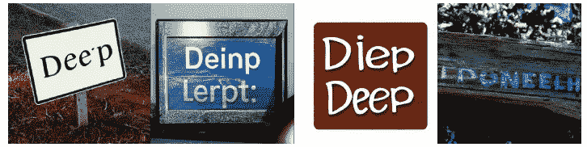

A sign that says deep learning

3.它不会在图像中生成详细的场景。

例如。

对于输入“时代广场的高质量照片”，生成的图像中的屏幕上没有任何可读或可理解的信息。

A high quality photo of Times Square

4.总是存在创建带有不适当或恶意内容的虚假图像的风险。

要了解更多关于 DALL-E 2 的风险和局限性，请参考[本](https://github.com/openai/dalle-2-preview/blob/main/system-card.md)。

*好了，今天就到这里吧！我希望你喜欢这个博客！*

如果你看到了，别忘了鼓掌😉。此外，如果有任何进一步的问题，请随时联系我。

参考资料:

[达尔·E 2(openai.com)](https://openai.com/dall-e-2/)

[dall-e-2.pdf(openai.com)](https://cdn.openai.com/papers/dall-e-2.pdf)

[Linkedin](https://www.linkedin.com/in/saurav-pawar-058143196?lipi=urn%3Ali%3Apage%3Ad_flagship3_profile_view_base_contact_details%3Bg1SMnhkeQbS4sm8NB1FZOg%3D%3D)[Twitter](https://twitter.com/saurav_py)

 [## Mlearning.ai 提交建议

### 如何成为 Mlearning.ai 上的作家

medium.com](/mlearning-ai/mlearning-ai-submission-suggestions-b51e2b130bfb)