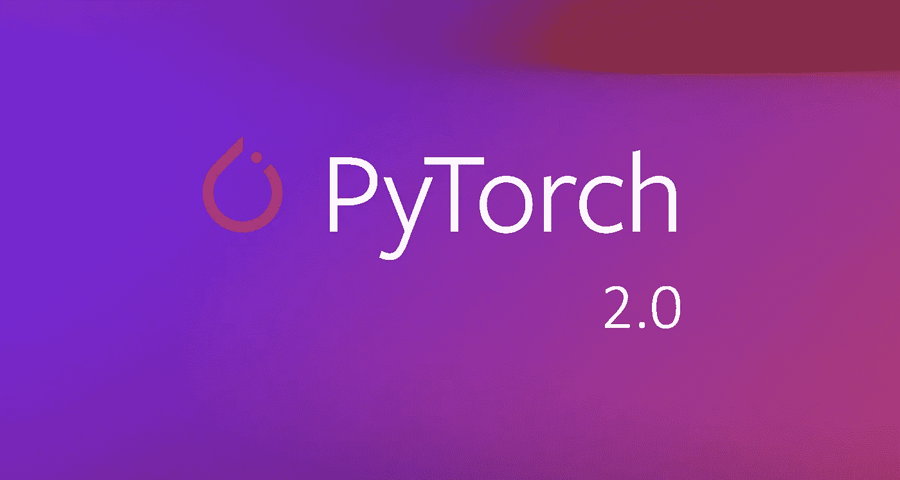
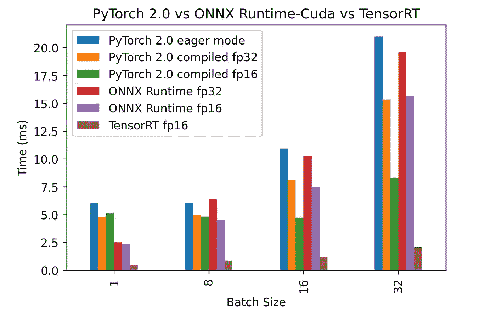

# PyTorch 2.0 在推理方面表现如何？带有 TensorRT 和 ONNX 运行时的基准测试

> 原文：<https://medium.com/mlearning-ai/how-does-pytorch-2-0-perform-in-inference-a-benchmark-with-tensorrt-and-onnx-runtime-fa1e59237f93?source=collection_archive---------1----------------------->

PyTorch 2.0 于 2022 年 12 月初在 [NeurIPS 2022](https://nips.cc/) 上发布，并因其主要的 torch.compile 组件而引起了很多关注，预计该组件将比 PyTorch 的先前版本带来更大的计算速度。

这对人工智能世界来说是一个惊人的消息，训练时间改进的早期结果令人印象深刻。PyTorch 团队在 PyTorch GitHub 上的[发布新闻稿](https://pytorch.org/get-started/pytorch-2.0/)和[中没有提到的是 PyTorch 2.0 推理性能。](https://github.com/pytorch/torchdynamo/issues/681)

让我们对这个主题进行更多的研究，并发现 PyTorch 2.0 与其他推理加速器如 [Nvidia TensorRT](https://developer.nvidia.com/tensorrt) 和 [ONNX Runtime](https://onnxruntime.ai/) 相比表现如何。

我们使用 [Speedster](https://github.com/nebuly-ai/nebullvm/tree/main/apps/accelerate/speedster) 、 [Nebuly](https://www.nebuly.com/) 的开源库运行了一些推理测试，以应用 SOTA 优化技术，并在您的硬件上实现最大的推理加速。对于这个用例，Speedster 允许我们运行 TensorRT、ONNX 运行时，并在短短两行代码内将它们与 16 位和 8 位动态和静态量化结合起来。在测试期间，我们还使用 Speedster 收集顶层策略的性能信息，以减少推理延迟。
我们在配有 ResNet 的 Nvidia 3090Ti GPU 上运行了测试，该型号与 PyTorch 2.0 新闻稿中的示例中使用的型号相同。

# 用 [Speedster](https://github.com/nebuly-ai/nebullvm/tree/main/apps/accelerate/speedster) 测试 PyTorch 2.0 的推理性能

以下是测试得出的 4 个主要结论:

1.  **PyTorch 2.0 与之前批量更大的版本相比变得越来越有效**。在更高的批处理速度下，fp16 精度变得比 fp32 编译版本更有效。这很容易解释，因为 Pytorch 2.0 编译主要是为训练设计的，通常批量比推理大。关注 fp16 是有意义的，因为训练程序最近已经从全精度转向半精度，特别是对于大型模型。
2.  **ONNX 运行时在小批量时比 PyTorch 2.0 执行得好得多，而在大批量时结果却相反**。同样，这是因为 ONNX 运行时主要是为推理而设计的(通常使用较小的批量)，而如前所述，PyTorch 2.0 的主要目标是训练。
3.  **py torch 紧急模式和 PyTorch 2.0(已编译)显示批量 1 和 8** 的运行时间相同。这表明两个运行时在批处理大小等于 1 时没有使用全部计算能力，而其他推理驱动的优化器(如 ONNX 运行时)能够更好地管理计算能力。同样，这可能与 PyTorch 编译器主要是为训练而设计的这一事实有关，忽略了批处理大小不足以使用内核的所有计算能力的情况。
4.  **在测试的 Nvidia GPU 上，TensorRT 在小批量和大批量方面都远远优于竞争对手**。事实上，随着批量的增加，相对速度会变得更快。这显示了 Nvidia 的工程师如何能够在推理时更好地利用硬件缓存，因为激活占用的内存随着批量大小线性增长，适当的内存使用可以大大提高性能。

请注意，基准测试高度依赖于所使用的数据、模型、硬件和优化技术。为了在推理中获得最佳性能，在将模型部署到产品中之前，总是建议[测试所有优化器](https://github.com/nebuly-ai/nebullvm/tree/main/apps/accelerate/speedster)。

# 参考

*   [Speedster](https://github.com/nebuly-ai/nebullvm/tree/main/apps/accelerate/speedster) ，这款开源工具可以自动应用 SOTA 优化技术，在您的硬件上实现最大的推理加速。
*   GitHub [存储库](https://github.com/diegofiori/benchmark-pytorch2.0-with-nebullvm)用代码复制基准测试实验

___

# 推荐读物

*   [遇见 ChatLLaMA:用有限的计算资源构建一个类似 ChatGPT 的助手](https://www.nebuly.com/blog/chatllama-0-0-2-release-notes)
*   [如何利用 NVIDIA 多进程服务(MPS)提高 Kubernetes 中的 GPU 利用率](https://www.nebuly.com/blog/how-to-increase-gpu-utilization-in-kubernetes-with-nvidia-mps)
*   [人类反馈强化学习(RLHF)——一个简化的解释](https://www.nebuly.com/blog/reinforcement-learning-from-human-feedback-rlhf-a-simplified-explanation)
*   [META 的美洲驼:打败巨人的小语种模型](https://www.nebuly.com/blog/metas-llama-a-small-language-model-beating-giants)
*   [PyTorch 实现 Geoffrey Hinton 的前向-前向算法](https://www.nebuly.com/blog/geoffrey-hinton-forward-forward)
*   [2023 年关于机器学习和人工智能的 10 大最佳时事通讯](https://www.nebuly.com/blog/top-10-newsletters-on-machine-learning-and-ai-in-2023)

 [## Mlearning.ai 提交建议

### 如何成为 Mlearning.ai 上的作家

medium.com](/mlearning-ai/mlearning-ai-submission-suggestions-b51e2b130bfb)