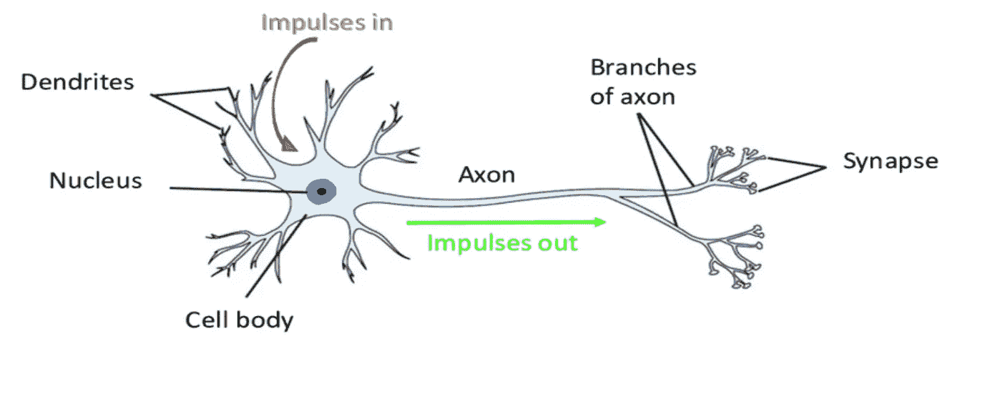
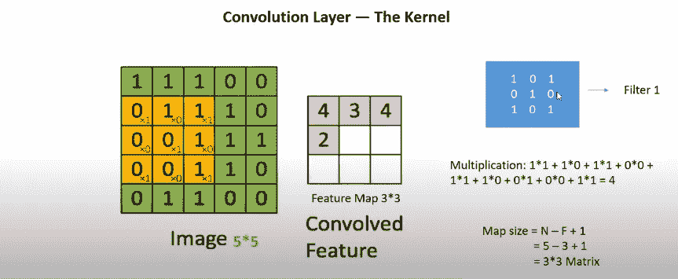
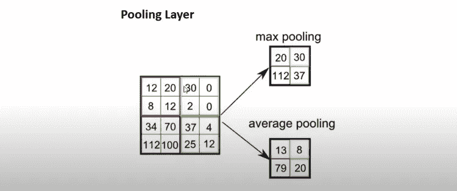

# 卷积神经网络(CNN)是如何工作的？

> 原文：<https://medium.com/mlearning-ai/how-does-the-convolutional-neural-network-cnn-work-dcc46d68cd1c?source=collection_archive---------1----------------------->

我喜欢自然语言处理(NLP)；不幸的是，我在写关于孟加拉假新闻检测的研究论文时，不得不介绍卷积神经网络(CNN)。然后，我看到了一些研究论文，这些论文通过超越长期短期记忆(LSTM)，使用 CNN 获得了很多很好的准确性。任何与 LSTM 共事的人都知道 LSTM 在文本数据方面有多美。我试图去理解 CNN 的理论，而不是去实现它。对我来说，这是一个明智的决定，我现在感觉到，因为不知道一些事情的细节有点困难，因为那时你必须在不知道幕后的情况下做一切事情。但是，我特别喜欢 CNN，因为我目前正在研究生物医学成像，它在医学图像数据中显示出了有前途的结果。我想你看完这篇文章后会爱上 CNN 就像我溺水一样。

你会学到什么？

*   人脑神经元
*   神经网络与人脑中神经元的关系
*   CNN 如何从一幅图像中提取特征？
*   CNN 在现实生活中的应用。

**让我们开始吧。**

# **人类大脑的神经元**

人类大脑中的两个神经元都是电可兴奋的。电脉冲主要在树突上接收，在细胞体中处理，然后沿着轴突传递。**神经元**释放一种叫做**神经递质**的特殊分子，直到电信号碰到**突触**【1】。

**Figure 1: Human brain’s neuron**

在大脑神经元中可以发现三个相互连接的模块:树突、胞体或细胞体和轴突。组件的描述如下:

**树突:**突触连接用来接收信息。可以使用来自感觉神经呼叫的感觉数据或来自其他神经细胞的“计算”输入，在单个细胞中可以发现多达 100K 个输入(每个输入来自不同的细胞)。

**细胞体:**这是细胞体，来自所有树突的输入在这里结合，并根据所有这些信号做出是否触发输出的判断。这有点过于简化，因为一些测量发生在细胞体之前，并编码在细胞的树突结构中[2]。

**轴突:**一旦决定点燃一个输出信号(从而激活细胞)，轴突就是承载信号的机制，通过作为其终端结构的树，通过与神经元的突触连接将信号传递给下一级树突。

# **人类大脑中神经网络与神经元的关系**

我想你已经清楚人脑的神经元是如何工作的了？不是吗？让我给你解释另一个概念，它是根据人类大脑的工作结构创造出来的。神经网络被设计成以与人脑相同的方式工作。在阅读笔迹或面部识别时，大脑很容易做出选择。在面部识别的情况下，大脑可能会开始问:“是女性还是男性？”这是一张黑白照片吗？是年轻还是年老？“你有伤疤吗？”等等。

**Figure 2: Neural Network [3]**

# **CNN 如何从图像中提取特征？**

C 旋转神经网络(CNN)是神经网络的主要组成部分之一。它由具有学习权重和偏见的神经元组成。每个神经元接收多个输入，并对它们进行加权求和，然后传递一个激活函数，并再次以一个输出做出响应。CNN 通常依赖于三层，例如，卷积层、池层和密集层(全连接神经网络)。你已经知道了人脑的神经元，每个神经元都做一些工作；此外，以同样的方式，CNN 层在对图像进行分类时做出了贡献。

对图像进行分类有以下优点:

> **可以直接在 CNN 中输入图像，而不是将其转换成 2D 阵列或任何标准维度。**
> 
> **我们用于训练的数据，例如，如果我们利用一些猫的图片作为训练数据，那么 CNN 会根据每张图像的特征(如眼睛、鼻子、耳朵等)创建一个过滤器，以帮助检测图像。**
> 
> **理解起来又快又简单。它是所有图像预测算法中最精确的。**

由于 CNN 有三层(卷积层、池层和密集层)，所以让我们看看卷积层是如何工作的。

1.  **卷积层:**在卷积神经网络中，主要的构建模块是卷积层。卷积层是将滤波器应用于输入以产生激活的基本过程。因此，在输入图像上出现了在任何地方都可以识别的极其独特的特征。

**Figure 3: Convolutional Layer**

通过查看图 3，可以看到图像的大小为 5x5，并且有一些用黄色标记的特征。CNN 首先基于输入图像中的所有特征创建过滤器(内核),以允许图像检测。例如，如果你想象一个人在图像的地方，他的特征像眼睛，鼻子，耳朵，嘴，嘴唇等等。在现实生活中，当我们真正看到某人时，我们首先试图通过匹配他们的一些特征来检测他们，这就是我们人类大脑的工作方式。

上图中显示的过滤器大小是 3x3，基本上，很难确定过滤器的大小，因为模型会自动创建它，但我们可以根据需要手动定义它。过滤器的大小可以手动定义(3x3、4x4 或 5x5)，然而，3x3 是每个人最常用的方法。

滤波器与每个图像的特征相乘，并且可用值存储在特征图中。特征图的矩阵大小取决于以下等式:

> **地图大小= N-F+1**
> 
> **这里，N=图像大小，F=滤镜大小，1=偏差**

如果有 RGB 图像，则该过程将单独继续。

**2。池层:CNN 的另一个组成部分是池层。其目标是逐渐缩小表示的空间大小，以减少网络中的参数和计算的数量。每个功能图都由池层单独处理。有两种形式的池级别:平均最大池和最大池，但最大池是最常见的。汇集层减少了模型过度拟合减少的参数。**

**Figure 4: Pooling Layer**

> **图 4** 显示了池层通过两种类型的过程(最大池和平均池)减少了特征图的参数。这就是池操作是如何完成的。

**3。密集层(全连接神经网络):**一层中的每一个神经元接收前一层中所有神经元的信息，使其紧密连接。换句话说，密集层是一个完全连通的层，这意味着一个层中的所有神经元都连接到下一个部分，并通过该层对输入图像进行分类。接下来，我们必须定义激活函数，如 Relu、Softmax、Sigmoid 等。激活函数取决于数据，例如 Softmax 可用于多类分类，Sigmoid 可用于二类分类。

# **CNN 在现实生活中的应用**

*   图像识别和 OCR
*   自动驾驶汽车的目标检测
*   社交媒体上的人脸识别
*   医疗保健中的图像分析
*   医学图像计算

# **结论**

总之，这篇文章讨论了 CNN 的基本原理，并具体展示了深度学习与人脑神经元的联系。希望这篇文章能让大家受益。

## **参考文献**

1.  神经元是如何工作的？。(2021).2021 年 4 月 5 日检索，来自[https://www . wings for life . com/en/latest/how-do-a-neuron-work-562/](https://www.wingsforlife.com/en/latest/how-does-a-neuron-work-562/)
2.  神经网络真的像神经元一样工作吗？。(2021).2021 年 4 月 5 日检索，来自[https://medium . com/swlh/do-neural-networks-really-work-like-neurons-667859 dbfb4f](/swlh/do-neural-networks-really-work-like-neurons-667859dbfb4f)
3.  博客。(2021).2021 年 4 月 5 日检索，来自 https://glastonburyc.github.io/neuralprimer.html