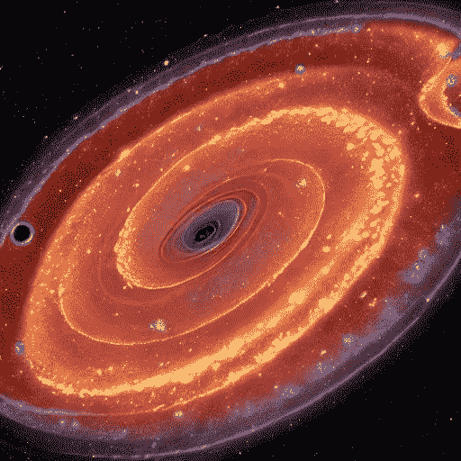
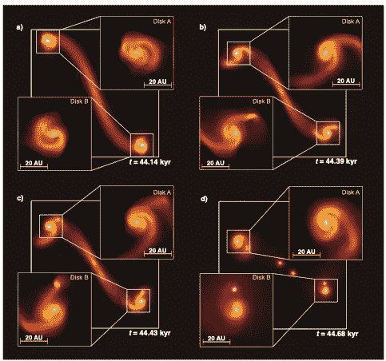
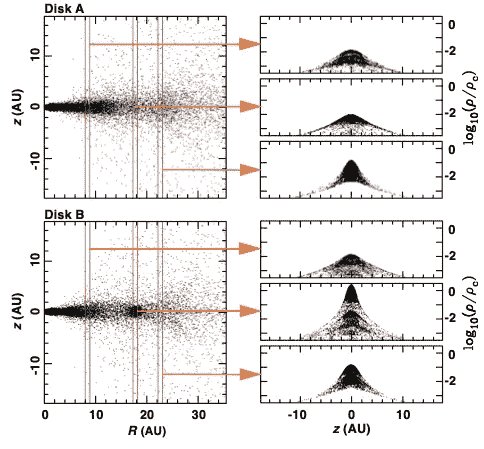

# 初始核心温度如何影响原恒星盘碎裂？

> 原文：<https://medium.com/mlearning-ai/how-does-the-initial-core-temperature-affect-protostellar-disc-fragmentation-ebc9464c5683?source=collection_archive---------3----------------------->

## 原恒星盘的小规模碎裂发生在恒星形成前的核心，这种碎裂导致了紧密双星系统的形成，正如最近 ALMA 观测所显示的那样。SPH 计算表明，通过原恒星盘的小规模碎裂形成紧密的双星系统，这与 ALMA 的观测结果一致。

AI-Stable diffusion generated image.

在恒星形成的最早期阶段，重力不稳定的原恒星盘会碎裂，从而形成快速增长的原恒星。这些旋转的星周盘在新恒星周围形成，并在坍缩早期碎裂，形成一对次级旋臂。与新形成的伙伴相比，质量最小的恒星吸积更慢，角动量更高。

在原行星盘形成的早期阶段，在它们周围也发现了旋臂。最近的研究提出，这些旋臂由位于磁场中的小尘埃颗粒组成，就像磁场中的铁屑一样。在 HD100453 周围的原行星盘中发现了双臂对称旋臂，在早期宇宙的极度贫金属环境中也发现了双臂对称旋臂。

# 计算模型

我们的代码基于 SPH 代码 GADGET-2 (Springel 2005)。GADGET-stellar 是 GADGET-2 的修改版本，它调用近似二阶精度，即它使用 C4·温德兰德平滑函数和改进的人工粘度方案。GADGET-stellar 使用了一种改进的人工粘性方案，该方案将真正的压缩激波与收敛流区分开来，并抑制了区域内的粘性耗散。

模型中采用了理想气体，并假定非等温条件开始出现在~ 1.0×10^(−14·g·cm^(−3).的某一临界密度该模型使用等压气体状态方程来定义气体从理想状态转变为非理想状态的条件。

# 一些结果

我们发现的证据有力地表明，在冷云核最密集的区域，原恒星盘往往会形成旋臂。我们还发现，原恒星往往最常形成于冷云最密集的区域。

**Fig 1.:** Equatorial density evolution of the cloud core centre for some of the model. The insets show amplified views of the protobinary cores and their accompanying protostellar discs.

本文讨论了在某些情况下，一个原恒星盘如何分裂成两个原恒星。它解释说，在两个原恒星由一个圆盘形成的情况下，质量更大的原恒星(从圆盘中吸积更多质量的那颗)将最终围绕质量较小的那颗运行。

因此，在较冷的内核中，恒星形成的效率似乎相对较高。然而，随着包层物质的进一步吸积将持续到本模拟所涵盖的时期之外，即超出圆盘中存在的分子氢的离解，一些原恒星可能变得足够热，从而引发原子氢的电离并终止吸积。

**Fig 2.:** Profiles of important quantities.

# 结论

结论是关于不同水平的扰动(振幅)如何影响原恒星盘的形成。据说，当振幅增加到 25%时，形成了紧密的双星和多次波，并且在模拟中观察到了小规模的特征，包括环绕双星系统的气体吸积到原双星系统部件周围的小原恒星盘上的螺旋形和长的流光。

感谢阅读，

直到下次，

# 点击此处获取报纸:

 [## 初始核心温度对原恒星盘碎裂的影响

### 抽象。地基和卫星观测显示在…中心尘埃温度低至 57k

doi.org](https://doi.org/10.1093/mnras/stac3694)  [## Mlearning.ai 提交建议

### 如何成为 Mlearning.ai 上的作家

medium.com](/mlearning-ai/mlearning-ai-submission-suggestions-b51e2b130bfb)