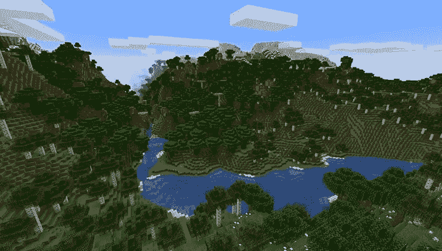

# 《我的世界》世界一代到底是如何运作的？

> 原文：<https://medium.com/mlearning-ai/how-exactly-does-minecraft-world-generation-work-e50c07693c9a?source=collection_archive---------2----------------------->

在即将到来的无人区天空中，看似无穷无尽的各种世界如果没有程序生成是不可能出现的。说到 PC 游戏，程序生成就是用来自动生成世界和特征，而不需要开发者去创建它们。过程生成广泛应用于《我的世界》、Terraria 或 No Mans Sky 等游戏中，这些游戏基于开放世界，玩家可以在其中自由探索和交互。如前所述，这可以用在机器学习中，以创建覆盖用传统的真实世界数据收集难以或昂贵地覆盖的区域的数据集。

在使用过程世界生成的视频游戏中，地图的种子值是用于过程地生成游戏世界(“地图”)的(相对)短的数字或文本串。启动《我的世界》时，会生成一个名为 Seed(或由玩家选择)的 64 位随机数，用于创建世界。当您在《我的世界》建立新的世界时，您可以选择透过输入世界产生器所使用的种子来建立自己的世界。

如果在创建新世界时未指定种子值，则《我的世界》将使用随机种子值。如果玩家想要使用一个特定的种子来创建一个特定的《我的世界》世界，他们必须在世界被创建之前这样做，因为这个世界随后不能被改变。不同的种子会创建不同的世界，如果你使用相同的种子，你总是会得到相同的结果(至少在相同版本的《我的世界》中是这样，因为地形生成的细节会因版本而异)。一种特殊算法通过随机分配称为《我的世界》种子码或简称为《我的世界》种子值的值来生成。

如果在《我的世界》的初始代码中也使用数字，一种特殊的算法可以创造出惊人的 281 万亿个不同的世界。这种差别是因为《我的世界》世界的生成器只能识别 40 亿字，所以只有《我的世界》的源代码才会为这些字生成。有了这些《我的世界》种子，仅仅用言语就能创造出 40 亿个理论世界。种子与一个特定的世界相关联，可以有不同的数字来定义它，因为创造《我的世界》世界的可能性几乎是无限的。

其他对生物群落的调整将它无限的重现价值提升到了一个全新的高度。《我的世界》的景观生成实际上发生在两个不同的层面:一个单独的“块”和整个世界。然后，当你探索《我的世界》的世界时，新的碎片将在你周围产生，创造一个广阔无痕的世界的幻象。你可以看到新的土地正在创造，因为你在世界各地移动。

 [## Mlearning.ai 提交建议

### 如何成为 Mlearning.ai 的作者

medium.com](/mlearning-ai/mlearning-ai-submission-suggestions-b51e2b130bfb)