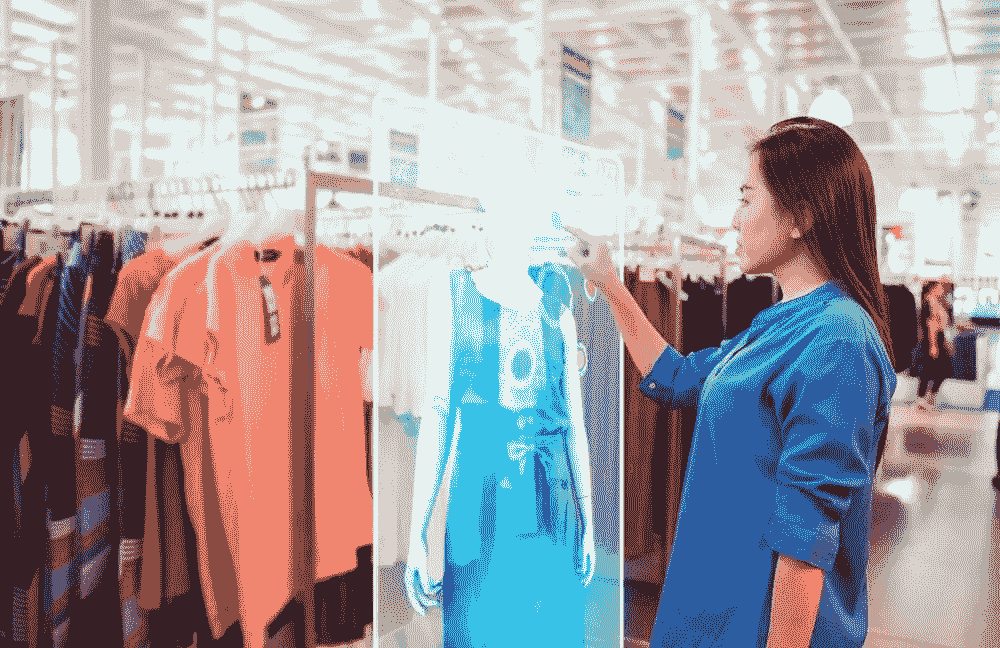
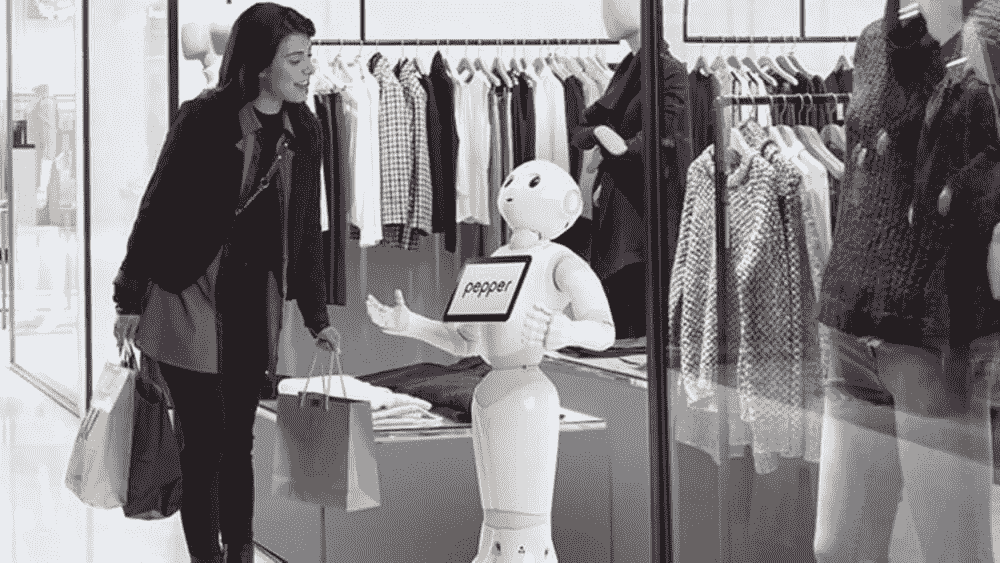

# 时尚和服装行业如何随着人工智能的实施而发展

> 原文：<https://medium.com/mlearning-ai/how-fashion-and-clothing-industry-evolved-with-ai-implementation-2b44bc611529?source=collection_archive---------5----------------------->

人工智能和时尚是两个长期被误解的话题，但随着人们欣赏这两个领域的独创性，这种情况正在改变。

许多不同的艺术领域目前都在使用人工智能技术。当谈到为更绿色的未来进行创新和开发时，时装设计师越来越多地转向人工智能。

**为什么人工智能在时尚行业很重要？**

为了提高我们社会的审美标准，我们的时尚需求在不断发展。事实上，这些数据表明，时尚是一个对全球预算有重大影响的大行业。

最新的人工智能技术，如机器学习和计算机视觉，已经如此深入我们的时尚，以至于它现在甚至会推荐符合我们风格和偏好的商品。此外，人工智能还以多种方式让客户的生活变得更加轻松，从推荐系统到虚拟助手。因此，时尚领域需要人工智能。此外，在时装业利用**人工智能**为时装店开辟了大量迄今未被发现的选择。

**人工智能在时尚零售行业有哪些优势？**

> 算法跟随客户的旅程，帮助他们找到完美的商品。这类似于 ***网飞的机器学习方法*** *，根据你之前的决定预测你可能会喜欢什么。*

客户服务:聊天机器人或触摸显示屏进行实时交流。将 [**人工智能运用于服装行业**](https://datafloq.com/read/the-rise-artificial-intelligence-fashion-clothing-industry/20570) ，让机器人辅助消费者寻找东西和回答简单的询问。

设计和采购:人工智能分析设计和采购中的趋势和客户行为。设计师和消费者会发现这些信息在设计新系列、选择颜色和风格等方面非常有价值。

预测和计划需求:计划员将获得更多信息，以便在正确的时间、正确的地点计划正确的数量(例如分配、聚类等)。

运营自动化:人工智能可以在流程的所有阶段进行自主决策，从观察到规划再到决策。例如，Grabit 使用自动化机器人和机器学习算法来提供工业帮助。

供应链中的库存管理包括实时库存跟踪(例如，通过 RFID)、仓库管理和运营采购。

> **人工智能在时尚领域的主要应用**
> 
> 无监督缝纫(缝纫机器人)
> 
> 顾客的购物习惯(根据社交媒体喜好匹配购物)
> 
> 无人监管的聊天服务员(虚拟助理和聊天机器人)
> 
> 既虚拟又非常全面的个人造型师。
> 
> 无监督缝纫(缝纫机器人)

随着人工智能的出现，先进技术以缝纫机器人的形式出现:机器人可以在没有人类帮助的情况下，或者在某些情况下，在人类的帮助下缝纫衣服。

在改进使用污水机器人的想法的过程中，许多人怀疑机器与织物的微妙本质互动的能力，织物总是起皱和收缩，但那是过去的事了。有趣的是，今天有几家公司正在引领时尚和零售领域的**人工智能革命。**

# ****消费者行为购物****

****

**如今，大多数时装公司不需要与顾客交谈就能知道他们想买什么。有了关于客户的大量可用数据，公司现在可以影响需要向客户的社交媒体页面发送哪些图像，这反过来又会影响客户的选择。所有这些都是通过数据分析实现的。**

****虚拟聊天服务员****

**虚拟聊天助手是时尚品牌将创意提升到新高度的方式之一。这些助理的工作是与客户互动，关注他们的需求，告知他们新产品和公司提供的任何其他产品。**

****虚拟造型师****

**虚拟造型师形式的人工智能一直致力于为合适的运动外套搭配完美的休闲鞋或最好的口红，就像任何造型师都会做的那样，甚至更好，因为 ***“程序”可以获得全方位的消费者数据，如鞋号、最喜欢的颜色、胸围和各种形式的统计数据。*****

**这项发明尤其有利于那些住在偏远地区，不能去发型师办公室，但仍想使用服务:谈论推动边界的时尚。**

****结论****

**虽然人工智能已被证明有利于增强时尚商业的各个方面，但人的因素将永远存在。当他们合作时，他们实现了更高的生产率、更好的消费者参与度和更高的收入。这种模式意味着人工智能正在作为一种增强智能而不是人工智能进化。**

** [## Mlearning.ai 提交建议

### 如何成为 Mlearning.ai 上的作家

medium.com](/mlearning-ai/mlearning-ai-submission-suggestions-b51e2b130bfb)**