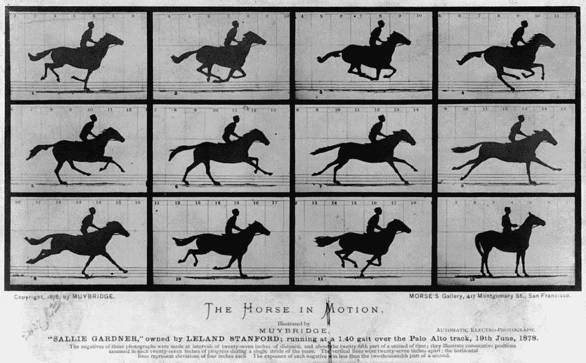

# 多快才算够快？

> 原文：<https://medium.com/mlearning-ai/how-fast-is-fast-enough-2af77c61007d?source=collection_archive---------5----------------------->

## 对“实时”数据含义的漫无边际的讨论

Horse in Motion [img: Wikipedia, Public Domain]

> 我的主张是:“实时”是任何比可以观察到的变化更快的东西

几年前，我参加了一个关于实时数据处理的午餐讨论，桌边的几个人以大男子主义的态度开始了讨论:

1.  我以前在战斗机上工作…实时是…