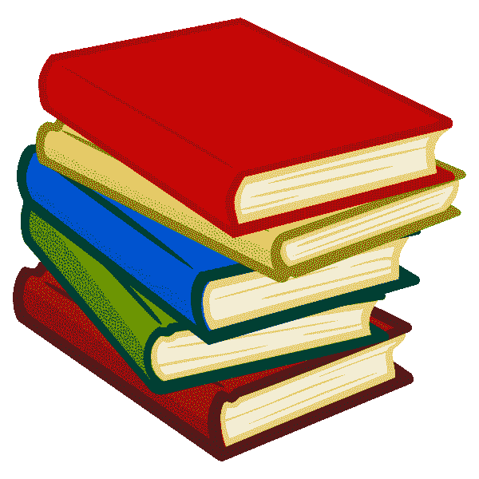

# 我如何在 ka ggle 2022 年 9 月的表格竞赛中获得最高分

> 原文：<https://medium.com/mlearning-ai/how-i-achieved-a-top-score-in-kaggles-september-2022-tabular-competition-772e336456bc?source=collection_archive---------1----------------------->

我期待着每个月的开始，因为 Kaggle 在他们每月的表格竞赛中有一个新的竞赛问题。2022 年 9 月的竞赛问题涉及图书销售，问题陈述如下:-

我参加这个比赛时并没有想到会赢，所以我决定分析一下…