# 我是如何分析你母亲的

> 原文：<https://medium.com/mlearning-ai/how-i-analyzed-your-mother-51cb0dc21cc8?source=collection_archive---------1----------------------->

# 孩子们，我要给你们讲一个不可思议的故事。我是如何用数据科学分析电视剧**如何遇见你妈**的故事。

当数据科学领域第一次引起我的注意时，我不知道它能有多深；任何人都可以利用数据科学。作为一个 2020 年 5 月大学毕业的人，我的工作前景非常低迷，我意识到我需要做出改变。我发现数据科学让我感兴趣，但我没有必要的技能。进入:熨斗学校。

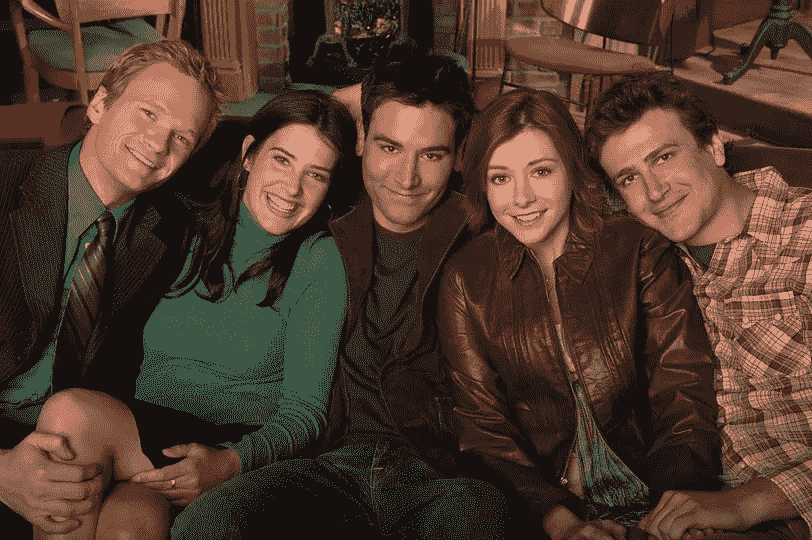

(from left to right) Barney, Robin, Ted, Lily, and Marshall in Season 1 (Image 1)

我刚开始的时候，偶然看到这篇文章:[https://towards data science . com/the-one-with the-all-the-friends-analysis-59 daf CEC 19 c 5](https://towardsdatascience.com/the-one-with-all-the-friends-analysis-59dafcec19c5)(1)我的大脑*恳求*我这样做是为了《我是如何遇见你妈的》(HIMYM)，这是我从小到大最喜欢的节目之一。我渴望得到泰德和他的伙伴们的照片，但是我不知道怎么去那里。然而，在过去的一年里，我从头到尾一直在构建一些项目，这些项目帮助我理解了机器学习、深度学习、自然语言处理，以及其中涵盖的许多主题。我甚至能够让这个项目成为我这个项目最后的顶点项目。所以现在我的技能达到了标准，我终于能够给我的大脑它应得的东西了:**关于 HIMYM 独特见解的漂亮图表**。但是首先，让我们走一遍如何到达那里，因为如果我说我没有发现它的乐趣，那我就是在撒谎；就像我发现特雷西是母亲一样！

# 该过程

对于那些希望跟进的人来说，这个项目遵循 OSEMN 的数据科学过程:获取、清理、探索、建模和解释。这个项目的目的是对该剧的主要角色进行彻底的探索性数据分析，然后建立一个模型来分类哪个角色说了哪个台词。对于那些想看完整笔记本的人来说，完整的 GitHub 库也在本文的底部链接。

# 获得

获取脚本的过程有点耗时，但非常值得。所有的剧本都放在一个网站上，叫做《永远做梦的抄本》( 2 ),有九个不同的索引页。使用 BeautifulSoup，我抓取了每一页的脚本，并建立了一个链接和剧集标题的列表。然后，我使用 for 循环遍历每个列表，并创建一个数据帧，其中包含每个主角说的每一句台词，以及每一句台词所属的季节和剧集。下面是 for 循环和创建的数据帧头。

# 矮树

在清理数据时，我做了一些基本的预处理。我删除了“运动”——括号中的任何东西——并将它们推到一个新的栏中。你可以在上面的第二行看到一个例子，它说(打开环)；我选择将它们移到一个新的专栏，以防我想探究每个角色做了什么样的动作(这次我没有使用它，但将来我可能会使用)。下面的块显示了查找动作和添加该列的代码，以及从 Line 列中删除动作的代码。

我还使用 TextBlob 为每一行添加了极性得分(衡量一个陈述的积极或消极程度，从-1 到 1)和主观性得分(衡量一个陈述的主观或客观程度，从 0 到 1，0 表示更客观，1 表示更主观)。这些分数有助于衡量情绪。下面的块显示了添加这些情感分数的代码，以及更新后的数据框的样子。

# 探索

这是项目的主要部分，也是真正有趣的地方！在我深入研究并向您提供所有细节之前，我想向您提供一些额外的代码。我希望我的每一幅图都使用 HIMYM 字体来增加项目的氛围。下面是一段代码，展示了如何为项目更改图形的字体。

起初，我确实遵循了我最初发现的那篇详述朋友分析的文章(1)；我查看了谁的台词最多，词汇量最大，谁的名字和昵称被提到的次数最多，等等。除此之外，我还查看了该剧的常见流行语、每个角色最常用的单词和短语，以及与他们的情感评分相关的多个角色关系(类似于最初的《老友记》文章，但更深入一些，并跨越了多个角色关系)。

通过以这种方式深入探索数据，我发现了我找到数据的网站的一些缺陷。首先，整个第九季没有被正确转录:没有一个角色的名字是用他们的台词写的，它只是每集的一个长独白，所以第九季不包括在任何分析中。许多剧集都是前几集的翻版，所以并不是每一季的每一集都包括在内。

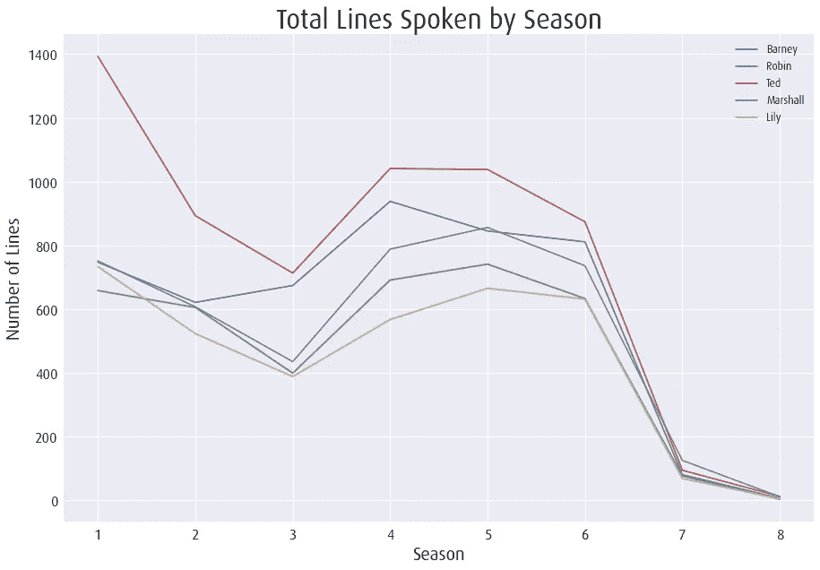

Total Lines by Season (Image 2)

除了重复剧集的问题，一些剧集也没有正确转录，特别是在第 7 和第 8 季，但你也可以看到第 3 季的下降(如图 2 所示)。因此，在阅读本文时请记住，这并不是对该节目的完整分析，而是对现有资料的补充。

记住这一点，你已经等得够久了，*让我们看看一些图表吧！*

**系列赛总台词**

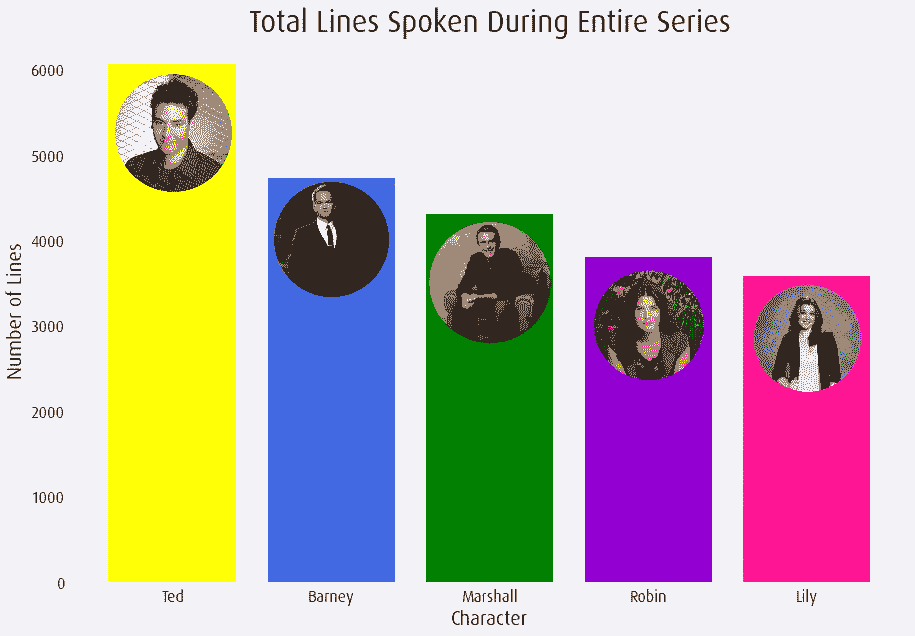

Total Lines Spoken During Entire Series (Image 3)

第一张图详细描述了整个系列中每个角色说的台词总数(我将很快发布另一篇博客文章，讲述如何制作带有条形图像的图表)。泰德有最多的台词是有道理的，因为他是这部剧的主角。接下来是巴尼，紧随其后的是马歇尔，然后是罗宾和莉莉。在整个分析中，每个角色都用相同的颜色绘制:泰德黄、巴尼蓝、马歇尔绿、知更鸟紫和百合粉(对于那些正在阅读的超级粉丝来说，根据 HIMYM 颜色理论，显然泰德是黄色的，知更鸟是紫色的)。

请记住，许多脚本都丢失了，我相信如果所有脚本都可用，这些数字会更均匀。作为狂热的 HIMYM 粉丝，我们知道莉莉有很多故事情节，话也很多，所以她应该没有泰德一半多。进一步考虑，我们的目标是建立一个模型，可以准确地分类哪个字符说了哪一行。到目前为止，我们看到这个数据集非常不平衡，所以我们的模型可能会有一些问题。

**最常被提及的**

我看了看其他主要角色提到最多的角色，无论是总的还是仅仅是昵称。

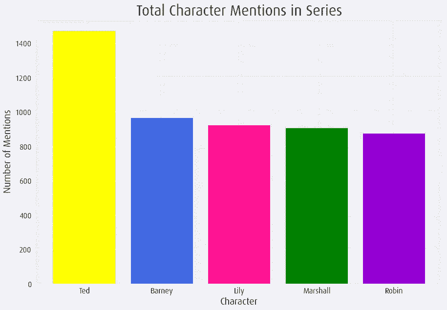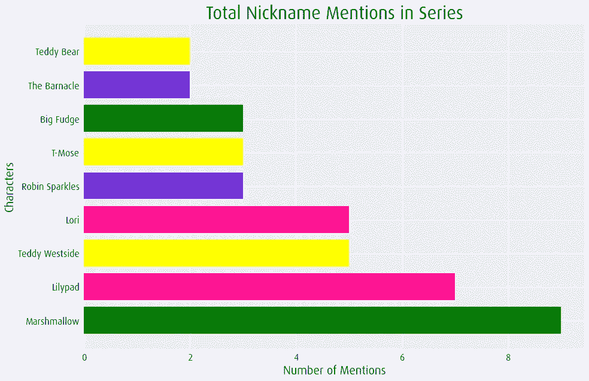

Total Character Mentions in Series (Image 4) and Total Nickname Mentions in Series (Image 5)

我们看到泰德被提到的次数最多，因为他是主角，这很有意义，因为即使他不在现场，人们也会谈论他。其余的角色总共被提及了大约两次。当谈到昵称时，我们看到棉花糖和莉莉帕德是被提到最多的，这也是有道理的，因为马歇尔和莉莉用它们作为彼此的昵称。我们还看到其他常见的昵称，如泰迪·威斯特、罗宾·斯巴克和大软糖。

Come again for Big Fudge? (Image 6)

不过有一点不太合理，那就是被提及的次数；应该有更多的方法。尤其是罗宾火花四射；它只被提到了三次，但是如果你看过这个节目，你就会知道他们已经说了不止三次了。这是对我的另一个指示，即剧集没有被正确转录。如果你是一个真正的粉丝，你还会注意到无论是 swar ley(swar ley-第二季第 7 集)还是 Robin daggs(p . s . I Love You-第八季第 15 集)都不在那个图表上。这是因为这些片段没有被正确地转录，因此，这些片段不能用于本分析。希望你开始在实践中看到网站陷阱的影响。

**人物词汇和短语**

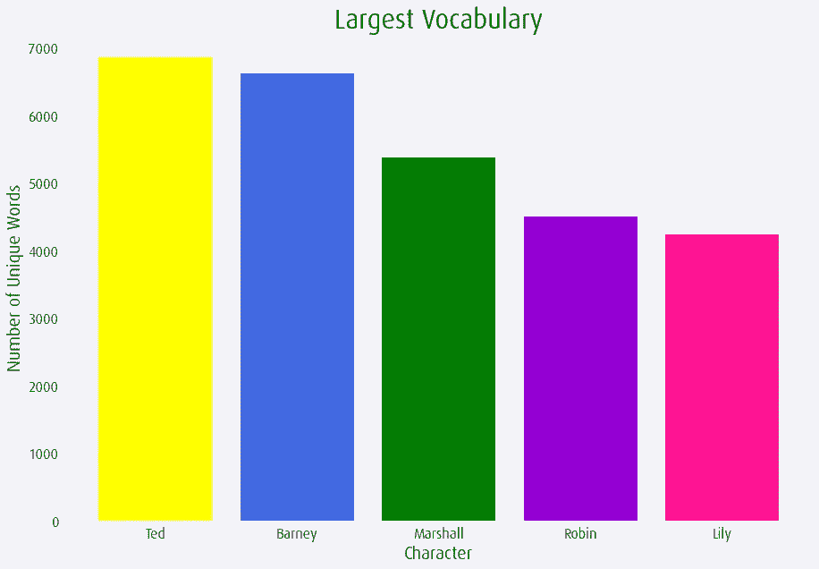

Largest Vocabulary (Image 7)

当谈到不同的词汇时，最大的词汇以完全相同的顺序跟随最多的行是有意义的。虽然它确实跟风，但我觉得有趣的是，巴尼的独特词汇数量接近 Ted 的总数；巴尼经常用很多独特的词，让你想听听他要说什么，或者他要让这帮人搞什么恶作剧。在我深入探讨每个角色的台词之前，我想先说说这部剧的一些常用词/流行语。

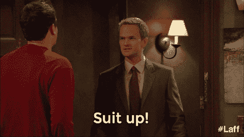

Suit up! (Image 8)

我没有进一步探究是谁说了什么或什么时候说的，我只是想知道一些经典台词被提及的频率。探索这一点有助于揭示更多关于该分析中缺失了多少集的信息。“律师”这个词只被提到了 10 次。“西装革履”只被提到了 11 次，对于巴尼请求泰德穿上经典装扮的频率来说，这感觉太低了。“西装”被提及 95 次，“西装”被提及 16 次；那好一点了。然而,“击掌”只被提到 7 次,“等着瞧”和“传奇”都只被提到 16 次。“加拿大”被提到了 54 次，他们也确实喜欢为她的家乡烤知更鸟；但那也应该更高，不是吗？希望作为狂热的粉丝，你也觉得这些数字很低。

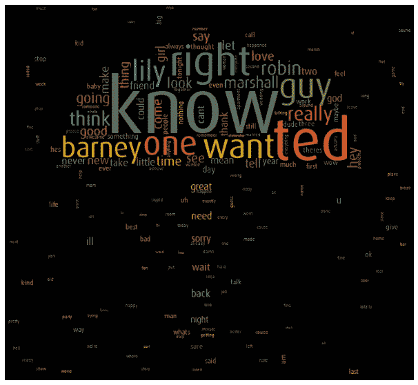

Total Corpus Word Cloud (Image 9)

上图是总语料库的一个词云；所以所有角色最常用的词。你可以看到“知道”是使用最多的词，人物名字也很常见，还有其他形容词。以下图像是每个字符的单词云。查看这些有助于确定每个角色的词汇之间的差异，并有助于在建模时了解不同类别之间的差异。

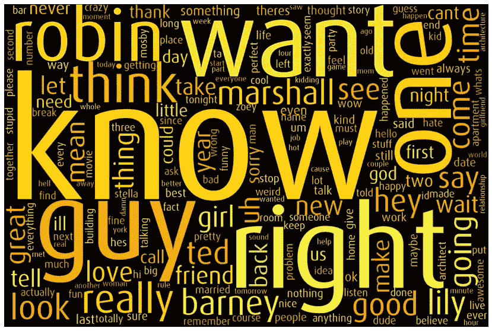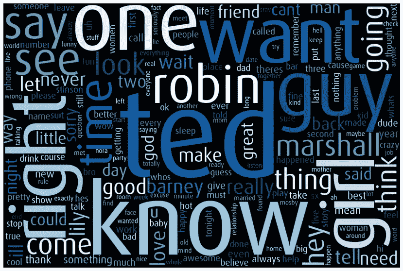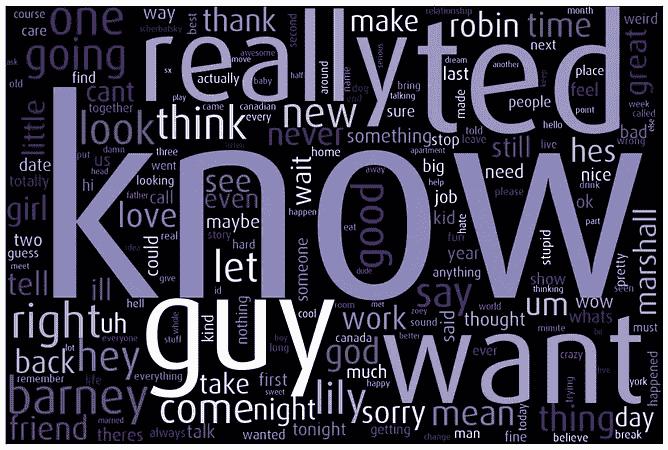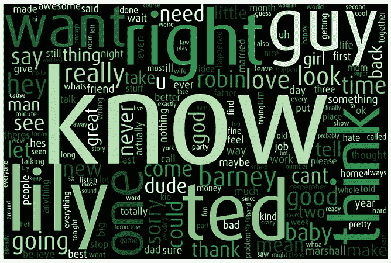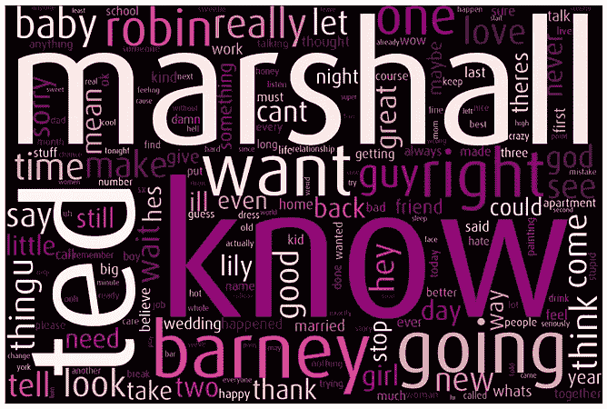

(from left to right, top to bottom) Ted, Barney, Robin, Marshall, and Lily Word Clouds (Images 10–14)

通过观察这些，有一点是清楚的:我们的模型将很难根据台词区分每个角色。除了巴尼，每个角色用得最多的词是“知道”；巴尼的是“泰德”，其次是“知道”。这些单词云看起来有点混乱，颜色也变了，这在技术上是正确的，但它们都显示不同的数据。这种特殊的探索是有益的，但它预示着未来的麻烦。

为了进一步探索每个字符的词汇之间的差异，我看了一下 Ngrams，从一个词到四个词的短语，看看这些短语是否会告诉我们更多关于每个字符在他们的行中如何不同的信息。这些差异在三个单词的短语中表现得最为明显:

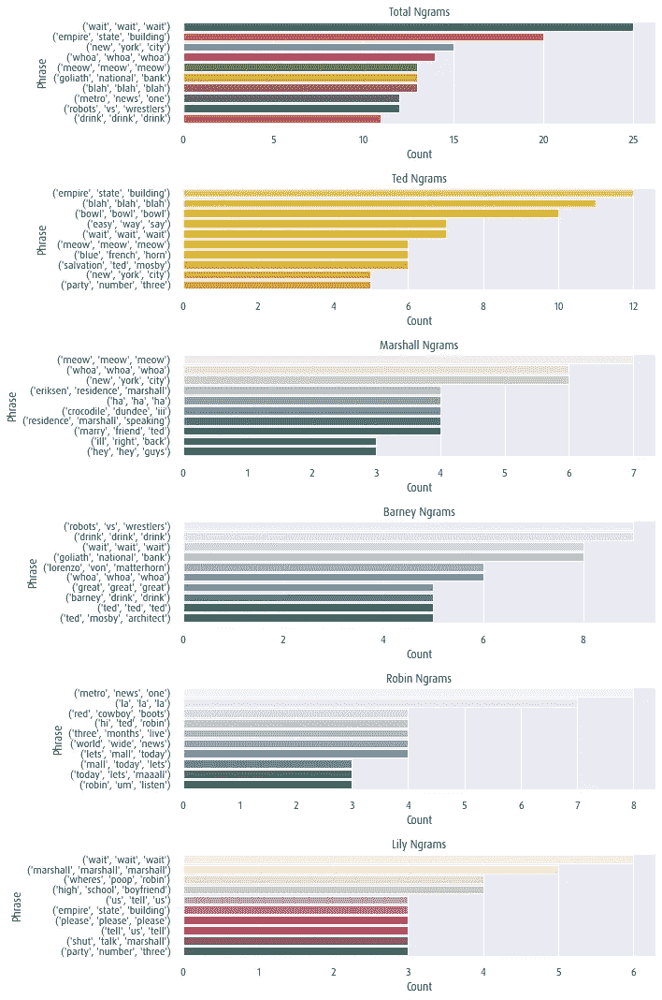

Three-Word phrases for total corpus and each character (Image 15)

虽然每个角色的短语有很多相似之处，但我们也看到了一些不同之处。需要注意的是，很多短语都是重复的，比如“哇哇哇”或者“等等等等”。总语料库的常用短语是有意义的，尤其是“帝国大厦”和“纽约市”，因为这帮人住在纽约市，经常谈论它。“都市新闻一台”和“巨人国家银行”是常用短语也是有道理的，因为这些是罗宾、泰德、马歇尔和巴尼整个季节的工作场所。我觉得很有趣的是，马歇尔最常见的三个单词短语是“埃里克森住宅马歇尔”和“住宅马歇尔在说话”，因为这是来自一个特定的插曲(哦，亲爱的-第 6 季第 15 集)，当时他正在明尼苏达州的家中访问。

Eriksen Residence. Marshall Speaking. (Image 16)

尽管我们通过查看 Ngrams 看到了更多的差异，但越来越清楚的是，我们的模型将很难基于字符进行分类。

**感悟**

我想通过情感分析来看看一些不同的角色关系是如何演变的。我看了第一季和第二季的马修和莉莉，第一季、第二季和第三季的泰德和罗宾，第三季、第四季和第五季的巴尼和罗宾。从第一季和第二季中他们台词的主观性和极性的角度，让我们来看看泰德和罗宾的感情时间线:

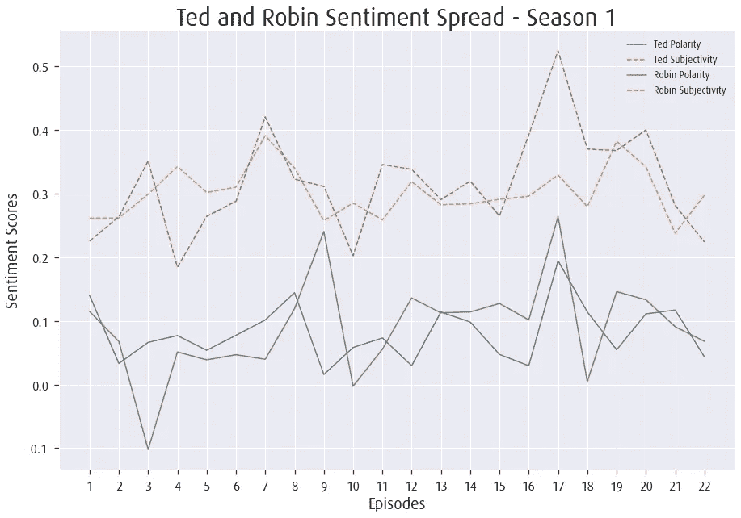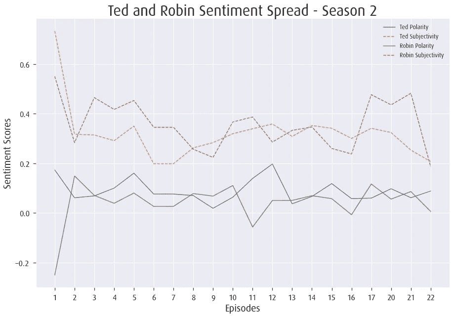

Spread of Ted and Robin’s Sentiment Scores across Seasons 1 and 2 (Images 17–18)

我们看到的是泰德和罗宾在整个第一季中追逐她的过程中的起起落落，以及他们最终在第一季的最后一集和第二季的开头相遇。然而，虽然他们个人对在这些集里聚在一起感到兴奋，但他们不得不安慰一个受压迫的马歇尔，因为莉莉刚刚离开他去了旧金山，这可以解释为什么极性得分较低。我们在第一季第 17 和 18 集看到了泰德和罗宾的高潮，这几集是泰德欺骗他的海外女友和罗宾在一起；所以这种上升和下降是有道理的。跳过一个图形，即使在第二季大结局中透露他们要分手，但也不算太消极，因为他们不想把注意力从莉莉和马歇尔的婚礼上转移开。

了解了建模过程的所有信息后，我将快速概述一下这个过程和结果。在建模之前，我选择删除第七季和第八季中的所有台词，因为这两季中的台词很少，我觉得这可能有助于增加角色之间的平衡。

# 模型

如果你一直在跟踪，你会知道我们的模型很可能很难对每个角色进行分类——事实也的确如此。利用蛮力方法，我构建了六个基线模型(逻辑回归、多项式朴素贝叶斯、K 近邻、随机森林、决策树和 AdaBoost ),每个模型都有两个矢量器(Count 和 TF-IDF ),从而产生了 12 个基线模型。我使用 Cohen 的 Kappa 评分比较了每个模型，这是一种用于在不平衡数据集上评估多类分类器的度量；它的得分最高为 1，越接近 1，分类器越好。

我调优了前五个模型，再次使用了强力方法，但是这次使用了参数调优，这样我就可以解析出迭代之间的具体差异。最终和最佳表现模型是:**使用计数矢量器的逻辑回归，C 设置为 0.5** 。该模型产生了 0.125 的 Cohen’s Kappa 分数和 0.32 的准确度。虽然这绝不是一个好模型，但它是最好的。我甚至在这个最终模型上尝试了更多的超参数调整，但这些仍然是最高的结果。

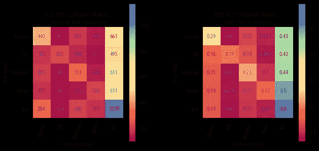

Confusion Matrix for Final Model Test Set (Image 19)

# 口译

让我重申，这绝不是一个好模型，它只是我最好的。不过，有很多东西可以解释这一点。首先，我们知道这些类非常不平衡(记住，Ted 的行数几乎是 Lily 的两倍)。我们还知道每个角色都有非常相似的词汇，所以我们知道在建模过程中，我们的模型将很难区分每个角色。

Precision Recall Curve graph for Final Model (Image 20)

查看每个字符的精确回忆曲线 AUC 分数，我们可以看到每个类别的表现都比随机分类器差(0.5)。最高性能的分类器是 0.36 的 Ted，这是有意义的，因为他有最独特的单词和最多的台词，所以有更多的单词要尝试和分类给他。按照这种逻辑，你可能会认为莉莉的得分最低，但实际上罗宾只有 0.24 分。无论如何，这些分数彼此都非常接近，并且都与模型表现不佳密切相关。试图按字符对整个系列进行分类并不是一个好的分类器。

# 进一步的探索和迭代

在发现在整个系列中按角色分类并不能产生高性能的模型后，我想到了一些其他的方法，这个项目的进一步迭代可能会产生一个更好的模型。首先，你可以只按一季的人物来分类，而不是按整个系列的人物来分类；查看一个季节内的特定语言可能会发现比这个概述中看到的更具体的差异。另一种建模的方式可以是按季节分类:看什么台词适合什么季节，而不是哪个角色说的。这肯定会导致更高的准确性，因为有一些单词或短语只在特定的季节提到，所以这些差异更明显。

说到数据探索，我真的只是触及了表面。可以做的事情很多，但时间有限。进一步的探索可以包括寻找角色之间更具体的差异，也许可以看看如何在建模前应用。我认为可以制作更多的图表来探索 HIMYM 宇宙中最受欢迎的短语；按性格，季节等。我也没有机会利用动作和台词，所以看一看会有好处。可以对不同季节和角色的主题进行更深入的分析，以及他们的语言是如何融入这些主题的。

虽然这些模型不是最好的，但我们做了一个强大的探索性数据分析，我觉得它包含了这个节目的核心。你可以看到角色关系的起伏，以及一些最喜欢的台词和流行语的使用频率；所有这些都增加了《我是如何遇见你的母亲》的氛围，作为一个狂热的粉丝，我很高兴能够通过这条途径重新体验这部剧。

如果你做到了这一步，谢谢你的耐心，我希望你也喜欢。如果您有任何问题、意见或顾虑，请随时联系我。你可以通过我的 twitter @ DataSciSrobz 或者评论这个帖子来联系我。这个项目的 GitHub 库位于:[https://github.com/srobz/How-I-Analyzed-Your-Mother](https://github.com/srobz/How-I-Analyzed-Your-Mother)。

# 引文

图片 1:[https://www . cheat sheet . com/WP-content/uploads/2019/08/how-I-met-your-mother-cast-1024 x681 . jpg](https://www.cheatsheet.com/wp-content/uploads/2019/08/how-i-met-your-mother-cast-1024x681.jpg)
(1)[https://towardsdatascience . com/the-one-with-all-the-friends-analysis-59 daf CEC 19 c 5](https://towardsdatascience.com/the-one-with-all-the-friends-analysis-59dafcec19c5)
(2)[https://transcripts.foreverdreaming.org/viewforum.php?f=177](https://transcripts.foreverdreaming.org/viewforum.php?f=177)
图片 6: [https](https://c.tenor.com/sMTRAxtcRgEAAAAC/come-again-big-fudge.gif)