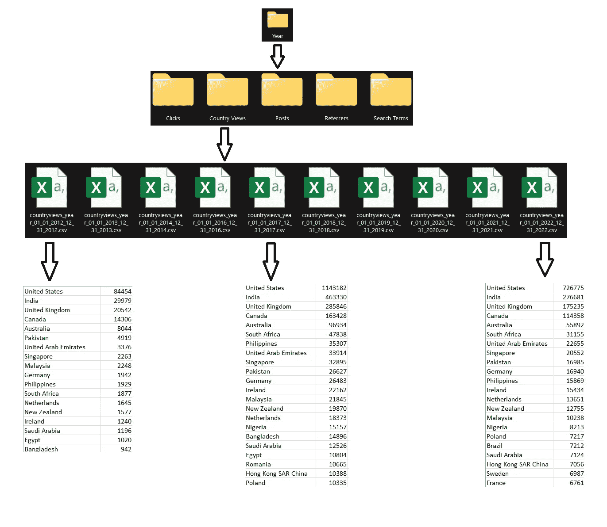
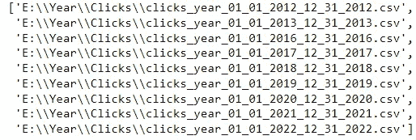
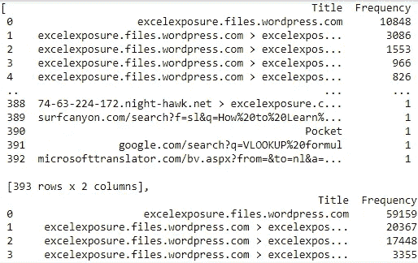
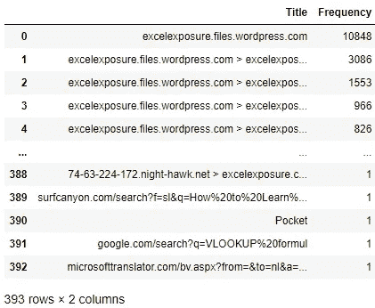
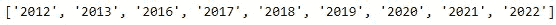
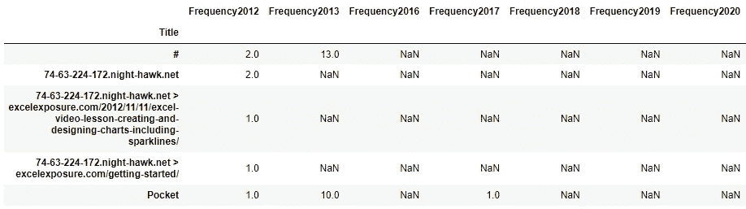
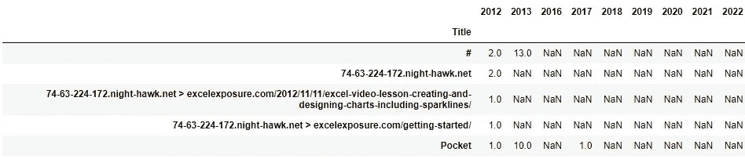

# 我如何使用 Python 将 5 个目录中的 60 个 csv 文件合并到一个函数中

> 原文：<https://medium.com/mlearning-ai/how-i-combined-60-csv-files-from-5-directories-with-a-single-function-using-python-5e17d31e0db6?source=collection_archive---------0----------------------->


# **摘要:**

本教程是我最近参与的一个项目的一个子集。这里的任务是将多个 csv 文件中的数据合并成一个文件，这样就不会丢失任何信息，并且合并所有文件中的列时不会出现任何不一致。

# **简介:**

您是否遇到过这样的情况:多个表有一个公共列，并且必须根据一个主键合并它们？我相信现在你会认为我在谈论连接。是的，但是如果我说我们把这些表都存储在一个 csv 文件中，那么每个 csv 文件就是一个表呢？在 5 个不同的文件夹中有 10 个 csv。总共 50 个 csv 文件。这里的任务是合并每个文件夹中的所有 csv 文件，并生成一个主 csv 文件，所以最终我们应该有 5 个主 csv 文件。这里的数据集与网站的流量相关

# **关于数据:**

让我快速浏览一下文件夹结构:



*年>国家视图> 10 csv 文件*

类似地，所有其他 4 个文件夹也有类似的结构。所有的 csv 都有两列，一列是参数本身，另一列是收到的参数的值或命中数。每个 csv 文件代表一年。行数可能会增加或减少，有些可能会在不同的年份重复。因此，我们需要确保在合并时没有数据丢失。

我们可以使用 SQL 和 left outer joins 或者使用 excel 中的 VLookUp 函数来实现这一点，但是这将非常耗时。在这里，蟒蛇来救我们了。

我们将使用 python 自动完成这项任务，并创建一个函数，该函数将单个输入作为文件夹“Year”的路径，并在单个调用中为我们在每个子目录中创建一个新的主 csv。够了，让我们开始工作吧。

*导入必要的库:*

```
import pandas as pd
import os        #provides functions necessary to interact with os
import glob      #used to extract file paths that match specific                pattern
import re        #regular expression package
```

# **方法:**

1.  我们的函数将遍历主文件夹“Year”中的所有子文件夹。“子文件夹”列表将存储所有子文件夹的名称。
2.  在每个子文件夹中，我们将遍历所有文件，并将每个文件路径存储在列表“all_files”中。
3.  每个文件的数据将被存储为一个数据帧，并且每个数据帧将被存储在一个新的列表‘Li’中。换句话说，我们将创建一个列表，其中每个索引代表一个数据帧(csv)。
4.  我们还将创建一个“year”列表，该列表将使用库“re”从所有 csv 文件名中提取并存储年份。
5.  使用列表“li”的索引，我们将用左外连接合并每个数据帧，从前 2 个索引开始，然后迭代直到列表索引的结尾。
6.  在我们生成最终的主 csv 之后，我们将在“年份”列表的帮助下重命名所有的列我们将使用先前创建的“子文件夹”列表，用各自的文件夹名称命名子文件夹中的所有文件。

# **执行:**

我们的函数将是一个迭代器。这里，为了便于理解，我将带你经历一次迭代，然后我们将它转换成一个动态函数。我们将使用太多的列表和 for 循环。

第一步:

解析主文件夹“Year”并存储列表中所有子文件夹的名称。

```
data_dir = r’E:\Year’
sub_folders = os.listdir(data_dir)
sub_folders
```


第二步:

遍历子文件夹“Clicks”中的所有文件，并将它们的文件路径存储在列表“all_files”中

```
path = os.path.join(data_dir, sub_folders[0])
os.chdir(path)
all_files = glob.glob(path + “/*.csv”)
all_files
```



第三步:

创建一个新的文件数据列表作为数据帧“li”

```
li = []
for filename in all_files:
 df = pd.read_csv(filename,on_bad_lines=’skip’,names=[‘Title’, ‘Frequency’])
 li.append(df)
li
```



```
li[0]
```



*一览列表“李”中第一个指标的样子*

第四步:

创建一个“年份”列表，使用库 re 从文件名中提取所有年份

```
year = []
for file in range(0,len(all_files)):
 x = re.search(“[0–5][0–9][0–5][0–9]”, all_files[file])
 year.append(x.group())
year
```



第五步:

从索引 0 和 1 开始，用左外连接逐一合并每个数据帧中的所有数据。在此之前，我们将添加用 0 替换所有数据帧中的所有空白值。

```
li[index].fillna(0)
li[index] = li[index].groupby([‘Title’]).agg(‘sum’)left = li[0]
for i in range(0,len(year)-1):
 right = li[i+1]
 result = pd.merge(left, right, on=”Title”, how=”outer”,suffixes=    (year[i],year[i+1]))
 left = result
left.head()
```



第六步:

让我们重新命名这些列，因为 frequency 被添加到连接生成的所有新列名中。

```
left.columns = year
left.head()
```



最后，让我们在“Clicks”子文件夹中用适当的文件名导出数据帧

```
left.to_csv(sub_folders[0]+’.csv’)
```

因此，我们成功地完成了手头的任务。现在让我们把所有的代码放在一个函数中。

```
def combine_data(data_dir):

 os.chdir(data_dir)
 sub_folders = os.listdir(data_dir) #list of sub_foldersfor folder in range(0,len(sub_folders)): #loop through all sub_folders
 path = os.path.join(data_dir, sub_folders[folder])
 os.chdir(path)
 all_files = glob.glob(path + “/*.csv”) #list of all files in folderli = []
 for filename in all_files:
 df = pd.read_csv(filename,on_bad_lines=’skip’,names=[‘Title’, ‘Frequency’])
 li.append(df) #list li of df (each csv as 1 df at each index of li)

 for index in range(0,len(all_files)):
 li[index].fillna(0)
 li[index] = li[index].groupby([‘Title’]).agg(‘sum’)year = []
 for file in range(0,len(all_files)):
 x = re.search(“[0–5][0–9][0–5][0–9]”, all_files[file])
 year.append(x.group()) #list of year fetched from .csv filenamesleft = li[0]
 for i in range(0,len(year)-1):
 right = li[i+1]
 result = pd.merge(left, right, on=”Title”, how=”outer”,suffixes=(year[i],year[i+1])) #outer merge on 2 consecutive indexes of df
 left = result#year.insert(0,’Title’) 
 left.columns = year #updating column names of master dfleft.to_csv(sub_folders[folder]+’.csv’) #exporting the df
```

函数调用:

```
data_dir = r’E:Year’
combine_data(data_dir)
```

*感谢您阅读这篇文章。请联系任何关于 kakadiya95@gmail.com 的问题、澄清或版权问题。或者你可以在我的*[*Linkedin*](https://www.linkedin.com/in/kkkakadiya/)*页面给我发消息。还有，结账我的*[*github*](https://github.com/sh4dowbyt3)*账号。*

[](/mlearning-ai/mlearning-ai-submission-suggestions-b51e2b130bfb) [## Mlearning.ai 提交建议

### 如何成为 Mlearning.ai 上的作家

medium.com](/mlearning-ai/mlearning-ai-submission-suggestions-b51e2b130bfb)