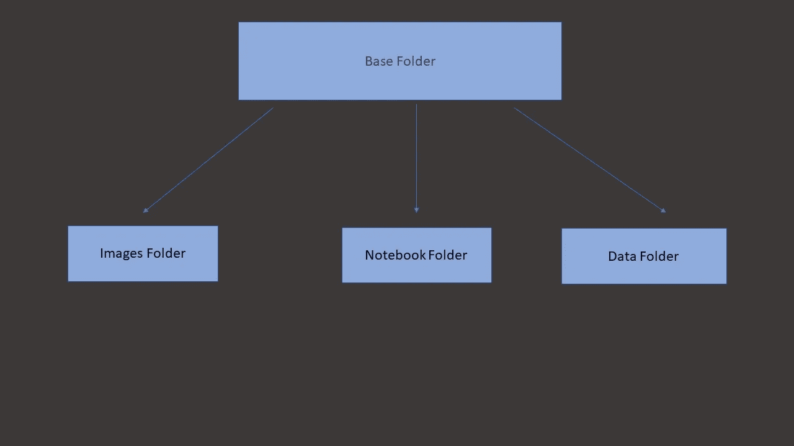
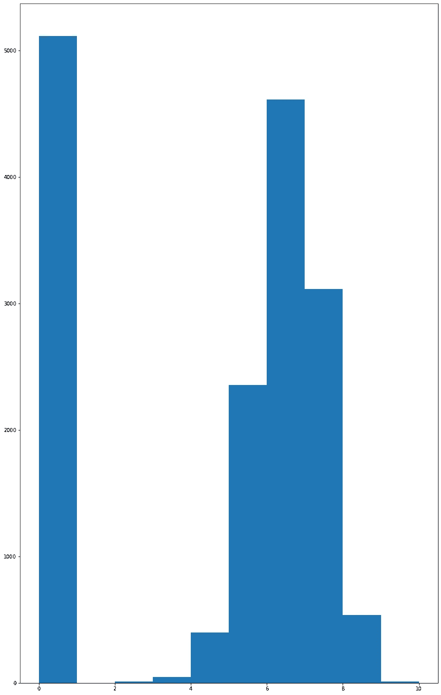
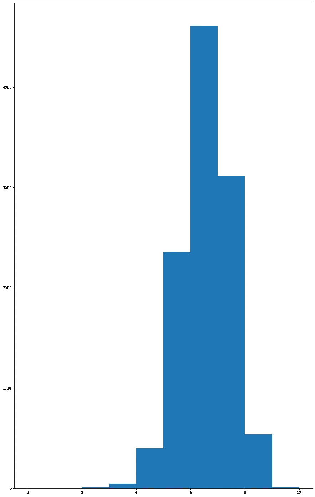
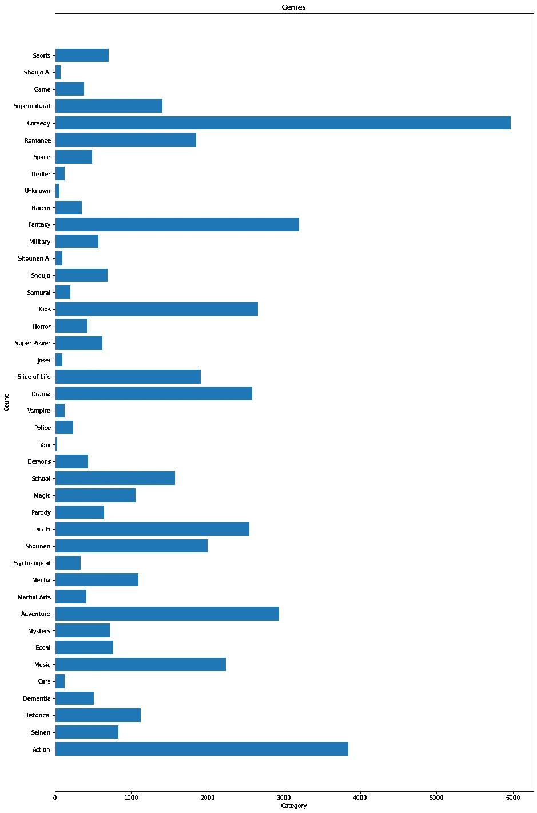
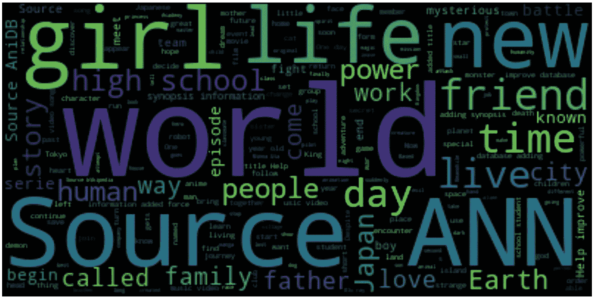

# 我如何用数据科学来决定一部漫画的成功

> 原文：<https://medium.com/mlearning-ai/how-i-determined-the-success-of-a-manga-using-data-science-5bf3ba8bcb90?source=collection_archive---------5----------------------->


Photo by [Gracia Dharma](https://unsplash.com/@graciadharmaa?utm_source=medium&utm_medium=referral) on [Unsplash](https://unsplash.com?utm_source=medium&utm_medium=referral)

# 介绍

每年都有数百部漫画被出版商抛弃。作为一个如饥似渴地阅读的人，看到一部文学作品被抛弃是令人心碎的。很多时候，这是因为缺乏读者，糟糕的翻译和它的宣传方式。利用数据科学和分析，我将找到一种方法来确定漫画的成功，并利用这种分析可能会改变他们向公众描绘的方式。

# 数据

这些数据是通过网络搜集在 myanimelist.com 上找到的。关于网络的更多信息，请查看我的前一篇文章。数据由以下几列组成:MALID、名称、分数、流派、概要(漫画的描述)。在分数栏中，分数“未知”意味着该漫画没有被任何成员评级。在我的本地机器上，文件的结构如下。



# 探索性数据分析

如果你跟着这里是 EDA 的代码。我也解释了我对以下步骤的推理。

```
import pandas as pd
import numpy as np
import matplotlib.pyplot as plt
from gensim.parsing.preprocessing import remove_stopwords
from wordcloud import WordClouddf = pd.read_csv("../Data/anime_with_synopsis.csv")
display(df)
display(df.info())
display(df.describe())numerical_features_columns = [""]
description_label = ""
df["Score"] = df["Score"].apply(lambda x : .0 if x == "Unknown" else x)
df.dropna(inplace = True) categories_list = []
for row in df["Genres"]:
    [categories_list.append(x.strip()) for x in row.split(",")]categories = list(set(categories_list))
categories_count = [categories_list.count(x) for x in categories]fig = plt.figure(figsize=(15,25))
plt.barh( categories,categories_count  )
plt.xlabel("Category")
plt.ylabel("Count")
plt.title("Genres")
plt.show()df["Score"] = pd.to_numeric(df["Score"])
fig = plt.figure(figsize=(15,25))
plt.hist(list(df["Score"]) , bins = [0,1,2,3,4,5,6,7,8,9,10])
plt.show()# We'll be removing all the manga with rating 0 to fit the gaussian curvedf["Score"] = pd.to_numeric(df["Score"])
fig = plt.figure(figsize=(15,25))
plt.hist(list(df[df["Score"] != 0]["Score"]) , bins = [0,1,2,3,4,5,6,7,8,9,10])
plt.show()df = df[df["Score"] != 0]
plt.figure(figsize=(30,30))
text = " ".join(str for str in df["sypnopsis"])
text_without_stopwords = remove_stopwords(text)
word_cloud = WordCloud(background_color = "black" , collocations = True).generate(text_without_stopwords)
plt.imshow(word_cloud , interpolation= "bilinear")
plt.axis("off")
plt.show()high_df = df[df["Score"] > 5]
low_df = df[df["Score"] <= 5]plt.figure(figsize=(30,30))
text = " ".join(str for str in high_df["sypnopsis"])
text_without_stopwords = remove_stopwords(text)
word_cloud = WordCloud(background_color = "black" , collocations = True).generate(text_without_stopwords)
plt.imshow(word_cloud , interpolation= "bilinear")
plt.axis("off")
plt.show()plt.figure(figsize=(30,30))
text = " ".join(str for str in low_df["sypnopsis"])
text_without_stopwords = remove_stopwords(text)
word_cloud = WordCloud(background_color = "black" , collocations = True).generate(text_without_stopwords)
plt.imshow(word_cloud , interpolation= "bilinear")
plt.axis("off")
plt.show()
```

因为没有被评级的漫画被给了“未知”的分数，所以我给他们的评级是零。

然后我做了一个分数直方图。我注意到分数栏似乎遵循正态分布曲线，但是零分太高了。正态分布或钟形曲线是大多数范围应该落入的。比如考试的分数，可量化的结果。这是钟形曲线应该有的样子。


这是我从分数直方图得到的结果。



正如你所看到的，我决定将所有分数为零的漫画标为“未知”是错误的。为了解决这个问题，我删除了所有带有“未知”标签的分数，虽然我丢失了很多数据，但这将确保更准确的读数。

去除“未知”分数后，下面是直方图。这要好得多，它很好地符合钟形曲线。从直方图来看，大多数分数似乎都在 4 到 8 分之间。



接下来，我开始测量每个流派的漫画数量。喜剧和动作似乎是漫画数量最多的。漫画中最常见的类型是喜剧、动作、奇幻、戏剧、儿童、冒险、音乐和科幻。



然后我从提要栏制作了一个词云来检查提要栏中最常用的词。



接下来，我将得分大于或等于 5 的数据概要和得分小于 5 的词云分开，以检查不同类型评级中使用的不同词。


WordCloud for a rating greater than 5


WordCloud for a rating of less than 5

# 分析

这个项目的原因是为了证明在漫画的类型、梗概和分数之间有统计学意义。所以我会做以下两个假设。

1.  大纲和我的动画列表上的分数之间存在线性关系。
2.  类型和我的动画列表上的分数之间没有线性关系，即所有类型都有相同的成功机会。

为了证明假设，我建立了一个模型，并测量模型的准确性，以确定统计意义。这就是我使用分类模型而不是回归模型的原因。我们将设置以下条件来证明存在线性关系。

1.  高于 0.85 的准确度将证明大纲和分数之间的关系。
2.  高于 0.91 的准确度将证明类型和分数之间的关系

我为类型选择更高准确度的原因是，某些类型比其他类型(如喜剧)具有更高的频率，模型可能会学习这一点。

如果你想自己试试，这里有代码

```
import pandas as pd
from sklearn.feature_extraction.text import TfidfVectorizer
from sklearn import svm,naive_bayes
from gensim.utils import simple_preprocess
from sklearn.metrics import accuracy_score
from sklearn.model_selection import train_test_splitdf = pd.read_csv("../Data/anime_with_synopsis.csv")
display(df)numerical_features_columns = [""]
description_label = ""
df["Score"] = df["Score"].apply(lambda x : .0 if x == "Unknown" else x)
df["Score"] = pd.to_numeric(df["Score"])
df = df[df["Score"] != 0.0]
df.dropna(inplace = True)
display(df)display(df["sypnopsis"].values[0])
display(simple_preprocess(df["sypnopsis"].values[0]))# In[90]:df["final_text"] = df["sypnopsis"].apply(lambda x:" ".join(simple_preprocess(x)))Tfidf_vect = TfidfVectorizer(max_features = 1500)
Tfidf_vect.fit(df["final_text"])
X  = Tfidf_vect.transform(df["final_text"])
y = df["Score"]
y = [round(x) for x in y]
X_train,X_test,y_train,y_test = train_test_split(X,y,test_size = 0.33 , random_state = 42 , stratify= y)model = naive_bayes.MultinomialNB()
model.fit(X_train, y_train)
prediction = model.predict(X_test)
print(accuracy_score(prediction , y_test))df["final_Genres"] = df["Genres"].apply(lambda x:" ".join(simple_preprocess(x)))
Tfidf_vect = TfidfVectorizer(max_features = 25)
Tfidf_vect.fit(df["final_Genres"])
X  = Tfidf_vect.transform(df["final_Genres"])
y = df["Score"]
y = [round(x) for x in y]
X_train,X_test,y_train,y_test = train_test_split(X,y,test_size = 0.33 , random_state = 42 , stratify= y)model = naive_bayes.MultinomialNB()
model.fit(X_train, y_train)
prediction = model.predict(X_test)
print(accuracy_score(prediction , y_test))
```

# 结果

这些是用线性模型拟合大纲的结果

```
 .-------------.----------.
                    |    Model    | Accuracy |
                    :-------------+----------:
                    | SVM         |     0.55 |
                    :-------------+----------:
                    | Naïve Bayes |     0.49 |
                    '-------------'----------'
```

这些是我在尝试用线性模型来拟合流派时得到的结果

```
 .-------------.----------.
                   |    Model    | Accuracy |
                   :-------------+----------:
                   | SVM         |     0.46 |
                   :-------------+----------:
                   | Naïve Bayes |     0.43 |
                   '-------------'----------'
```

从结果可以看出，我的第一个假设是错的，第二个假设是对的。剧情梗概和配乐以及体裁和配乐之间没有线性关系。

# 结论

如你所见，我的第一个假设被证明是正确的，而第二个被证明是错误的。这并不意味着没有办法预测一部漫画的分数，就像我说的这些值之间没有**线性**关系。我选择**线性**这个词是有原因的。通过使用**非线性**模型，有可能做出线性模型无法做出的预测。非线性模型的例子是神经网络，特别是 BERT。这些模型被设计成以高精度对文本进行分类。你也可以使用预先训练过的版本，这些版本已经使用 huggingface transformers 对大量文本进行了训练。

也有一些东西，比如作品和章节的数量，有助于一部漫画的成功，你可以用来分类分数。数据科学不仅依赖于你的数据，还依赖于你的创造力。