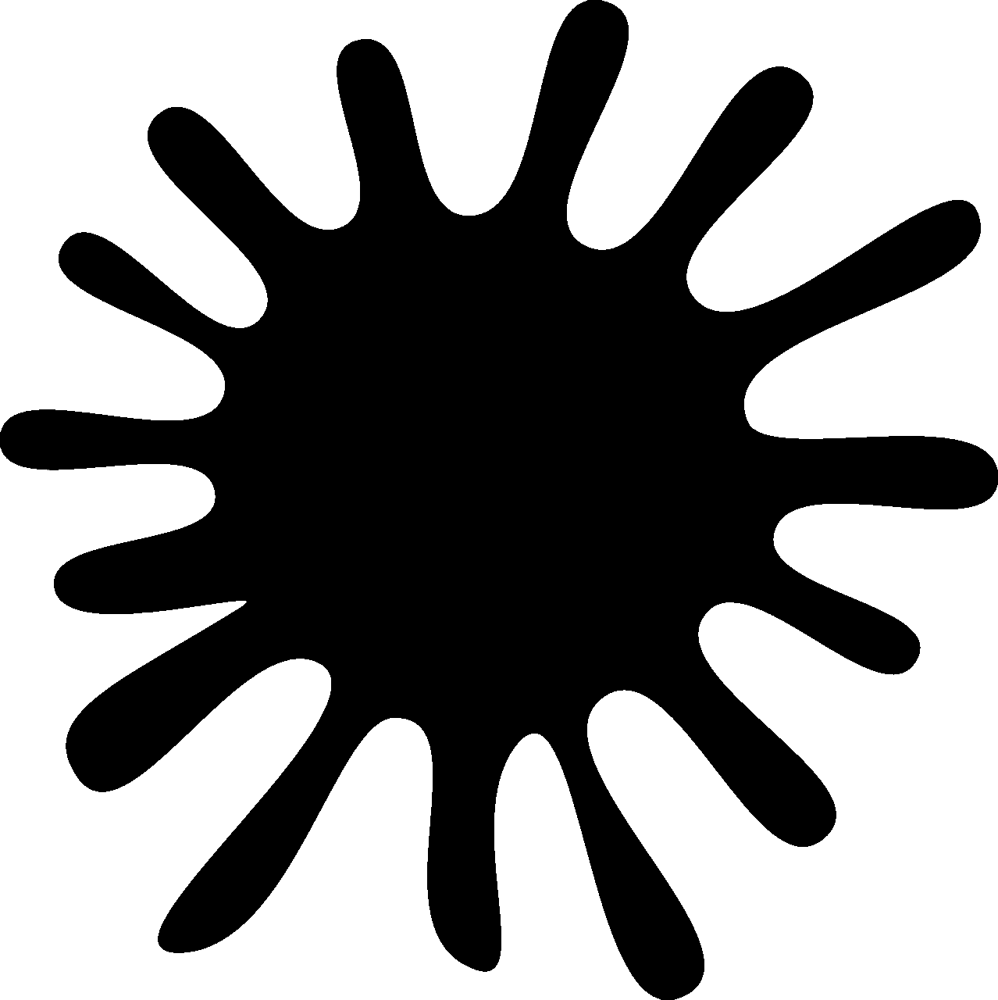

# 我是如何登上 ka ggle 2022 年 8 月表格竞赛排行榜的

> 原文：<https://medium.com/mlearning-ai/how-i-got-on-the-leaderboard-of-kaggles-august-2022-tabular-competition-6ba7ea70d5ea?source=collection_archive---------6----------------------->

又到那个时候了。我总是期待着每个月的第一天，这样我就可以参加 Kaggle 的每月表格比赛。2022 年 8 月的表格竞赛是一个分类问题，问题陈述在下面的截图中:-

我已经在 Kaggle 的免费在线 Jupyter 笔记本上写了这个程序。