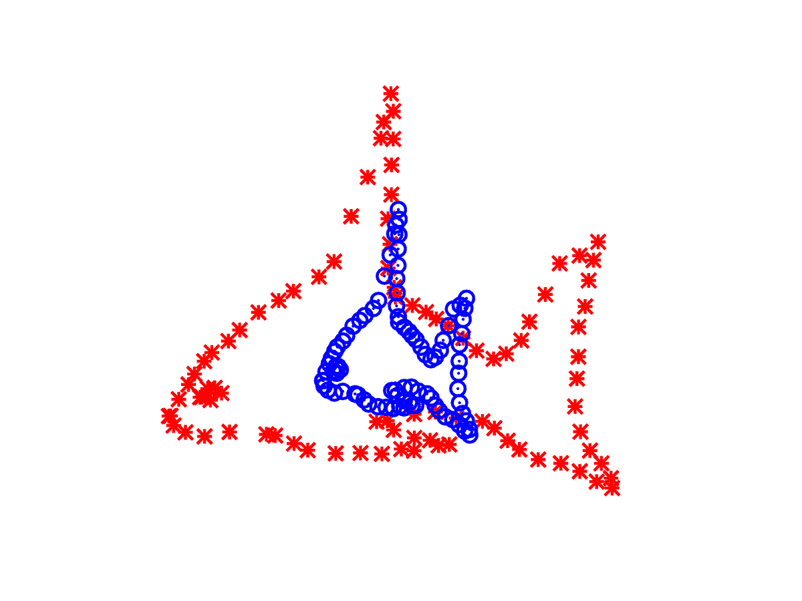

# 在 ka ggle 2021 年 5 月的表格比赛中，我如何通过采用多种输出将准确率提高了 5%

> 原文：<https://medium.com/mlearning-ai/how-i-improved-accuracy-5-on-kaggles-may-2021-tabular-competition-by-employing-multiple-outputs-feb0ebe06322?source=collection_archive---------2----------------------->

过去几天，我一直在为 2021 年 5 月的 Kaggle 表格竞赛工作，尝试了几种方法来提高分数。我最近写的关于这个主题的帖子可以在这里找到:- [我如何通过使用 SMOTE | by](/mlearning-ai/how-i-improved-the-accuracy-of-kaggles-may-2021-tabular-competition-by-using-smote-ba8989ba606c) 提高 ka ggle 2021 年 5 月表格比赛的准确性…