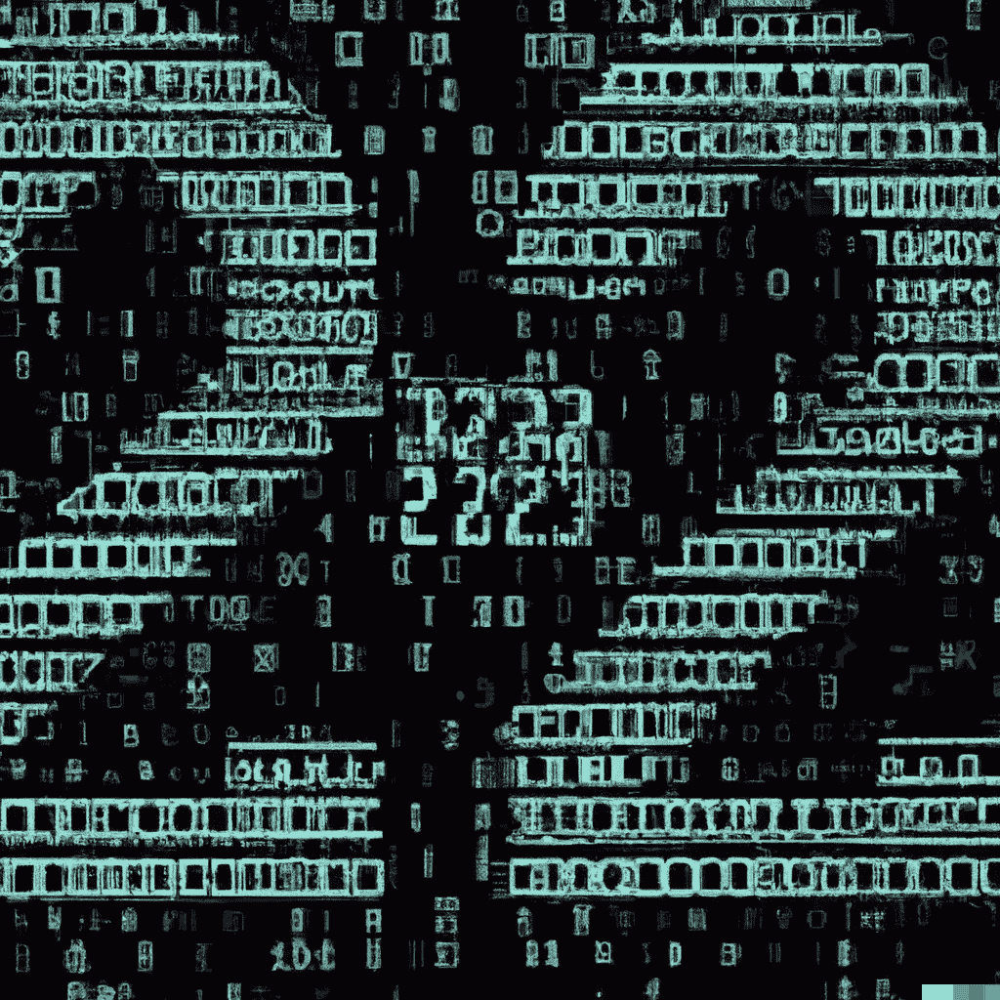

# 作为一名程序员和机器学习专家，我在 2022 年是如何进步的

> 原文：<https://medium.com/mlearning-ai/how-i-improved-as-a-programmer-and-machine-learning-expert-during-2022-97f9cef3af7f?source=collection_archive---------8----------------------->

## 我的项目和从 2022 年的经历中学到的经验教训

Photo generated by the generative AI [DALL-E 2](https://openai.com/dall-e-2/) by [OpenAI](https://openai.com/)

现在是 2022 年年底，在过去的 365 天里，我的编程生涯发生了很多事情。2017 年，我基本上是通过开始以学士学位为目标的商业信息学学士课程来开始我的编码之旅的…