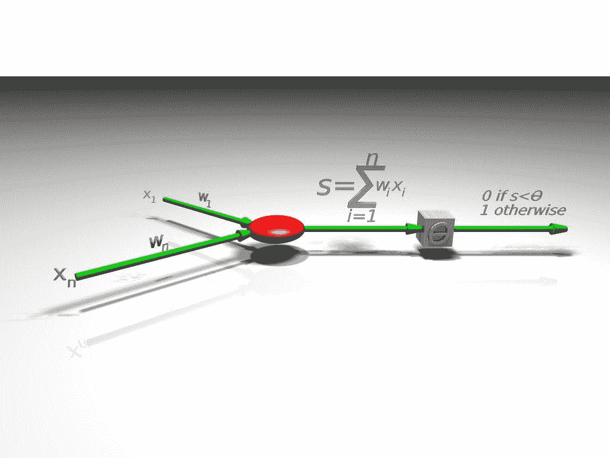

# 在 ka ggle 2021 年 5 月的表格竞赛中，我如何通过使用感知器将分数提高了 12%

> 原文：<https://medium.com/mlearning-ai/how-i-improved-my-score-by-12-on-kaggles-may-2021-tabular-competition-by-using-perceptron-102810302b77?source=collection_archive---------0----------------------->

正如那些一直关注我的博客帖子的人所知，我已经为 Kaggle 的 2021 年 5 月表格竞赛工作了近一周。我一直在努力提高这场比赛的准确性，并张贴了我用来实现这一目标的不同技术。我最近关于这个主题的帖子…