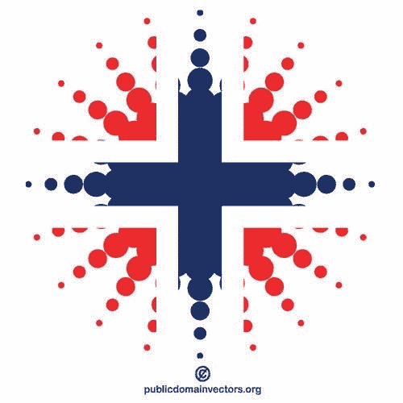

# 我如何通过使用 CCA 提高我在 ka ggle 8 月 21 日表格竞赛中的分数

> 原文：<https://medium.com/mlearning-ai/how-i-improved-my-score-on-kaggles-august-21-tabular-competition-by-employing-cca-24650f7efccc?source=collection_archive---------3----------------------->

在过去的几篇帖子中，我一直在记录我在顶级数据科学网站 Kaggle 的 2021 年 8 月表格竞赛上取得好成绩的努力。在我最近发表的一篇文章中，我讨论了 Python 的机器学习库 sklearn 中的一个特性选择器 GenericUnivariateSelect，我也很惊讶…