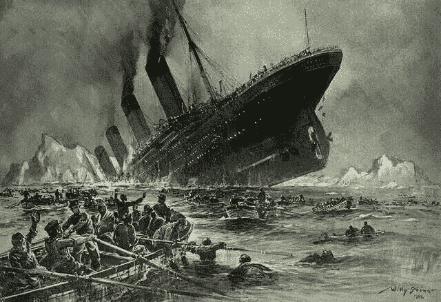

# 我如何通过使用高级分类技术来提高我在 Kaggle 的泰坦尼克号比赛中的分数

> 原文：<https://medium.com/mlearning-ai/how-i-improved-my-score-on-kaggles-titanic-competition-by-using-advanced-classification-techniques-a2f5f63f7194?source=collection_archive---------3----------------------->

我一直在寻找方法来提高我在各种卡格尔比赛中的分数，泰坦尼克号比赛是我投入大部分时间的比赛。我的个人 Kaggle 账户里全是 Jupyter 笔记本，我一直在努力通过运用一种技巧来提高我在排行榜上的分数…