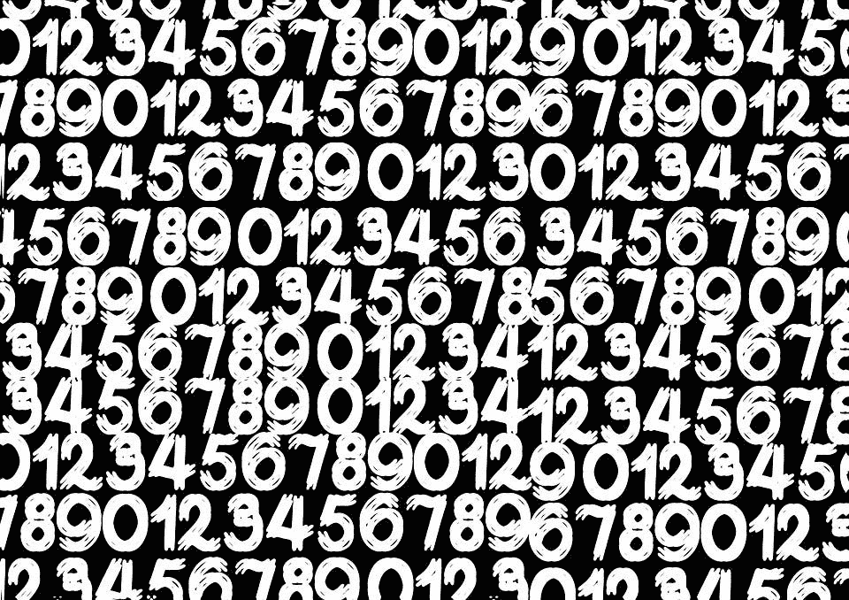

# 我如何使用 PyTorch 和 skorch 在 Kaggle 的 MNIST 竞赛中提高 2%的准确率

> 原文：<https://medium.com/mlearning-ai/how-i-increased-accuracy-2-on-kaggles-mnist-competition-using-pytorch-and-skorch-6520913fa8b2?source=collection_archive---------4----------------------->

在我之前的文章中，我使用 PyTorch 和一个名为 skorch 的新库对 openml 的 MNIST 数据集的解决方案进行了代码审查。这篇文章的链接可以在这里找到:- [代码审查:与 sklearn 和 skorch 一起的谷歌 MNIST 预测|作者 Tracyrenee | 2021 年 4 月| Medium](https://tracyrenee61.medium.com/code-review-google-colab-mnist-prediction-with-sklearn-and-skorch-f759731c828d)