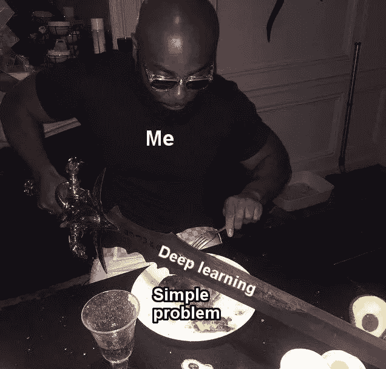

# 我如何学会评估值得追求的 MLOps 项目

> 原文：<https://medium.com/mlearning-ai/how-i-learned-to-assess-mlops-projects-worth-pursuing-4be86a05bf22?source=collection_archive---------4----------------------->

在本文中，您将了解如何评估一个 MLOps 项目是否值得您花费时间，是否会提供有意义的商业价值。

Source: [https://pbs.twimg.com/media/FL821KVXIAQEwRU.jpg](https://pbs.twimg.com/media/FL821KVXIAQEwRU.jpg)

2019 年，在我作为顾问数据科学家的职业生涯开始时，我失去了一份与非洲最大的快速消费品(FMCG)分销商之一的重要合同，为他们建立一个 ML 产品。