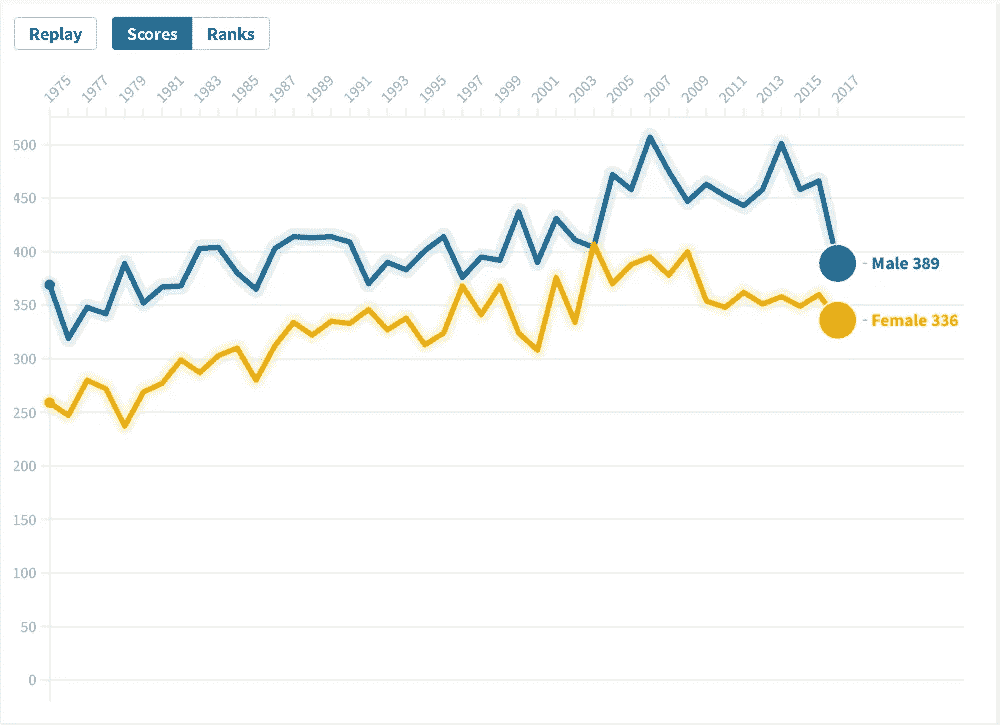
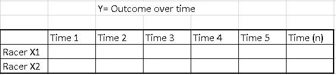
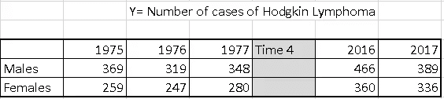
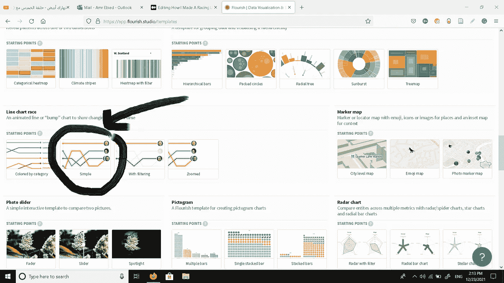
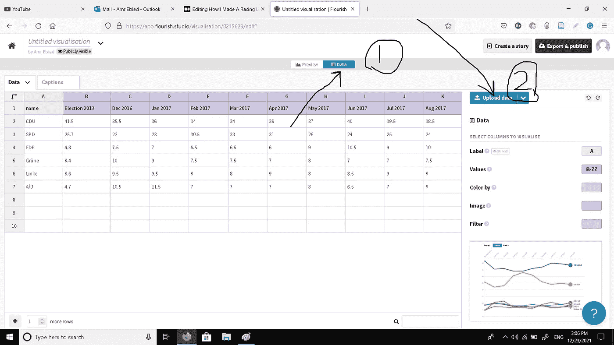
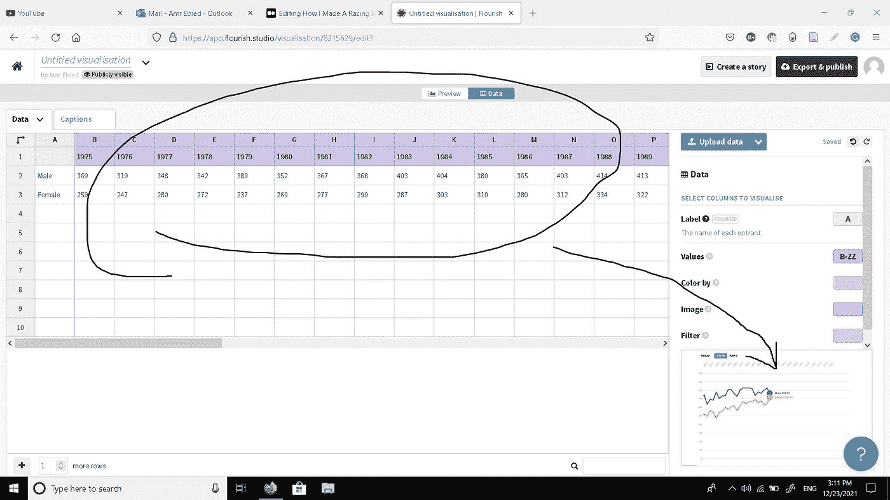

# 我是如何用花体绘制赛车线图的？

> 原文：<https://medium.com/mlearning-ai/how-i-made-a-racing-line-chart-with-flourish-6ccd1a1976a5?source=collection_archive---------4----------------------->

你做同样的事会花更少的时间。

A screenshot of the final product. Read for more details.

我一直对[繁华](https://flourish.studio/)着迷。

具体来说，我对 YouTube 上的赛车条形图非常感兴趣，并希望创建一些自己的条形图。

然而，我想先做一些简单的实验。所以，我考虑制作比赛线形图，或者线形图比赛可视化，就像网站给它们起的名字一样。

## 首先，整理好你的数据。

要制作赛车折线图，您的数据集必须符合以下方式。

所以，对于我提取上传的数据来说，我选择(Y)作为一段时间内(从 1975 年到 2017 年)霍奇金淋巴瘤病例的患病率(频率或数量)。对于 X1，我选择男性病例，对于 X2，我选择女性病例。我使用 SEER 数据库来提取我的数据，但是如何提取超出了本文的范围。

 [## 如何从 SEER 数据库创建一个简单的 Excel 数据集

### SEER*Stat 软件的一个应用

towardsdatascience.com](https://towardsdatascience.com/how-to-create-a-simple-excel-data-set-from-the-seer-database-6f1794249fa3) 

所以，我最终的数据集大概是这样的。我只包括了数据集的一部分，只是为了说明 X，Y 和时间的含义。

## 第二，打开折线图比赛可视化在蓬勃发展。

你必须去[发展](https://flourish.studio/)。选择免费注册选项。登录后，您将被带到项目网页(见下面的截图)。

点击“新的可视化”，你将被带到模板网页。

向下滚动一点，直到找到“线图竞赛”模板。

点击“简单”模板。您将看到一个简短的预览，然后您现在可以上传您的数据。

## 第三，上传你的数据(以正确的格式)。

点击“数据”选项卡。

然后点击“上传数据”

一旦上传了数据集的正确格式，程序将要求您导入数据集。点击“导入”，屏幕右下角会显示一个你上传数据的小预览，就像下面的截图一样。

如上所述，程序将 A 列(包含 X1 =男性和 X2=女性)视为折线图竞赛中的两个竞争者。它还将其余列中的值分别视为男性和女性的结果。如果上传数据后没有自动完成，您可以自己手动选择 Xs 和 Ys。

在导出和发布可视化之前，您现在要做的就是在屏幕的左上角为您的可视化创建一个标题，就在斜体的“无标题可视化”的位置。

## 第四，导出并发布您的可视化。

只需点击屏幕右上角的“导出&发布”标签，即可将你所有的作品公开保存在云端。它还为你提供了将这种可视化嵌入到你的网站或社交媒体帖子中的可能性。

我试图在 Twitter 上发布我所做的事情，但不幸的是，可视化的链接不起作用。所以，我用 Camtasia 来记录可视化效果，然后在做了一些改进后将视频上传到我的 YouTube 频道。

想看看吗？

如果你从本教程中学到了什么，请告诉我。

谢了。

 [## Mlearning.ai 提交建议

### 如何成为 Mlearning.ai 上的作家

medium.com](/mlearning-ai/mlearning-ai-submission-suggestions-b51e2b130bfb)