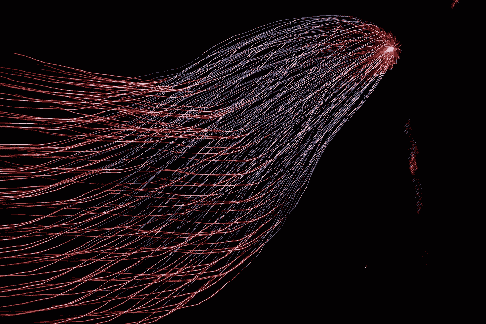

# 我是如何获得 Tensorflow 开发者证书的

> 原文：<https://medium.com/mlearning-ai/how-i-made-my-way-to-the-tensorflow-developer-certificate-29c31bf16190?source=collection_archive---------1----------------------->

## 考试的准备和资源

Image from [unsplash.com](https://unsplash.com/photos/Ype9sdOPdYc)

> **简介**

Tensorflow 开发者认证需要机器学习应用方面的广泛专业知识。机器学习对我来说一直是一个迷人的主题，Tensorflow 是一个开创性的开源平台，用于实现神经网络来解决…