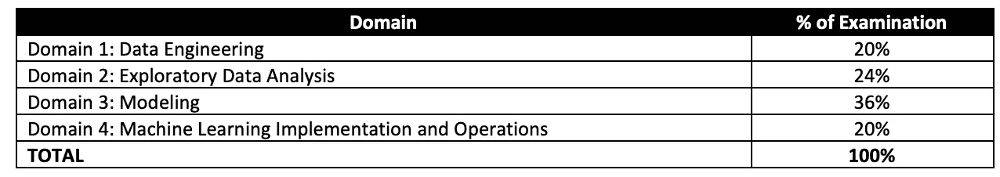
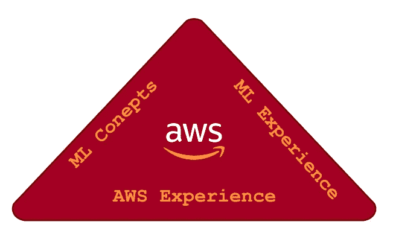
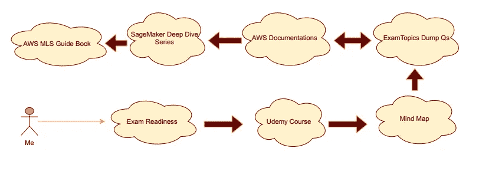

# 我是如何通过 AWS 机器学习专业考试的？

> 原文：<https://medium.com/mlearning-ai/how-i-passed-aws-machine-learning-specialty-exam-983daa06c436?source=collection_archive---------1----------------------->

我关于成为 AWS 认证机器学习专家的黑客之路的故事可能也会启发你

# 动机

我在设计基于 ML 的系统方面的经验不断增长，从试验想法到发布工作系统，但我想成为那种在 AWS 这样强大的可扩展平台上工作的工程师，从这一点开始，我专注于深入研究 AWS 服务，特别是那些与机器学习系统生命周期合作的服务。

当我在做研究时，我遇到了埃及 MCIT 大学提供的奖学金项目，该项目旨在培训 500 名 AWS 认证机器学习专业的软件工程师成为认证专家。我申请了它，经过几个选拔阶段后，我得到了成为 AWS ML 认证专家的机会，挑战的火花被点燃了。

# 考试是关于什么的？

AWS 为所有职业级别提供了许多类型的证书，其中之一是“专业”系列，这是我的机器学习专业证书所属的系列，根据 [AWS 认证网站](https://aws.amazon.com/certification/certified-machine-learning-specialty/?ch=sec&sec=rmg&d=2)，它的目标如下:

> AWS 认证机器学习-专业认证面向从事开发或数据科学工作的个人。它验证候选人针对给定业务问题设计、实施、部署和维护机器学习(ML)解决方案的能力。

考试证书的有效期为 3 年，要通过考试，必须通过考试 65 个问题中的 75%,这些问题涵盖了云架构模式、开发和跨这些领域分布的服务的许多领域:

Fig [1]: exam domain content

# 为什么这个考试和其他 AWS 考试不一样？

这种类型的考试是不同的，因为它取决于下表中的许多方面，如果没有其中一个方面，你将不得不付出更多的努力来填补这个空白。

Fig[2]: ML exam focus

*   **ML 概念**是模型或基本统计方法背后的科学，需要在考试前了解。
*   **ML Experience** 是一种构建系统和解决机器学习生命周期相关问题的手持体验。
*   **AWS 体验**是从使用 AWS 服务中获得的体验，无论是 ML 相关的服务还是在各个领域工作的一般服务，这种类型的体验将非常有助于将心态转向云计算和 AWS。

# 我用了哪些资源？

*   [考试准备:AWS 认证机器学习—专业](https://www.aws.training/Details/eLearning?id=42183)。
*   [“AWS 认证机器学习专业 2021 —动手操作！”](https://www.udemy.com/course/aws-machine-learning/)Udemy 上的 Frank Kane(他们 btw 推广了很多折扣)。
*   [AWS ML 服务思维导图](https://gitlab.com/juliensimon/awsmlmap)作者朱利安·西蒙。
*   [考试题目转储题](https://www.examtopics.com/exams/amazon/aws-certified-machine-learning-specialty/)。
*   [AWS 文件](https://docs.aws.amazon.com/)。
*   [“亚马逊 SageMaker 技术深潜系列](https://www.youtube.com/playlist?list=PLhr1KZpdzukcOr_6j_zmSrvYnLUtgqsZz)”由 Emily Webber 在 YouTube 上发布。
*   [《AWS 认证机器学习专业:MLS-C01 认证指南](https://www.packtpub.com/product/aws-certified-machine-learning-specialty-mls-c01-certification-guide/9781800569003)》
    Somanath Nanda 著，Weslley Moura 著。

# 我的学习策略呢？

使用上述资源需要一个好的计划来最大化最终结果，这个策略对我来说非常有效:

Fig[3]: My personal strategy

**步骤#1** :通过观看每个领域的视频和做相关测验来研究 AWS 考试准备情况，然后解答“附加研究问题”模块，该模块大约有 40 个问题，涵盖所有领域，并初步了解薄弱环节，我建议将此分数作为基线分数。

**步骤#2** :观看 Udemy 课程、做笔记和做练习实验将让您体验概念，并更加熟悉 AWS 服务。

**第三步**:回顾思维导图对联系要点、组织记忆和回答我在前面步骤中遇到的一些问题很有帮助。

**步骤#4 & #5** :解决转储问题是一个非常重要的步骤(许多考试问题与这些类型的问题非常相似)，但是考试主题问题的力量不在于问题本身，而在于问题下的讨论，它们有许多对 AWS 文档和答案观点的参考，阅读这些链接将打开你的思路，了解其他人如何回答这些问题将有助于你定义问题中的关键词，从而选择正确的答案。你可以多次回答这些问题，但不要记住它们，而是证明你选择的答案是正确的。

**步骤#6** :观看 Sage Maker Deep Dive 系列有助于我专注于 Sage Maker 作为一个平台，以及使用其服务的内容、时间和方式，这是我备考的重要部分。但是我并不致力于此，除了进入第 7 步，我只是看了一两个视频。

**第 7 步**:阅读 AWS MLS 指南是一种很好的体验，因为它的设计是在每章之后用 GitHub 代码片段和问题进行总结，这是为了修正你的概念，并确保你现在熟悉其中的每个主题，而不是进入太多的细节。我强烈建议在考试前一天做笔记，这对复习很有帮助。

**步骤#8** (可选):再次解决考试准备中的“附加研究问题”模块，并将其与您在步骤#1 中获得的基线分数进行比较。我的分数从 60%上升到 94%，这种奇妙的感觉让我对自己的技能更有信心。

# 考试体验如何？

我在准备学习计划和估计我需要准备考试的时间后注册了我的考试，或者我以为我会准备好，但实际上 100%准备好只是一个梦想，如果我试图按照准备好的状态将重新安排考试日期一次或两次，所以我的建议是准备计划，估计时间，适应当前的截止日期。

在考试的前一天，我用一个总结来概括我需要快速复习的要点和模块，比如重要的公式和思维导图，因为复习内容中的每一点都要花很多时间。

我在[全球知识测试中心](https://www.globalknowledge.com/)注册了我的考试，这是一个 [Pearson V](https://home.pearsonvue.com/) UE 的认证中心，我更喜欢在线考试，以避免掉线或其他意外问题的风险以及[考前设置](https://home.pearsonvue.com/Test-takers/OnVUE-online-proctoring.aspx)的麻烦。这种体验非常棒，正如我在[“在皮尔逊 VUE 公司测试时会遇到什么情况？”视频](https://vimeo.com/482759138)。但对我来说，我面临的最困难的事情是连续坐 3 个小时，而我不习惯。

# 通过考试后我得到了哪些好处？

除了证书的价值、促进职业发展和开辟新的工作岗位之外，AWS 还提供其他巨大的好处，例如:

*   为下一次挑战提供支持，提供免费的实践考试代金券以及在未来 3 年内有效的下一次考试 50%的折扣。
*   在 LinkedIn 上参与 AWS 认证社区，这有助于建立新的联系，与同行互动，并向那些通过 AWS 认证验证其技术技能的人学习。
*   通过申请 [AWS SME 项目](https://aws.amazon.com/certification/certification-sme-program/)成为主题专家，帮助决定考试题目、开发问题和确定及格分数。

因此，通过 AWS 认证，不仅仅是一次考试和一个证书，而是一个包，这种关系已经开始并将持续很长时间。

# 结论

这段旅程令人惊叹，我获得的经验和价值让我更加开阔了眼界。我希望你喜欢阅读这篇文章，甚至可能会受到启发，让自己获得 AWS 认证(如果你是，请告诉我)。现在把它作为你今年的目标之一还不算晚！

如果你有任何问题，不要犹豫，在 [LinkedIn](https://www.linkedin.com/in/mahmoudai/) 上提醒我。